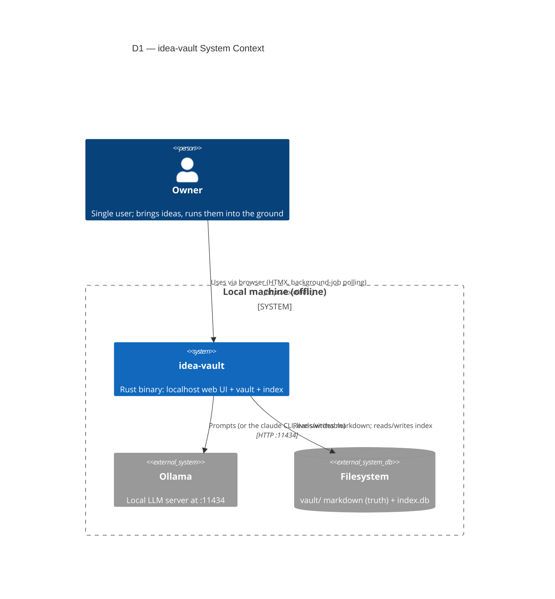
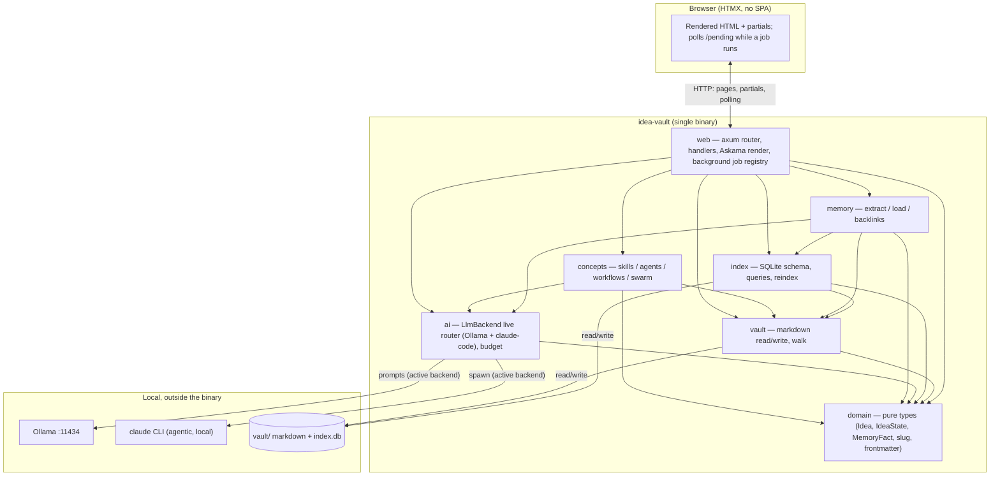

# 01 — Architecture

> The system skeleton: what runs, what it talks to, and how a request flows through it.
> Home of diagrams **D1** (system context), **D2** (container), and **D25** (boot sequence).
> Module-level structure is in [02-module-reference](./02-module-reference.md); data in
> [03-data-model](./03-data-model.md).

## Shape in one paragraph

idea-vault is a **single Rust binary** that serves a localhost web UI (axum + Askama + HTMX),
persists ideas as **markdown in a `vault/` directory** (source of truth), maintains a **rebuildable
SQLite index** for search/tags/backlinks, and calls a **local LLM backend** — Ollama by default, or
an agentic `claude` CLI backend, live-switchable via a Settings page
([ADR-0009](./adr/0009-pluggable-llm-backend-claude-code.md)/[ADR-0011](./adr/0011-live-switchable-llm-backend.md))
— for all AI. AI turns run as detached background jobs the browser polls, not an SSE stream
([ADR-0010](./adr/0010-ai-turns-as-background-jobs.md)). Everything runs on one machine, offline.

## D1 — System context (C4 Level 1)

Who and what the system interacts with. The dashed boundary is the local machine — nothing crosses
the network.



> If a renderer lacks `C4Context`, the [08-diagrams](./08-diagrams.md) registry notes the Graphviz
> fallback. All C4 diagrams here degrade to plain flowcharts conceptually.

## D2 — Container view (C4 Level 2)

Inside the single binary. Arrows follow the allowed dependency direction (see D4). The browser and
the disk/Ollama are adjacent containers the binary talks to.



Container responsibilities (detail in [02-module-reference](./02-module-reference.md)):

| Container | Responsibility |
|-----------|----------------|
| `web` | HTTP surface: routing, handlers, Askama rendering, and the background job registry (`web::jobs`, [ADR-0010](./adr/0010-ai-turns-as-background-jobs.md)). Depends on everything; nothing depends on it. |
| `concepts` | The harness primitives: skills, agents, workflows, swarm orchestration. |
| `memory` | Extract memory facts on Store; load them on Reopen; resolve `[[slug]]` backlinks. |
| `ai` | The only boundary to the LLM backends: the live `LlmBackend` router (Ollama + claude-code, [ADR-0011](./adr/0011-live-switchable-llm-backend.md)), health probe, context budgeting. |
| `index` | SQLite: schema/FTS5, queries, and the reindex-from-disk rebuild. Derived data only. |
| `vault` | Markdown read/write (source of truth) and the walk used by reindex. |
| `domain` | Pure types and rules with no IO — the shared vocabulary. |

## Request lifecycle (topology)

Two response shapes leave `web` — there is no long-lived streaming response:

- **Rendered pages / HTMX partials** — synchronous: handler reads vault/index, renders Askama, returns
  HTML. Detailed as the middleware pipeline **D16** in [09-web-ui](./09-web-ui.md).
- **AI-driven partials (background job + poll)** — the handler claims the per-idea job slot,
  persists what it can up front, spawns a detached task that drives the active `LlmBackend`, and
  returns immediately with a "thinking" indicator; the browser polls `GET /idea/:slug/pending`
  until the job resolves. Detailed as **D11** in [05-ai-integration](./05-ai-integration.md)
  ([ADR-0010](./adr/0010-ai-turns-as-background-jobs.md)).

The full route map (which route returns which shape) is **D17** in [09-web-ui](./09-web-ui.md).

## D25 — Startup / boot sequence

What `main.rs` does before serving. Encodes the reindex invariant (index verified/rebuilt from the
vault) and graceful AI degradation (probe, don't block) at boot.

```mermaid
sequenceDiagram
    autonumber
    participant Main as main.rs
    participant Cfg as config
    participant Idx as index
    participant Vault as vault
    participant LLM as ai::backend::LlmBackend
    participant Axum as axum server

    Main->>Cfg: load config (vault dir, db path, Ollama URL, initial backend/temperature/effort, concurrency limit)
    Main->>Idx: open index.db (create if missing)
    Idx->>Vault: check drift (index vs vault/**)
    alt index missing or drifted
        Idx->>Vault: walk vault/** and rebuild (reindex, D15)
        Note over Idx,Vault: reindex invariant — rebuild from markdown only
    else index fresh
        Idx-->>Main: ready
    end
    Main->>LLM: construct router (both backends; initial LlmSettings from config)
    Main->>LLM: health probe of the initially-active backend (non-blocking)
    Note over Main,LLM: absence is a valid state (D20); do NOT block boot. The Settings\npage can change the active backend later — this only probes the initial one.
    Main->>Axum: build AppState, mount router, bind IDEA_VAULT_BIND
    Note over Main,Axum: default 127.0.0.1:3000 for bare `cargo run`; 0.0.0.0:3000 in containers (D26)
    Axum-->>Main: serving
```

> **Deployment note:** the bind address, vault dir, index path, and Ollama URL are read from
> `IDEA_VAULT_*` environment variables (localhost-friendly defaults for bare runs, container values
> in Compose). See the configuration contract in [12-deployment](./12-deployment.md) and
> [ADR-0008](./adr/0008-containerized-local-deployment.md).

## Cross-cutting concerns

- **AppState** — cloneable shared state (config, index handle/pool, the `LlmBackend` router, swarm
  concurrency semaphore, background job registry) injected into handlers.
- **Middleware** — tower layers for tracing and error→response mapping (D16); the error taxonomy is
  **D24** in [05-ai-integration](./05-ai-integration.md).
- **Concurrency** — a single semaphore bounds concurrent AI calls across the whole process,
  regardless of active backend (swarms included); see
  [ADR-0006](./adr/0006-bounded-concurrency-swarm.md) and **D21**.

## Related

- [02-module-reference](./02-module-reference.md) — module graph (D4) and layout (D5).
- [03-data-model](./03-data-model.md) — what lives on disk and in the index.
- [ADR-0001](./adr/0001-server-rendered-htmx-over-spa.md),
  [ADR-0010](./adr/0010-ai-turns-as-background-jobs.md) (supersedes
  [ADR-0004](./adr/0004-sse-token-streaming.md)),
  [ADR-0011](./adr/0011-live-switchable-llm-backend.md).
