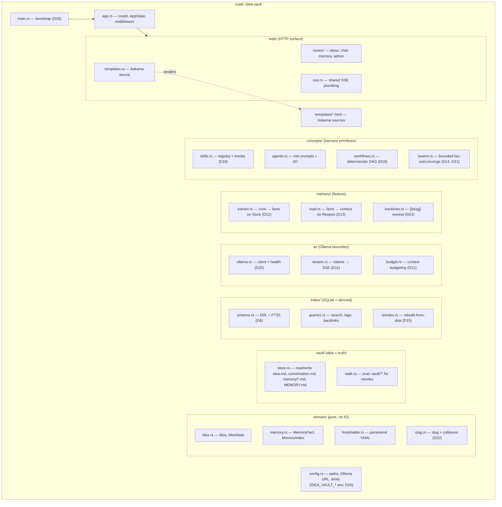
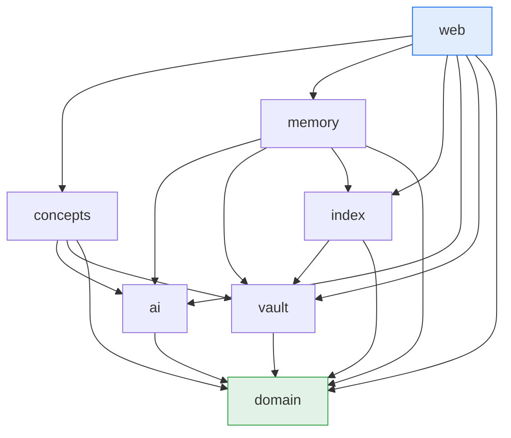

# 02 — Module Reference

> The single-crate decomposition the code is built against, plus the enforced dependency rules.
> Home of **D4** (module dependency graph) and **D5** (module layout). Decision rationale:
> [ADR-0005](./adr/0005-single-crate-vs-workspace.md).

idea-vault is **one binary crate** (`idea-vault`) with strict internal modules. Boundaries are a
convention enforced by review and by the D4 rules — not by the compiler — but the layout is designed
so a future workspace split is mechanical.

## D5 — Module / file layout

## D4 — Module dependency graph (allowed direction)

The single most important structural invariant: dependencies point **downward**, and **nothing
depends on `web`**. A violation (e.g. `domain` importing `web`, or `vault` importing `index`) is a
design smell caught in review.

### Dependency rules (normative)

| Module | May depend on | Must **not** depend on |
|--------|---------------|------------------------|
| `domain` | (std/serde only) | anything internal |
| `vault` | `domain` | `index`, `ai`, `memory`, `concepts`, `web` |
| `ai` | `domain` | `vault`, `index`, `memory`, `concepts`, `web` |
| `index` | `vault`, `domain` | `ai`, `memory`, `concepts`, `web` |
| `memory` | `vault`, `ai`, `index`, `domain` | `concepts`, `web` |
| `concepts` | `ai`, `vault`, `domain` (read `index` via `memory` where needed) | `web` |
| `web` | everything below | (nothing may depend on `web`) |

> Rationale for a couple of edges that might surprise: `index` depends on `vault` because reindex
> reads markdown to rebuild ([ADR-0002](./adr/0002-markdown-source-of-truth-sqlite-index.md)). `ai`
> deliberately does **not** depend on `vault` — it is a pure model boundary; callers assemble prompts
> and hand them in.

## Module responsibilities

- **`domain`** — the vocabulary from [11-glossary](./11-glossary.md) as pure types: `Idea`,
  `IdeaState` (`Draft`/`InDiscussion`/`Stored`/`Reopened`), `MemoryFact`, frontmatter (de)serialize,
  slug rules. No IO, trivially testable.
- **`vault`** — the only module that reads/writes the markdown files; owns the on-disk file contract
  from [03-data-model](./03-data-model.md). Append-only for `conversation.md`.
- **`index`** — owns `index.db`: schema + FTS5, query functions, and `reindex` (the rebuild-from-disk
  that upholds the reindex invariant, [D15](./03-data-model.md)).
- **`ai`** — the sole Ollama boundary: HTTP client, health probe, token-stream→SSE adapter, and
  context budgeting. Provider-swap would be localized here (out of scope, [ADR-0003](./adr/0003-ollama-local-only-ai.md)).
- **`memory`** — the memory feature: extract facts at Store ([D12](./06-concepts/memory.md)), load
  them at Reopen ([D13](./06-concepts/memory.md)), resolve backlinks ([D23](./06-concepts/memory.md)).
- **`concepts`** — skills, agents, workflows, and the swarm orchestrator ([06-concepts](./06-concepts/)).
- **`web`** — axum router, handlers, Askama rendering, SSE plumbing. The top of the graph.

## Future workspace mapping (not built now)

If promoted to a workspace ([ADR-0005](./adr/0005-single-crate-vs-workspace.md)):

| Future crate | Absorbs modules |
|--------------|-----------------|
| `idea-vault-core` | `domain`, `vault`, `index` |
| `idea-vault-ai` | `ai`, `memory`, `concepts` |
| `idea-vault-web` | `web` + binary (`main`, `app`, `config`) |

The D4 direction already matches these crate boundaries, so extraction requires no dependency
inversion.
