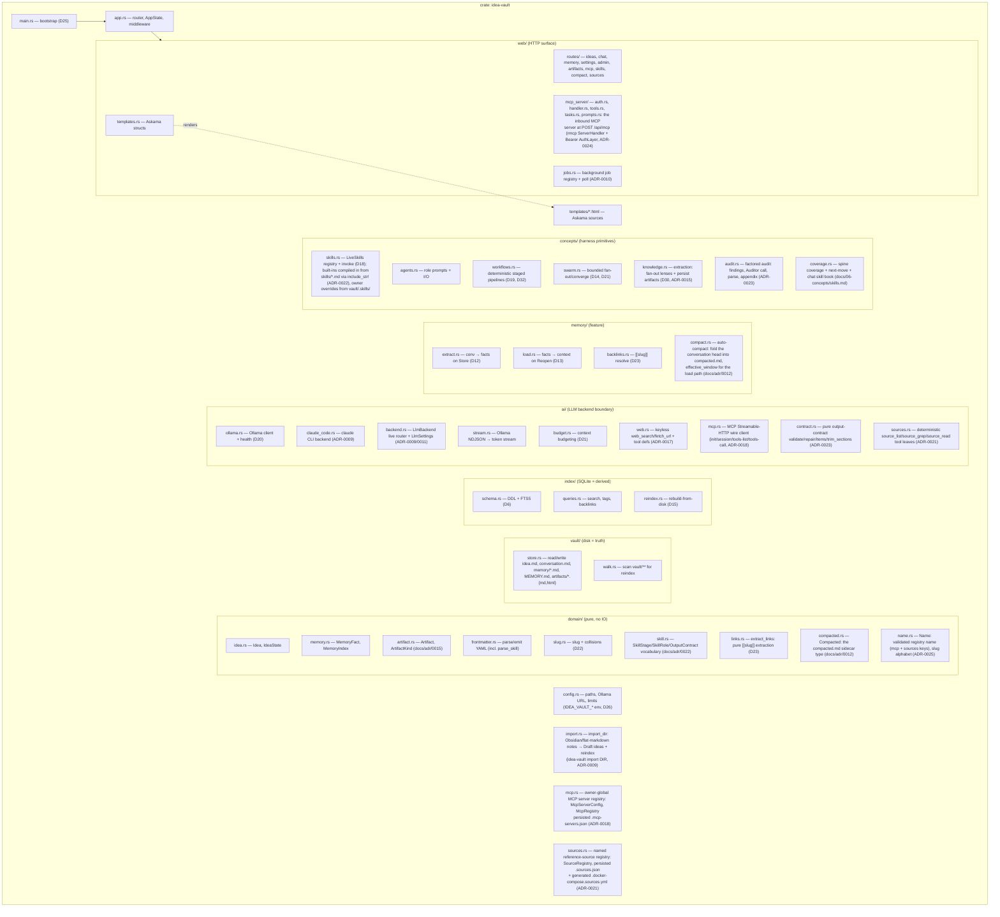
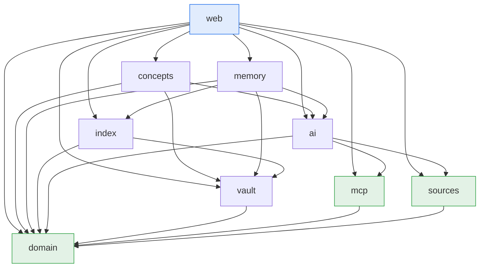

# 02 — Module Reference

> The single-crate decomposition the code is built against, plus the enforced dependency rules.
> Home of **D4** (module dependency graph) and **D5** (module layout). Decision rationale:
> [ADR-0005](./adr/0005-single-crate-vs-workspace.md).

idea-vault is **one binary crate** (`idea-vault`) with strict internal modules. Boundaries are a
convention enforced by review and by the D4 rules — not by the compiler — but the layout is designed
so a future workspace split is mechanical.

## D5 — Module / file layout

```mermaid
flowchart TB
    subgraph crate["crate: idea-vault"]
        MAIN["main.rs — bootstrap (D25)"]
        APP["app.rs — router, AppState, middleware"]
        CFG["config.rs — paths, Ollama URL, limits (IDEA_VAULT_* env, D26)"]
        IMPORT["import.rs — import_dir: Obsidian/flat-markdown notes → Draft ideas + reindex\n(idea-vault import DIR, ADR-0009)"]

        subgraph domain["domain/ (pure, no IO)"]
            D_IDEA["idea.rs — Idea, IdeaState"]
            D_MEM["memory.rs — MemoryFact, MemoryIndex"]
            D_ART["artifact.rs — Artifact, ArtifactKind (docs/adr/0015)"]
            D_FM["frontmatter.rs — parse/emit YAML (incl. parse_skill)"]
            D_SLUG["slug.rs — slug + collisions (D22)"]
            D_SKILL["skill.rs — SkillStage/SkillRole/OutputContract vocabulary (docs/adr/0022)"]
            D_LINKS["links.rs — extract_links: pure [[slug]] extraction (D23)"]
            D_COMP["compacted.rs — Compacted: the compacted.md sidecar type (docs/adr/0012)"]
            D_NAME["name.rs — Name: validated registry name (mcp + sources keys), slug alphabet (ADR-0025)"]
        end

        subgraph vault["vault/ (disk = truth)"]
            V_STORE["store.rs — read/write idea.md, conversation.md, memory/*.md, MEMORY.md, artifacts/*.{md,html}"]
            V_WALK["walk.rs — scan vault/** for reindex"]
        end

        subgraph index["index/ (SQLite = derived)"]
            I_SCHEMA["schema.rs — DDL + FTS5 (D6)"]
            I_QUERY["queries.rs — search, tags, backlinks"]
            I_REIDX["reindex.rs — rebuild-from-disk (D15)"]
        end

        subgraph ai["ai/ (LLM backend boundary)"]
            A_OLL["ollama.rs — Ollama client + health (D20)"]
            A_CC["claude_code.rs — claude CLI backend (ADR-0009)"]
            A_BK["backend.rs — LlmBackend live router + LlmSettings (ADR-0009/0011)"]
            A_STREAM["stream.rs — Ollama NDJSON → token stream"]
            A_BUDGET["budget.rs — context budgeting (D21)"]
            A_WEB["web.rs — keyless web_search/fetch_url + tool defs (ADR-0017)"]
            A_MCP["mcp.rs — MCP Streamable-HTTP wire client (init/session/tools-list/tools-call, ADR-0018)"]
            A_CONTRACT["contract.rs — pure output-contract validate/repair/items/trim_sections (ADR-0023)"]
            A_SRC["sources.rs — deterministic source_list/source_grep/source_read tool leaves (ADR-0021)"]
        end

        MCP["mcp.rs — owner-global MCP server registry: McpServerConfig, McpRegistry\npersisted .mcp-servers.json (ADR-0018)"]
        SRC["sources.rs — named reference-source registry: SourceRegistry, persisted .sources.json\n+ generated .docker-compose.sources.yml (ADR-0021)"]

        subgraph memory["memory/ (feature)"]
            M_EXTRACT["extract.rs — conv → facts on Store (D12)"]
            M_LOAD["load.rs — facts → context on Reopen (D13)"]
            M_BACK["backlinks.rs — [[slug]] resolve (D23)"]
            M_COMPACT["compact.rs — auto-compact: fold the conversation head into compacted.md,\neffective_window for the load path (docs/adr/0012)"]
        end

        subgraph concepts["concepts/ (harness primitives)"]
            C_SKILL["skills.rs — LiveSkills registry + invoke (D18); built-ins compiled in from\nskills/*.md via include_str! (ADR-0022), owner overrides from vault/.skills/"]
            C_AGENT["agents.rs — role prompts + I/O"]
            C_WF["workflows.rs — deterministic staged pipelines (D19, D32)"]
            C_SWARM["swarm.rs — bounded fan-out/converge (D14, D21)"]
            C_KNOW["knowledge.rs — extraction: fan-out lenses + persist artifacts (D30, ADR-0015)"]
            C_AUDIT["audit.rs — factored audit: findings, Auditor call, parse, appendix (ADR-0023)"]
            C_COVER["coverage.rs — spine coverage + next-move + chat skill book (docs/06-concepts/skills.md)"]
        end

        subgraph web["web/ (HTTP surface)"]
            W_ROUTES["routes/ — ideas, chat, memory, settings, admin, artifacts, mcp, skills, compact, sources"]
            W_MCPSRV["mcp_server/ — auth.rs, handler.rs, tools.rs, tasks.rs, prompts.rs: the inbound MCP\nserver at POST /api/mcp (rmcp ServerHandler + Bearer AuthLayer, ADR-0024)"]
            W_JOBS["jobs.rs — background job registry + poll (ADR-0010)"]
            W_TMPL["templates.rs — Askama structs"]
        end

        TEMPLATES["templates/*.html — Askama sources"]
    end

    MAIN --> APP --> web
    W_TMPL -.renders.-> TEMPLATES
```

## D4 — Module dependency graph (allowed direction)

The single most important structural invariant: dependencies point **downward**, and **nothing
depends on `web`**. A violation (e.g. `domain` importing `web`, or `vault` importing `index`) is a
design smell caught in review.

```mermaid
flowchart TD
    web["web"]
    concepts["concepts"]
    memory["memory"]
    index["index"]
    ai["ai"]
    vault["vault"]
    domain["domain"]
    mcp["mcp"]
    sources["sources"]

    web --> concepts
    web --> memory
    web --> index
    web --> ai
    web --> vault
    web --> domain
    web --> mcp
    web --> sources

    concepts --> ai
    concepts --> vault
    concepts --> domain

    memory --> ai
    memory --> vault
    memory --> index
    memory --> domain

    index --> vault
    index --> domain

    ai --> domain
    ai --> mcp
    ai --> sources
    vault --> domain
    mcp --> domain
    sources --> domain

    classDef top fill:#1f6feb22,stroke:#1f6feb;
    classDef base fill:#2ea04322,stroke:#2ea043;
    class web top;
    class domain base;
    class mcp base;
    class sources base;
```

### Dependency rules (normative)

| Module | May depend on | Must **not** depend on |
|--------|---------------|------------------------|
| `domain` | (std/serde only) | anything internal |
| `mcp` | `domain` | anything else internal, **especially `ai`** |
| `sources` | `domain` | anything else internal, **especially `ai`** |
| `vault` | `domain` | `index`, `ai`, `memory`, `concepts`, `web`, `mcp`, `sources` |
| `ai` | `domain`, `mcp`, `sources` | `vault`, `index`, `memory`, `concepts`, `web` |
| `index` | `vault`, `domain` | `ai`, `memory`, `concepts`, `web`, `mcp`, `sources` |
| `memory` | `vault`, `ai`, `index`, `domain` | `concepts`, `web`, `mcp`, `sources` |
| `concepts` | `ai`, `vault`, `domain` (read `index` via `memory` where needed) | `web`, `mcp`, `sources` |
| `web` | everything below | (nothing may depend on `web`) |

> Rationale for a couple of edges that might surprise: `index` depends on `vault` because reindex
> reads markdown to rebuild ([ADR-0002](./adr/0002-markdown-source-of-truth-sqlite-index.md)). `ai`
> deliberately does **not** depend on `vault` — it is a pure model boundary; callers assemble prompts
> and hand them in. **`mcp` is a leaf like `domain`**, not a peer of `ai::mcp`: `mcp` holds only the
> owner's server registry (config/persistence, no protocol knowledge) and must never import `ai`;
> `mcp` and `sources` may depend on `domain` alone, for the shared slug-alphabet check
> (both key their entries by `domain::Name`, valid by construction iff `domain::slug::is_valid`)
> ([ADR-0025](./adr/0025-registry-leaves-may-use-domain.md));
> `ai::mcp` (the wire client) must never import `mcp`; `ai::backend` is the *only* module that imports
> both, one-way, so combining "which servers are enabled" with "how to call one" never creates a
> cycle ([ADR-0018](./adr/0018-mcp-servers.md)). `web` also depends on `mcp` directly (not only
> through `ai`) because `web::routes::mcp` reads/writes the registry itself for the `/mcp`
> management page. **`sources` mirrors `mcp`** ([ADR-0021](./adr/0021-reference-sources.md)):
> `crate::sources` holds the owner's named reference sources (`sources::SourceRegistry`) and never
> imports `ai`. `ai::sources` (the `source_*` tool leaves) and `ai::backend` depend on it only for
> the resolved-root type `sources::ResolvedSource`. `web` depends on it directly because
> `web::routes::sources` serves the `/sources` page and `web::routes::scoped_llm` resolves an idea's
> attached sources for each turn.

## Module responsibilities

- **`domain`** — the vocabulary from [11-glossary](./11-glossary.md) as pure types: `Idea`,
  `IdeaState` (`Draft`/`InDiscussion`/`Stored`/`Reopened`), `MemoryFact`, frontmatter (de)serialize,
  slug rules. No IO, trivially testable.
- **`vault`** — the only module that reads/writes the markdown files; owns the on-disk file contract
  from [03-data-model](./03-data-model.md). Append-only for `conversation.md`.
- **`index`** — owns `index.db`: schema + FTS5, query functions, and `reindex` (the rebuild-from-disk
  that upholds the reindex invariant, [D15](./03-data-model.md)).
- **`ai`** — the sole LLM-backend boundary (ADR-0009): `LlmBackend`, a **live router** over an
  Ollama HTTP client and the `claude` CLI backend, dispatching per call from runtime-tunable
  `LlmSettings` ([ADR-0011](./adr/0011-live-switchable-llm-backend.md)); also health probe and
  context budgeting. Provider-swap is localized here (out of scope beyond these two,
  [ADR-0003](./adr/0003-ollama-local-only-ai.md)). `ai::web` supplies the keyless `web_search`/
  `fetch_url` tool leaves the router's bounded tool-calling loop executes on the Ollama path when
  the live `web_access` setting is on ([ADR-0017](./adr/0017-web-access-tools.md)). `ai::mcp` is the
  MCP Streamable-HTTP wire client (initialize/session/tools-list/tools-call); `ai::backend` is the
  sole bridge that combines it with the `mcp` registry to offer enabled servers' tools on either
  backend ([ADR-0018](./adr/0018-mcp-servers.md)).
- **`mcp`** — the owner-global MCP server registry (`McpServerConfig`, `McpRegistry`): pure
  config/persistence, `std`+`serde` only, backing `<vault>/.mcp-servers.json` (app config, not vault
  truth — [03-data-model](./03-data-model.md)). Deliberately a leaf module like `domain`: it must
  never import `ai`, so it cannot know how to *call* a server, only which servers the owner has
  configured and enabled ([ADR-0018](./adr/0018-mcp-servers.md)).
- **`memory`** — the memory feature: extract facts at Store ([D12](./06-concepts/memory.md)), load
  them at Reopen ([D13](./06-concepts/memory.md)), resolve backlinks ([D23](./06-concepts/memory.md)).
- **`concepts`** — skills (registry over built-in + owner `vault/.skills/` markdown files,
  [ADR-0022](./adr/0022-skills-as-markdown-and-the-skill-book.md)), agents, workflows, the swarm
  orchestrator, knowledge extraction (`knowledge.rs`, [D30](./06-concepts/swarm.md)), the factored
  audit (`audit.rs`, [ADR-0023](./adr/0023-verification-layer.md)), and spine coverage (`coverage.rs`)
  ([06-concepts](./06-concepts/)).
- **`web`** — axum router, handlers, Askama rendering, and the background job registry (`web::jobs`,
  [ADR-0010](./adr/0010-ai-turns-as-background-jobs.md)) that every AI-driven route (including
  `routes::artifacts`, [ADR-0015](./adr/0015-knowledge-extraction-artifacts.md)) spawns into and
  polls. The top of the graph.
- **`import`** — a bin-level driver (used only by `main`, like `web`): converts a directory of flat
  Obsidian `.md` notes into ideas, then reindexes ([ADR-0009](./adr/0009-pluggable-llm-backend-claude-code.md)).
  Depends on `domain` + `vault` + `index`; nothing depends on it.

## Future workspace mapping (not built now)

If promoted to a workspace ([ADR-0005](./adr/0005-single-crate-vs-workspace.md)):

| Future crate | Absorbs modules |
|--------------|-----------------|
| `idea-vault-core` | `domain`, `vault`, `index` |
| `idea-vault-ai` | `ai`, `memory`, `concepts` |
| `idea-vault-web` | `web` + binary (`main`, `app`, `config`) |

The D4 direction already matches these crate boundaries, so extraction requires no dependency
inversion.
