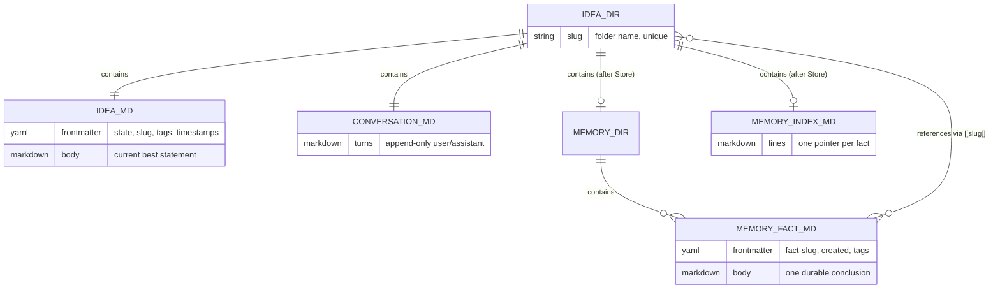
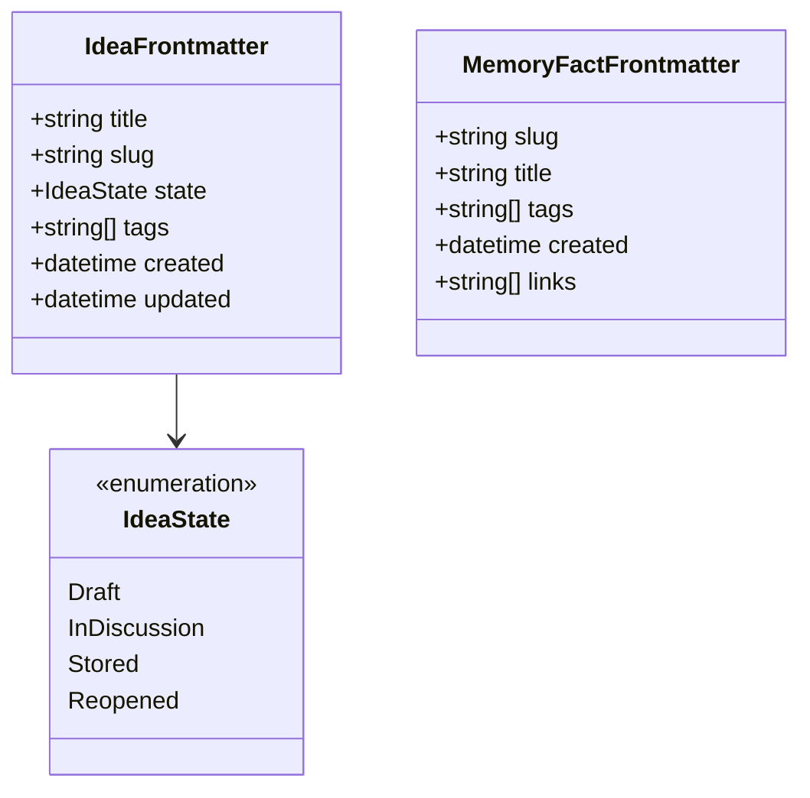
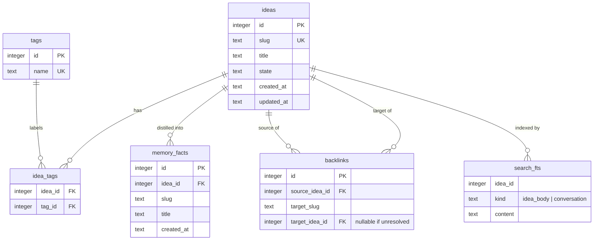
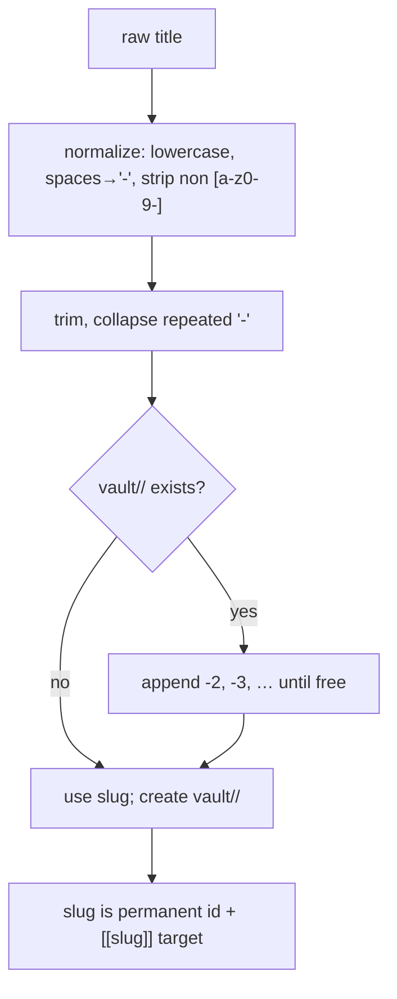

# 03 — Data Model

> The on-disk vault contract (source of truth), the SQLite index schema (derived), and the
> operations that keep them consistent. Home of **D6** (ER), **D7** (vault entity map), **D8**
> (frontmatter schema), **D15** (reindex), and **D22** (slug lifecycle).
> Governing decisions: [ADR-0002](./adr/0002-markdown-source-of-truth-sqlite-index.md),
> [ADR-0007](./adr/0007-state-in-frontmatter-not-db.md).

## The two layers

1. **Vault (truth)** — markdown files under `vault/`. Everything the owner reads. Authoritative.
2. **Index (derived)** — `index.db` (SQLite). Search, tags, backlinks. **Rebuildable from the vault
   alone** — the *reindex invariant*.

Writes always go **vault first, index second**. If the index write fails, truth is intact and
reindex reconciles.

## Vault on-disk contract

```
vault/
  <slug>/
    idea.md          # frontmatter + body (current best statement)
    conversation.md  # append-only transcript
    memory/
      <fact-slug>.md # one memory fact per file (frontmatter + body)
    MEMORY.md        # one-line index of memory/*.md
index.db             # derived index (may be deleted + rebuilt)
```

### D7 — Vault entity map (what relates to what on disk)



### Conversation turn grammar

`conversation.md` is plain markdown: a turn is a `## <role>` heading line followed by its content
lines up to the next such heading. The app writes `## user`, `## assistant`, and labelled assistant
variants — `## assistant (skill: <name>)`, `## assistant (swarm)`, `## assistant (workflow: <name>)`
— for turns produced by a skill, swarm synthesis, or workflow step. Only `## user`/`## assistant`
heading lines are recognized as boundaries, so an ordinary `## Section` heading written inside a
turn's own content does not split it — it stays part of that turn, verbatim, because markdown is
truth. Any content line that would otherwise read as a `## user`/`## assistant` heading is escaped
with a leading backslash on write, so submitted chat text or model output can never forge a turn
boundary and masquerade as another speaker.

```markdown
## user
Is a subscription model viable here?
## Second-order effects
This is just a heading the user typed, not a new turn.
## assistant
Steelmanning it first: predictable revenue, but watch churn.
```

### Canonical vs indexed (traceability)

Every indexed field traces to a vault source. This table is the contract the reindex must satisfy:

| Data | Canonical location (truth) | Indexed copy (derived) |
|------|----------------------------|------------------------|
| Idea state | `idea.md` frontmatter `state:` | `ideas.state` |
| Title | `idea.md` frontmatter `title:` | `ideas.title` |
| Tags | `idea.md` frontmatter `tags:` | `tags` + `idea_tags` |
| Idea body text | `idea.md` body | `search_fts` |
| Conversation text | `conversation.md` | `search_fts` |
| Memory fact | `memory/<fact>.md` | `memory_facts` |
| `[[slug]]` links | inside bodies | `backlinks` |
| Timestamps | frontmatter `created:`/`updated:` | `ideas.created_at`/`updated_at` |

## D8 — Frontmatter schema

The structured header of `idea.md` (and a lighter one for memory facts). Field names and the
serialized `state` values are part of the data contract and must match the `domain` types verbatim.



**Serialized `state` mapping** (frontmatter uses lower-kebab; see
[ADR-0007](./adr/0007-state-in-frontmatter-not-db.md)):

| `IdeaState` (code) | frontmatter `state:` |
|--------------------|----------------------|
| `Draft` | `draft` |
| `InDiscussion` | `in_discussion` |
| `Stored` | `stored` |
| `Reopened` | `reopened` |

Example `idea.md` header:

```yaml
---
title: Distributed idea market
slug: distributed-idea-market
state: in_discussion
tags: [markets, incentives]
created: 2026-07-07T10:15:00Z
updated: 2026-07-07T11:40:00Z
---
```

## D6 — SQLite index ER

All tables are **derived** and rebuilt by reindex. `search_fts` is an FTS5 virtual table.



> `backlinks.target_idea_id` is nullable: a `[[slug]]` may point at an idea that doesn't exist yet.
> Resolution happens during reindex ([D23](./06-concepts/memory.md)).

## D15 — Reindex: rebuild SQLite from markdown

The operation that enforces the reindex invariant. Triggered on startup-if-drift ([D25](./01-architecture.md)),
on demand (admin route), and after writes (incremental upsert; full rebuild is the fallback).

```mermaid
sequenceDiagram
    autonumber
    participant Trig as Trigger (startup / admin / drift)
    participant Reidx as index::reindex
    participant Walk as vault::walk
    participant Parse as domain::frontmatter
    participant DB as SQLite (txn)

    Trig->>Reidx: reindex()
    Reidx->>DB: BEGIN; drop/clear derived tables
    Reidx->>Walk: enumerate vault/*/
    loop each idea dir
        Walk-->>Reidx: idea.md, conversation.md, memory/*.md
        Reidx->>Parse: parse frontmatter + bodies
        Reidx->>DB: upsert ideas, tags, idea_tags
        Reidx->>DB: upsert memory_facts
        Reidx->>DB: insert search_fts (body + conversation)
        Reidx->>DB: insert backlinks ([[slug]] found)
    end
    Reidx->>DB: resolve backlinks.target_idea_id by slug
    Reidx->>DB: COMMIT
    Reidx-->>Trig: counts (ideas, facts, links) for verification
```

The returned counts back the property test in [10-testing-strategy](./10-testing-strategy.md):
*reindex twice → identical index; index reconstructable from vault alone.*

## D22 — Slug lifecycle & collision handling

Title → filesystem/URL-safe slug, with deterministic disambiguation. Owns folder creation.



Rules: slug is generated once at creation and **never changes** (it is the `[[slug]]` link target and
the folder name); renaming the idea's title updates `title:` but not `slug`.

## Consistency & failure model

- **Write order:** markdown first (truth), then index upsert. Index failure ⇒ log + rely on next
  reindex; truth is never lost.
- **External edits:** the owner may edit `idea.md`/frontmatter by hand; the app tolerates this and
  re-derives on reindex ([ADR-0007](./adr/0007-state-in-frontmatter-not-db.md)).
- **Deletion:** removing `vault/<slug>/` removes the idea; the next reindex drops its index rows and
  nulls any inbound `backlinks.target_idea_id`.

## Related

- [04-state-machine](./04-state-machine.md) — how `state` transitions (D9).
- [06-concepts/memory](./06-concepts/memory.md) — how `memory/*.md` and backlinks are produced.
- [10-testing-strategy](./10-testing-strategy.md) — property-testing the reindex invariant.
