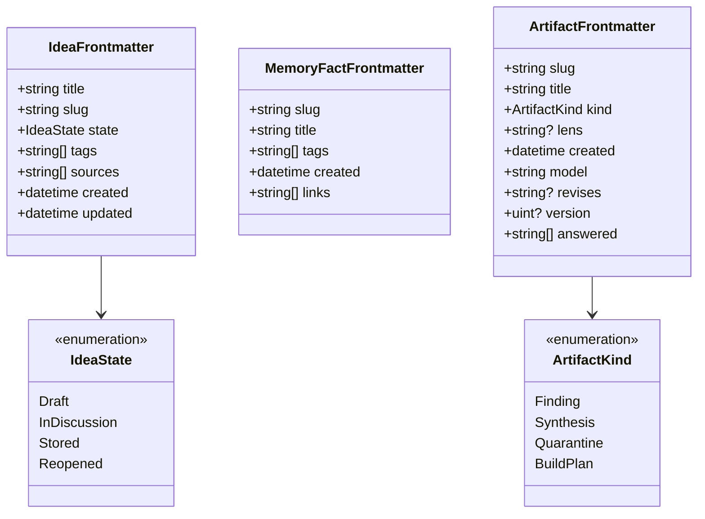
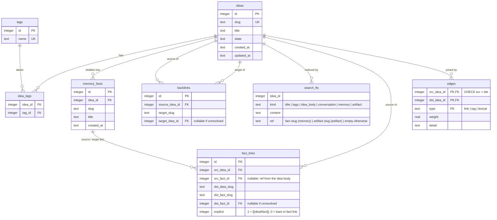
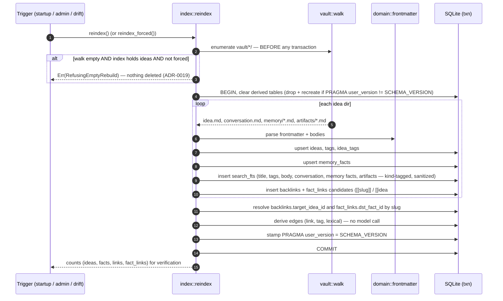
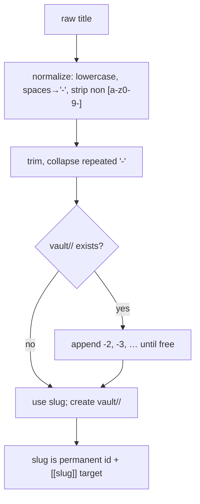

# 03 — Data Model

> The on-disk vault contract (source of truth), the SQLite index schema (derived), and the
> operations that keep them consistent. Home of **D6** (ER), **D7** (vault entity map), **D8**
> (frontmatter schema), **D15** (reindex), and **D22** (slug lifecycle).
> Governing decisions: [ADR-0002](./adr/0002-markdown-source-of-truth-sqlite-index.md),
> [ADR-0007](./adr/0007-state-in-frontmatter-not-db.md).

## The two layers

1. **Vault (truth)** — markdown files under `vault/`. Everything the owner reads. Authoritative.
2. **Index (derived)** — `index.db` (SQLite). Search, tags, backlinks. **Rebuildable from the vault
   alone** — the *reindex invariant*.

Writes always go **vault first, index second**. If the index write fails, truth is intact and
reindex reconciles.

## Vault on-disk contract

```
vault/
  <slug>/
    idea.md          # frontmatter + body (current best statement)
    conversation.md  # append-only transcript
    compacted.md     # derived, non-canonical sidecar: fingerprinted rollup of the conversation
                     #   head (ADR-0012); deletable + regenerable, never indexed
    memory/
      <fact-slug>.md # one memory fact per file (frontmatter + body)
    MEMORY.md        # one-line index of memory/*.md
    artifacts/
      <run-stamp>-<lens-short>.md  # one persisted knowledge-extraction finding (frontmatter + body)
      <run-stamp>-synthesis.md    # the converged synthesis of a run (frontmatter + body)
      <run-stamp>-report.html     # optional derived export of a run (opt-in, unindexed; ADR-0015)
      <run-stamp>-quarantined-facts.md  # store-time facts the evidence gate kept out of memory
                                        #   (kind: quarantine; ADR-0023)
index.db             # derived index (may be deleted + rebuilt)
.idea-vault-root     # vault-root marker — its presence says "this is the real vault" (ADR-0019)
.mcp-servers.json    # owner-global MCP server registry — APP CONFIG, not vault truth (ADR-0018)
.sources.json        # owner's named reference-source registry — APP CONFIG, not vault truth (ADR-0021)
.docker-compose.sources.yml  # GENERATED compose override: ro binds per source (ADR-0021)
.gitignore           # created/appended by the source registry to cover the two sources dotfiles
.skills/             # owner-authored skill files <name>.md — APP CONFIG, not vault truth (ADR-0022)
```

> **`.idea-vault-root` is the vault's identity, not content.** `vault::store::ensure_vault_dir`
> writes it (`vault::store::VAULT_MARKER`) on a genuine first run (`VaultInit::Created`) or when it
> adopts a pre-marker vault that already holds ideas (`VaultInit::Adopted`). An existing directory
> with no marker and no ideas is `VaultInit::Suspect`: the app logs an error and writes nothing, since
> blessing it would make a wrong or unmounted path look healthy
> ([ADR-0019](./adr/0019-vault-mount-verified-not-created.md)). Don't delete the marker from a real,
> empty vault.

> **The sources dotfiles are app configuration too**, with the same "invisible to reindex" status as
> `.mcp-servers.json` below. `sources::SourceRegistry` persists `.sources.json` (path:
> `IDEA_VAULT_SOURCES_CONFIG`) and regenerates `.docker-compose.sources.yml`
> (`sources::OVERRIDE_FILENAME`) beside it. It also makes sure the vault `.gitignore` lists both,
> creating the file or appending only the missing lines, because host paths must not leak into an
> ideas repo the owner might publish. Per-idea attachment lives in `idea.md` frontmatter
> (`sources:`, see D8), never in these files
> ([ADR-0021](./adr/0021-reference-sources.md)).

> **`.skills/` is app configuration too.** Each file is one ideation move — frontmatter + prompt
> template ([skills](./06-concepts/skills.md)) — that adds to or overrides a built-in. Like the
> registries below, it is invisible to reindex (no `idea.md`, so `vault::walk` never enters it) and
> never indexed; deleting it restores the built-ins. Path: `IDEA_VAULT_SKILLS_DIR`.

> **`.mcp-servers.json` is not part of the vault contract above.** It lives beside `index.db` at the
> vault root only because the vault directory is the one host-persistent path in a containerized run
> ([12-deployment](./12-deployment.md)); it holds the owner's MCP server list
> (`crate::mcp::McpRegistry`, [ADR-0018](./adr/0018-mcp-servers.md)), not idea content. It is
> **structurally invisible to reindex** — `vault::walk` only enumerates directories that contain an
> `idea.md`, so a top-level dotfile is never walked, parsed, or indexed, the same way `.mcp-servers.json`
> is exempt from the canonical-vs-indexed table below by never entering it. Losing the file costs the
> owner a re-add of server URLs; it is never an idea-content loss. Its path is overridable via
> `IDEA_VAULT_MCP_CONFIG` and defaults into the vault dir purely for host-mount convenience — the same
> argument [02-module-reference](./02-module-reference.md) makes for the `crate::mcp` module split.

### D7 — Vault entity map (what relates to what on disk)


```mermaid
erDiagram
    IDEA_DIR ||--|| IDEA_MD : contains
    IDEA_DIR ||--|| CONVERSATION_MD : contains
    IDEA_DIR ||--o| COMPACTED_MD : "contains (derived, deletable)"
    IDEA_DIR ||--o| MEMORY_DIR : "contains (after Store)"
    IDEA_DIR ||--o| MEMORY_INDEX_MD : "contains (after Store)"
    MEMORY_DIR ||--o{ MEMORY_FACT_MD : contains
    MEMORY_FACT_MD }o--o{ IDEA_DIR : "references via [[slug]]"
    IDEA_DIR ||--o| ARTIFACTS_DIR : "contains (after an extraction run)"
    ARTIFACTS_DIR ||--o{ ARTIFACT_MD : contains
    ARTIFACTS_DIR ||--o{ ARTIFACT_HTML : "contains (opt-in export)"

    IDEA_DIR {
        string slug "folder name, unique"
    }
    IDEA_MD {
        yaml frontmatter "state, slug, tags, timestamps"
        markdown body "current best statement"
    }
    CONVERSATION_MD {
        markdown turns "append-only user/assistant"
    }
    COMPACTED_MD {
        yaml frontmatter "compacted_through, covered_bytes, turn_count_at_compaction, model, updated"
        markdown body "rolling summary of the conversation head"
    }
    MEMORY_FACT_MD {
        yaml frontmatter "fact-slug, created, tags"
        markdown body "one durable conclusion"
    }
    MEMORY_INDEX_MD {
        markdown lines "one pointer per fact"
    }
    ARTIFACT_MD {
        yaml frontmatter "slug, title, kind (finding|synthesis|quarantine|build_plan), lens, created, model, revises, version, answered (build plans)"
        markdown body "one lens's finding, the converged synthesis, or quarantined store-time facts"
    }
    ARTIFACT_HTML {
        html body "derived, self-contained report export; not domain-typed"
    }
```

### Conversation turn grammar

`conversation.md` is plain markdown: a turn is a `## <role>` heading line followed by its content
lines up to the next such heading. The app writes `## user`, `## assistant`, and labelled assistant
variants — `## assistant (skill: <name>)`, `## assistant (swarm)`, `## assistant (workflow: <name>)`,
`## assistant (knowledge)` — for turns produced by a skill, swarm synthesis, workflow step, or a
knowledge-extraction synthesis ([D30](./06-concepts/swarm.md)). Only `## user`/`## assistant`
heading lines are recognized as boundaries, so an ordinary `## Section` heading written inside a
turn's own content does not split it — it stays part of that turn, verbatim, because markdown is
truth. Any content line that would otherwise read as a `## user`/`## assistant` heading is escaped
with a leading backslash on write, so submitted chat text or model output can never forge a turn
boundary and masquerade as another speaker.

```markdown
## user
Is a subscription model viable here?
## Second-order effects
This is just a heading the user typed, not a new turn.
## assistant
Steelmanning it first: predictable revenue, but watch churn.
```

### Canonical vs indexed (traceability)

Every indexed field traces to a vault source. This table is the contract the reindex must satisfy:

| Data | Canonical location (truth) | Indexed copy (derived) |
|------|----------------------------|------------------------|
| Idea state | `idea.md` frontmatter `state:` | `ideas.state` |
| Title | `idea.md` frontmatter `title:` | `ideas.title` + `search_fts` (`kind = 'title'`, always) |
| Tags | `idea.md` frontmatter `tags:` | `tags` + `idea_tags` + `search_fts` (`kind = 'tags'`, one row of the space-joined names, only when non-empty) |
| Idea body text | `idea.md` body | `search_fts` (`kind = 'idea_body'`) |
| Conversation text | `conversation.md` | `search_fts` (`kind = 'conversation'`) |
| Compacted rolling summary | `compacted.md` | *(none — derived sidecar, never indexed; ADR-0012)* |
| Memory fact (frontmatter) | `memory/<fact>.md` | `memory_facts` |
| Memory fact text (title + body) | `memory/<fact>.md` | `search_fts` (`kind = 'memory'`, one row per fact, `ref` = the fact's frontmatter slug — `memory_facts` itself has no body column, so this is the only searchable copy of a fact's body) |
| Knowledge-extraction artifact (finding or synthesis), quarantined store-time facts, or a gated build plan (`<run-stamp>-build-plan.md`, `kind: build_plan`, [ADR-0030](./adr/0030-gated-build-plan.md)) | `artifacts/<run-stamp>-*.md` | `search_fts` (`kind = 'artifact'`, `ref` = the artifact slug) |
| Plan lineage (`revises`/`version`/`answered`) and owner answers | the build-plan artifact's frontmatter and body, plus the answer `## user` turns in `conversation.md` | *(nothing new: no index column or table; the artifact's `search_fts` row is as for any artifact, and `reindex` rebuilds it from disk)* |
| Derived HTML report export | `artifacts/<run-stamp>-report.html` | *(none — never indexed, like `compacted.md`)* |
| `[[slug]]` links | inside the idea body and memory facts only — **not** mined from conversation or artifact bodies | `backlinks` |
| `[[idea#fact]]` refs (plus bare `[[x]]` / `links:` candidates inside a fact) | idea body and `memory/<fact>.md` | `fact_links` (`explicit = 1` for `[[idea#fact]]`; an explicit ref to another idea also adds a `backlinks` row for `idea`) |
| Link edge | resolved `backlinks` + resolved cross-idea `fact_links` | `edges` (`type = 'link'`, weight 1.0) |
| Tag edge | `idea.md` frontmatter `tags:` (exact names) | `edges` (`type = 'tag'`): a tag on `df` of `N` ideas weighs `0.3·ln(N/df)/ln(N)`, summed per pair, capped at 1.0 |
| Lexical edge | title, tags, idea body and memory rows of `search_fts` | `edges` (`type = 'lexical'`): top 2 per idea, at least 3 shared terms after the idf-0 guard and the linked-pair slug-word guard, weight at most 0.19 |
| Timestamps | frontmatter `created:`/`updated:` | `ideas.created_at`/`updated_at` |

All strings funneled into `search_fts` are passed through a `sanitized()` helper (`index::reindex`)
that strips the two Private-Use-Area sentinel codepoints (`index::SNIPPET_MATCH_OPEN`/
`SNIPPET_MATCH_CLOSE`, U+E000/U+E001) `queries::search`'s `snippet()` call uses to delimit matched
spans — the defensive half of the sentinel contract: no owner-authored text can forge a match
marker the web layer would mistake for a real highlight (`routes::ideas::highlight_snippet`
escapes first and only then translates the sentinel pair into `<mark>`, so this is belt-and-
suspenders, not the only guard).

## D8 — Frontmatter schema

The structured header of `idea.md` (and a lighter one for memory facts and artifacts). Field names
and the serialized `state` values are part of the data contract and must match the `domain` types
verbatim. The diagram covers the vault's idea-scoped files. Two more frontmatter types live in
`domain::frontmatter` but are not idea data: `CompactedFrontmatter` (the `compacted.md` sidecar, see
D7) and `SkillFrontmatter` (skill files, which reject unknown keys; see
[skills](./06-concepts/skills.md)).

`sources` is optional: `domain::frontmatter::IdeaFrontmatter::sources` defaults to empty and is
skipped on emit when empty, so an idea with no attached sources serializes exactly as it did
before the field existed ([ADR-0021](./adr/0021-reference-sources.md)).


```mermaid
classDiagram
    class IdeaFrontmatter {
        +string title
        +string slug
        +IdeaState state
        +string[] tags
        +string[] sources
        +datetime created
        +datetime updated
    }
    class IdeaState {
        <<enumeration>>
        Draft
        InDiscussion
        Stored
        Reopened
    }
    class MemoryFactFrontmatter {
        +string slug
        +string title
        +string[] tags
        +datetime created
        +string[] links
    }
    class ArtifactFrontmatter {
        +string slug
        +string title
        +ArtifactKind kind
        +string? lens
        +datetime created
        +string model
        +string? revises
        +uint? version
        +string[] answered
    }
    class ArtifactKind {
        <<enumeration>>
        Finding
        Synthesis
        Quarantine
        BuildPlan
    }
    IdeaFrontmatter --> IdeaState
    ArtifactFrontmatter --> ArtifactKind
```

The three lineage fields are build-plan only and optional
([ADR-0032](./adr/0032-plan-workbench-answers-and-versions.md)): `revises` is the stem of the plan
this one is the next version of, `version` is `n+1` (absent means 1), and `answered` lists the
`Q#`/`T#` ids the owner answered to make this version. All three are skipped on write when
empty, so an artifact without them (every other kind, and every plan from before lineage)
serializes as it always did and reads as a version-1 root. The lineage is linear: the head is the
newest plan no other plan `revises`.

**Plan item fields the workbench adds.** In a stored plan body, a Settled item recording an owner
answer carries `answers: Q6`, `asked: "<the question, without proposed:>"` and `in: <base stem>`,
with `quote` holding the full answer verbatim; an unblocked task carries `unblocked: "<answer>"`
and its Settled item `unblocks: T6`; a task whose `[?]` the model wrote carries `owner: model`.
Untrusted model output never keeps `answers`/`asked`/`in`/`unblocks`/`unblocked`.

**Answer-turn grammar.** Each answer is one ordinary owner turn whose body is
`Re <id> (<base-stem>): <the owner's words>`:

```markdown
## user
Re Q6 (20260929-120000-build-plan): We freeze the zone snapshot at entry for every desk.
```

It is a plain `## user` turn, so it is Owner evidence and feeds chat context and store-time
extraction like any other; the code never writes the question text into it.

**Serialized `state` mapping** (frontmatter uses lower-kebab; see
[ADR-0007](./adr/0007-state-in-frontmatter-not-db.md)):

| `IdeaState` (code) | frontmatter `state:` |
|--------------------|----------------------|
| `Draft` | `draft` |
| `InDiscussion` | `in_discussion` |
| `Stored` | `stored` |
| `Reopened` | `reopened` |

Example `idea.md` header:

```yaml
---
title: Distributed idea market
slug: distributed-idea-market
state: in_discussion
tags: [markets, incentives]
created: 2026-07-07T10:15:00Z
updated: 2026-07-07T11:40:00Z
---
```

## D6 — SQLite index ER

All tables are **derived** and rebuilt by reindex. `search_fts` is an FTS5 virtual table.


```mermaid
erDiagram
    ideas ||--o{ idea_tags : has
    tags  ||--o{ idea_tags : labels
    ideas ||--o{ memory_facts : "distilled into"
    ideas ||--o{ backlinks : "source of"
    ideas ||--o{ backlinks : "target of"
    ideas ||--o{ search_fts : "indexed by"
    ideas ||--o{ fact_links : "source of"
    memory_facts ||--o{ fact_links : "source / target fact"
    ideas ||--o{ edges : "joined by"

    ideas {
        integer id PK
        text slug UK
        text title
        text state
        text created_at
        text updated_at
    }
    tags {
        integer id PK
        text name UK
    }
    idea_tags {
        integer idea_id FK
        integer tag_id FK
    }
    memory_facts {
        integer id PK
        integer idea_id FK
        text slug
        text title
        text created_at
    }
    backlinks {
        integer id PK
        integer source_idea_id FK
        text target_slug
        integer target_idea_id FK "nullable if unresolved"
    }
    fact_links {
        integer id PK
        integer src_idea_id FK
        integer src_fact_id FK "nullable: ref from the idea body"
        text dst_idea_slug
        text dst_fact_slug
        integer dst_fact_id FK "nullable if unresolved"
        integer explicit "1 = [[idea#fact]], 0 = bare in-fact link"
    }
    edges {
        integer src_idea_id PK, FK "CHECK src < dst"
        integer dst_idea_id PK, FK
        text type PK "link | tag | lexical"
        real weight
        text detail
    }
    search_fts {
        integer idea_id
        text kind "title | tags | idea_body | conversation | memory | artifact"
        text content
        text ref "fact slug (memory) | artifact slug (artifact) | empty otherwise"
    }
```

> `backlinks.target_idea_id` is nullable: a `[[slug]]` may point at an idea that doesn't exist yet.
> Resolution happens during reindex ([D23](./06-concepts/memory.md)). `fact_links.dst_fact_id` is
> nullable for the same reason, but only an explicit `[[idea#fact]]` may stay dangling; an
> unresolved bare candidate is dropped.

**Schema stamp.** `schema::SCHEMA_VERSION` (currently **7**) is written into `PRAGMA user_version`
by a completed reindex. An index stamped with another value was built by a different binary, so
`reindex::check_drift` reports drift and `reindex` drops and recreates every derived table before
rebuilding ([ADR-0027](./adr/0027-cross-idea-retrieval-and-the-phase-2-verdict.md)). The derived
tables are never migrated. Any change to the DDL or to how a table is derived must bump the
version.

### Derived edges

`edges` holds one canonical row per idea pair and type (`PRIMARY KEY (src_idea_id, dst_idea_id, type)`,
`CHECK (src_idea_id < dst_idea_id)`, never a self-pair). The types are `link`, `tag` and `lexical`
(weights in the traceability table above). Edges are rebuilt entirely by reindex from the markdown
already on disk, with no model call, so deleting `index.db` and reindexing reproduces them
([ADR-0027](./adr/0027-cross-idea-retrieval-and-the-phase-2-verdict.md)). `index::queries::related_ideas`
reads them (up to two hops) for the related block and panel.

## D15 — Reindex: rebuild SQLite from markdown

The operation that enforces the reindex invariant. Triggered on startup-if-drift ([D25](./01-architecture.md)),
on demand (admin route), and after writes (incremental upsert; full rebuild is the fallback).


```mermaid
sequenceDiagram
    autonumber
    participant Trig as Trigger (startup / admin / drift)
    participant Reidx as index::reindex
    participant Walk as vault::walk
    participant Parse as domain::frontmatter
    participant DB as SQLite (txn)

    Trig->>Reidx: reindex() (or reindex_forced())
    Reidx->>Walk: enumerate vault/*/ — BEFORE any transaction
    alt walk empty AND index holds ideas AND not forced
        Reidx-->>Trig: Err(RefusingEmptyRebuild) — nothing deleted (ADR-0019)
    end
    Reidx->>DB: BEGIN, clear derived tables (drop + recreate if PRAGMA user_version != SCHEMA_VERSION)
    loop each idea dir
        Walk-->>Reidx: idea.md, conversation.md, memory/*.md, artifacts/*.md
        Reidx->>Parse: parse frontmatter + bodies
        Reidx->>DB: upsert ideas, tags, idea_tags
        Reidx->>DB: upsert memory_facts
        Reidx->>DB: insert search_fts (title, tags, body, conversation, memory facts, artifacts — kind-tagged, sanitized)
        Reidx->>DB: insert backlinks + fact_links candidates ([[slug]] / [[idea#fact]] found in idea body and memory facts only)
    end
    Reidx->>DB: resolve backlinks.target_idea_id and fact_links.dst_fact_id by slug
    Reidx->>DB: derive edges (link, tag, lexical) — no model call
    Reidx->>DB: stamp PRAGMA user_version = SCHEMA_VERSION
    Reidx->>DB: COMMIT
    Reidx-->>Trig: counts (ideas, facts, links, fact_links) for verification
```

**The empty-vault guard** ([ADR-0019](./adr/0019-vault-mount-verified-not-created.md)). At this
layer, a walk that finds no ideas looks exactly like a wrong or unmounted `vault_dir`, and rebuilding
from it would wipe every derived row. The UI lists ideas from the index, so the whole vault would
vanish. `index::reindex::reindex` therefore walks first and returns
`IndexError::RefusingEmptyRebuild` when the walk is empty but `ideas` is not. It is a precondition on
the input; the rebuild itself is unchanged. `index::reindex::reindex_forced` skips the guard. Only
two callers use it: the owner's explicit `POST /admin/reindex?force=1`, and
`web::routes::reindex_logged_forced` after `POST /idea/:slug/delete`. That route has just deleted a
real idea folder, which proves the vault is real, so deleting the last idea from the UI doesn't
leave it stranded in the list. The web layer answers a refusal with `409`
(`web::WebError`), not 500. At boot, `main` logs the refusal as an error and keeps the existing index.

The returned counts back the property test in [10-testing-strategy](./10-testing-strategy.md):
*reindex twice → identical index; index reconstructable from vault alone.*

## D22 — Slug lifecycle & collision handling

Title → filesystem/URL-safe slug, with deterministic disambiguation. Owns folder creation.


```mermaid
flowchart TD
    A["raw title"] --> B["normalize: lowercase, spaces→'-', strip non [a-z0-9-]"]
    B --> C["trim, collapse repeated '-'"]
    C --> D{"vault/<slug>/ exists?"}
    D -- no --> E["use slug; create vault/<slug>/"]
    D -- yes --> F["append -2, -3, … until free"]
    F --> E
    E --> G["slug is permanent id + [[slug]] target"]
```

Rules: slug is generated once at creation and **never changes** (it is the `[[slug]]` link target and
the folder name); renaming the idea's title updates `title:` but not `slug`.

The same `domain::slug::disambiguate` disambiguation step (append `-2`, `-3`, …) is reused for
artifact file stems (`artifacts/<run-stamp>-<lens-short|synthesis>.md`), with a predicate that
probes for **either** a `.md` or a `.html` file at the candidate stem — so a `.md` truth file and a
`.html` export can never silently shadow one another, and two extraction runs in the same second
still disambiguate instead of colliding ([ADR-0015](./adr/0015-knowledge-extraction-artifacts.md)).

## Consistency & failure model

- **Write order:** markdown first (truth), then index upsert. Index failure ⇒ log + rely on next
  reindex; truth is never lost.
- **External edits:** the owner may edit `idea.md`/frontmatter by hand; the app tolerates this and
  re-derives on reindex ([ADR-0007](./adr/0007-state-in-frontmatter-not-db.md)).
- **Deletion:** removing `vault/<slug>/` removes the idea; the next reindex drops its index rows and
  nulls any inbound `backlinks.target_idea_id`. `POST /idea/:slug/delete` removes the folder and
  immediately runs a forced rebuild (`web::routes::reindex_logged_forced`). If the owner deletes the
  *last* folder by hand, the walk is empty while the index is not, so `reindex` refuses (the D15
  empty-vault guard); the owner confirms with `POST /admin/reindex?force=1`.
- **Extraction artifacts are all-or-nothing per run:** every finding `.md` plus the synthesis `.md`
  and its conversation turn are written in one await-free block, so a cancelled
  `POST /idea/:slug/extract` job can only persist the whole set or none of it
  ([ADR-0015](./adr/0015-knowledge-extraction-artifacts.md)). The opt-in `.html` report is written
  afterward and is not covered by that guarantee — losing it costs only the derived export.

## Related

- [04-state-machine](./04-state-machine.md) — how `state` transitions (D9).
- [06-concepts/memory](./06-concepts/memory.md) — how `memory/*.md` and backlinks are produced.
- [06-concepts/swarm](./06-concepts/swarm.md) — D30, how `artifacts/*.md` are produced.
- [10-testing-strategy](./10-testing-strategy.md) — property-testing the reindex invariant.
- [ADR-0012](./adr/0012-auto-compact.md) — `compacted.md`, the derived conversation-head sidecar.
- [ADR-0015](./adr/0015-knowledge-extraction-artifacts.md) — the `artifacts/` truth directory.
