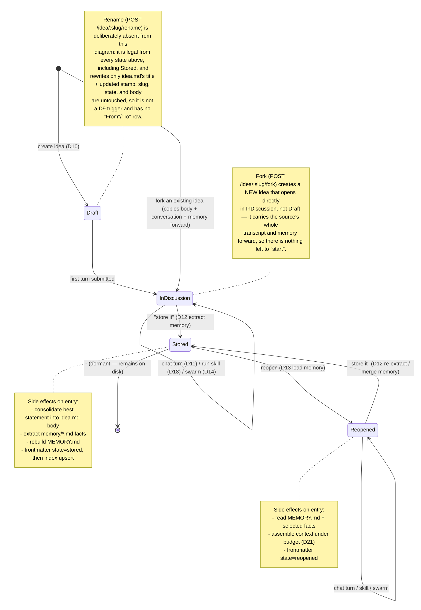

# 04 — Idea Lifecycle State Machine

> The core behavioral model: how an idea moves through its four states, what triggers each
> transition, what guards it, and what side effects fire. Home of **D9**.
> State is canonical in `idea.md` frontmatter ([ADR-0007](./adr/0007-state-in-frontmatter-not-db.md));
> the enum is `domain::idea::IdeaState`.

## The four states

| State (`IdeaState`) | frontmatter | Meaning |
|---------------------|-------------|---------|
| `Draft` | `draft` | Just created. Title + optional seed body. Not yet interrogated. |
| `InDiscussion` | `in_discussion` | The active loop — conversing with the AI, running the idea into the ground; swarms run here. |
| `Stored` | `stored` | Owner declared done. Consolidated writeup written; memory extracted. Dormant but complete. |
| `Reopened` | `reopened` | A `Stored` idea brought back into discussion with its memory reloaded as context. |

## D9 — State diagram

## Transitions (normative table)

| From | To | Trigger | Guard | Side effects (in order) |
|------|----|---------|-------|-------------------------|
| — | `Draft` | Create idea | title non-empty; slug free ([D22](./03-data-model.md)) | create `vault/<slug>/`, write `idea.md` (`state=draft`), index upsert |
| `Draft` | `InDiscussion` | First chat turn | Ollama reachable *or* degraded-notice shown ([D20](./05-ai-integration.md)) | append to `conversation.md`, set `state=in_discussion`, stream reply ([D11](./05-ai-integration.md)) |
| `InDiscussion` | `InDiscussion` | Chat turn / skill / swarm | — | append transcript; skills [D18], swarm [D14] |
| `InDiscussion` | `Stored` | "Store it" | at least one turn exists | consolidate `idea.md` body, extract `memory/*.md` ([D12](./06-concepts/memory.md)), rebuild `MEMORY.md`, `state=stored`, index upsert |
| `Stored` | `Reopened` | Reopen | idea exists | load `MEMORY.md`+facts, budget context ([D21](./06-concepts/swarm.md)), `state=reopened` ([D13](./06-concepts/memory.md)) |
| `Reopened` | `Reopened` | Chat turn / skill / swarm | — | append transcript |
| `Reopened` | `Stored` | "Store it" | — | re-consolidate, **merge** new facts into existing `memory/` (dedupe), rebuild `MEMORY.md`, `state=stored` |
| — | `InDiscussion` | Fork (`POST /idea/:slug/fork`) | source idea exists | create `vault/<new-slug>/` (title `"<source> (fork)"`, slug disambiguated per [D22](./03-data-model.md)), write `idea.md` with the source's body and `state=in_discussion` directly (not `draft`), copy the whole `conversation.md` and every `memory/*.md` fact forward, rebuild `MEMORY.md`, index upsert |

## Invariants

- **State is persisted before it is trusted.** A transition is not complete until `idea.md`
  frontmatter is written; the index copy is a best-effort derivative ([ADR-0007](./adr/0007-state-in-frontmatter-not-db.md)).
- **`conversation.md` is append-only** across every discussion state, with **one deliberate
  exception**: `vault::store::delete_turn` lets the owner explicitly remove a single turn they
  don't want, rewriting the file atomically (tmp + rename). This is a human cleanup action, never
  an automated one — no AI or workflow path ever calls it — and it is distinct from the streaming
  "never persist a partial turn" rule, which still holds absolutely. Storing itself never truncates
  the file.
- **Memory only grows or merges — with one deliberate exception.** Re-storing a `Reopened` idea
  merges/dedupes facts; it does not silently drop prior conclusions. The owner can still explicitly
  delete one accumulated fact (`vault::store::delete_memory_fact`, rebuilds `MEMORY.md`) to shrink
  the context a future reopen reloads — again a human cleanup action, never automatic.
- **`Draft` has no memory.** `memory/` and `MEMORY.md` first appear on the transition to `Stored`
  (or immediately, on a fork of an idea that already has memory).
- **Reopening is idempotent w.r.t. truth.** It reloads context and flips state; it does not rewrite
  the body or memory (those change only on Store).
- **Forking is a copy, not a link.** The fork's `idea.md`/`conversation.md`/`memory/*.md` are
  independent files from the moment of creation; editing or storing either idea afterward never
  touches the other.
- **Rename is orthogonal to D9, on purpose.** `POST /idea/:slug/rename` (docs/09-web-ui.md R23)
  rewrites `idea.md`'s frontmatter `title` + `updated` and nothing else — it is legal from every
  state (including `Stored`) and never appears as a row in the transitions table above because it
  never changes `state`. Crucially it never changes the **slug** either: the slug is the folder
  name, the `[[slug]]` backlink target, and the `/idea/:slug` URL, so retitling an idea can never
  break an existing link or bookmark ([D22](./03-data-model.md)).

## Mapping to code

- Enum + serialized mapping: `domain::idea::IdeaState` and [03-data-model](./03-data-model.md) D8.
- Transition side effects on Store/Reopen live in `memory::extract` / `memory::load`
  ([06-concepts/memory](./06-concepts/memory.md)).
- The web handlers that drive transitions are in `web::routes` ([09-web-ui](./09-web-ui.md), D17).

## Related

- [00-vision](./00-vision.md) — why the loop is shaped this way ("run it into the ground").
- [06-concepts/memory](./06-concepts/memory.md) — D12/D13 detail the Store/Reopen side effects.
