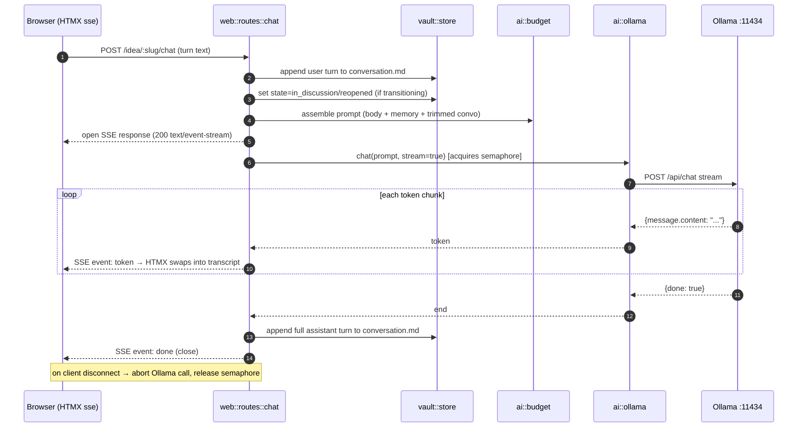
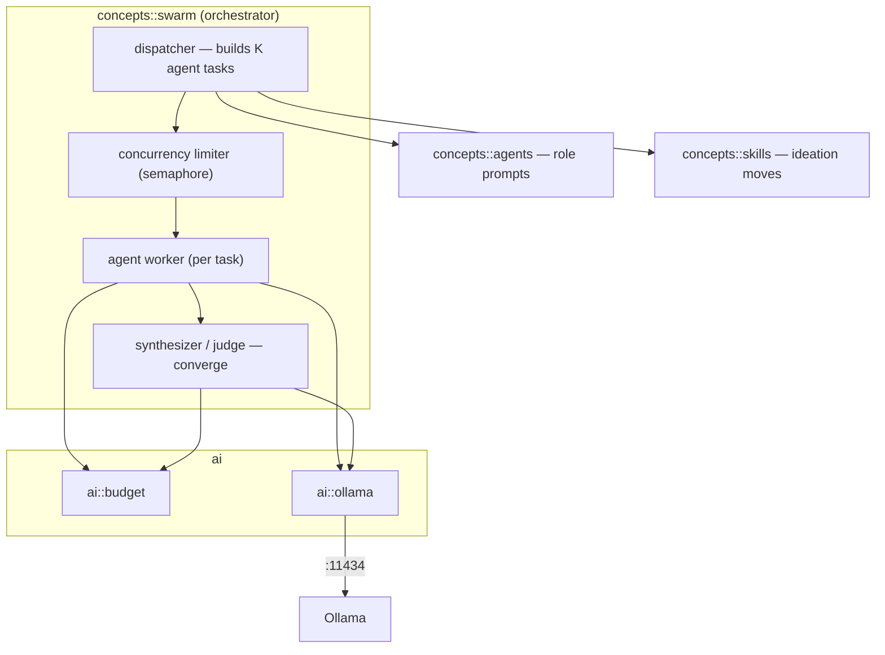
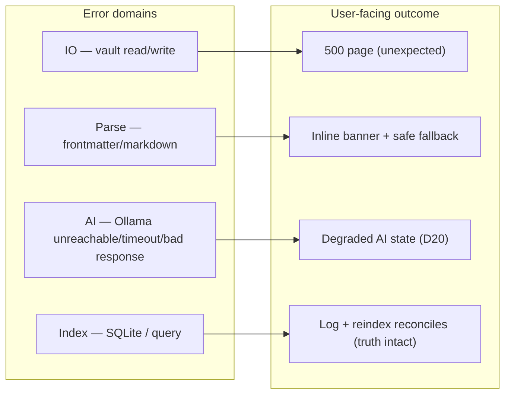

# 05 — AI Integration (Ollama)

> The `ai` module: the single boundary to the local Ollama server, the SSE streaming protocol,
> context budgeting, degradation, and the error taxonomy. Home of **D3** (swarm component view),
> **D11** (chat → Ollama → SSE), **D20** (degradation), **D24** (error taxonomy).
> Decisions: [ADR-0003](./adr/0003-ollama-local-only-ai.md), [ADR-0004](./adr/0004-sse-token-streaming.md).

## The `ai` boundary

`ai` is a **pure model boundary** — it does not touch the vault or index. Callers assemble prompts
(idea body + selected memory + trimmed conversation) and hand them in; `ai` talks HTTP to Ollama and
streams tokens back. This keeps provider concerns in one place ([D4](./02-module-reference.md)).

Submodules:

- `ai::ollama` — HTTP client to `http://localhost:11434` (`/api/chat`, `/api/tags`), plus health
  probe.
- `ai::stream` — adapts Ollama's streaming NDJSON response into an SSE event stream ([D11](#d11--chat--ollama--sse-token-stream)).
- `ai::budget` — assembles a prompt within the model's context limit ([D21](./06-concepts/swarm.md)).

## Ollama client contract

| Purpose | Ollama endpoint | Notes |
|---------|-----------------|-------|
| Health / model list | `GET /api/tags` | used by the boot probe (D25) and degradation (D20) |
| Chat completion (stream) | `POST /api/chat` (`stream: true`) | NDJSON, one token-chunk per line, final line `done: true` |

The client is configured from `config.rs` (base URL, default model, per-request timeout). The base
URL comes from `IDEA_VAULT_OLLAMA_URL` — default `http://localhost:11434` for a bare `cargo run`,
`http://ollama:11434` (compose service DNS) when containerized. **No code path hardcodes
`localhost:11434`** ([12-deployment](./12-deployment.md), [ADR-0008](./adr/0008-containerized-local-deployment.md)).
All calls acquire the process-wide **concurrency semaphore**
([ADR-0006](./adr/0006-bounded-concurrency-swarm.md)) so chat and swarm share one budget.

## D11 — Chat message → Ollama → SSE token stream

The core streaming flow behind every discussion turn. Non-blocking: the transcript updates live.

Key obligations:

- **Persist boundaries:** user turn appended *before* streaming; assistant turn appended *after*
  completion (never mid-stream — a partial turn must not become truth).
- **Disconnect handling:** if the browser closes, abort the Ollama request and release the semaphore.
- **State transition:** the first turn moves `Draft→InDiscussion` (or keeps `Reopened`) per
  [D9](./04-state-machine.md).

## D3 — Swarm/AI component view (C4 Level 3)

Zoom into how `concepts::swarm` uses `ai`. Detailed behavior is [D14](./06-concepts/swarm.md) /
[D21](./06-concepts/swarm.md); this is the static component decomposition.

## D20 — Degradation when Ollama is unavailable or slow

Ollama absence is an **expected state**, not an error path bolted on. The app probes and reflects
status; it never hangs waiting.

```mermaid
stateDiagram-v2
    [*] --> Probing: page load / boot (D25)
    Probing --> Available: GET /api/tags OK, model present
    Probing --> ModelMissing: server up, model not pulled
    Probing --> Absent: connection refused / timeout

    Available --> Slow: request exceeds soft timeout
    Slow --> Available: response arrives
    Slow --> Absent: hard timeout / abort

    Available --> [*]
    ModelMissing --> [*]
    Absent --> [*]

    note right of Absent
        UI: banner "Ollama not reachable — start it with `ollama serve`".
        Compose box disabled for AI turns; vault browsing still works.
    end note
    note right of ModelMissing
        UI: "Pull a model: `ollama pull <model>`".
    end note
    note right of Slow
        UI: keep SSE open, show typing indicator; allow cancel.
    end note
```

Guarantees: browsing/reading the vault works with Ollama down (it needs only vault+index); only AI
actions are gated. No AI call blocks the request thread — all are async with timeouts.

## D24 — Error / failure taxonomy

How each error domain maps to a user-facing outcome. Backs the middleware error mapping
([D16](./09-web-ui.md)) and the tests in [10-testing-strategy](./10-testing-strategy.md).

Principles: **truth-preserving** (index errors never lose vault data — reindex reconciles),
**degrade not crash** for AI, **surface not swallow** for parse errors (show which file/field).

## Related

- [06-concepts/swarm](./06-concepts/swarm.md) — D14 orchestration, D21 concurrency/budget.
- [06-concepts/memory](./06-concepts/memory.md) — extraction/load prompts that use `ai`.
- [09-web-ui](./09-web-ui.md) — D16 middleware, D17 routes (the SSE endpoints).
