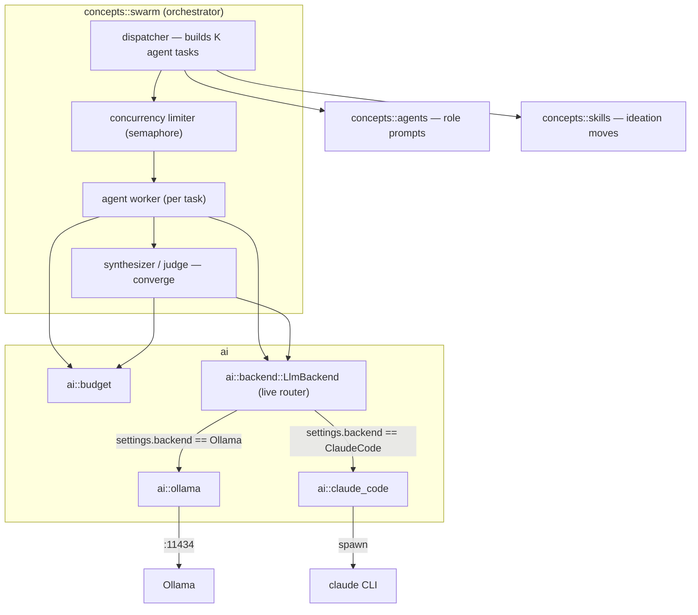
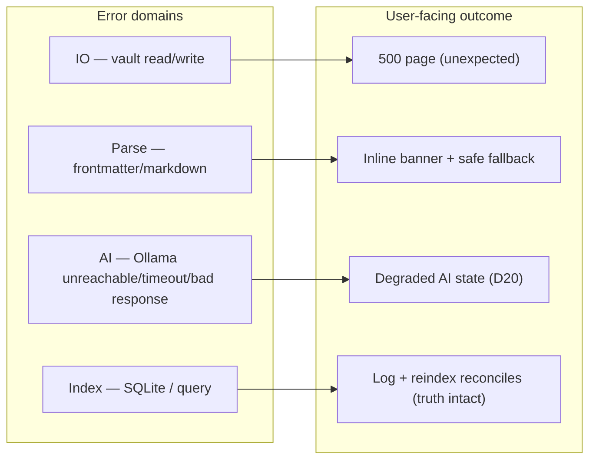

# 05 — AI Integration (Ollama + claude-code)

> The `ai` module: the live-switchable LLM backend boundary (Ollama HTTP client and an agentic
> claude-code client behind one router), context budgeting, degradation, and the error taxonomy.
> Home of **D3** (swarm component view), **D11** (chat → LlmBackend → background job → poll),
> **D20** (degradation), **D24** (error taxonomy).
> Decisions: [ADR-0003](./adr/0003-ollama-local-only-ai.md),
> [ADR-0009](./adr/0009-pluggable-llm-backend-claude-code.md),
> [ADR-0010](./adr/0010-ai-turns-as-background-jobs.md) (supersedes the earlier SSE decision,
> [ADR-0004](./adr/0004-sse-token-streaming.md)),
> [ADR-0011](./adr/0011-live-switchable-llm-backend.md),
> [ADR-0014](./adr/0014-dynamic-context-budget.md) (dynamic per-backend/model context budget).

## The `ai` boundary

`ai` is a **pure model boundary** — it does not touch the vault or index. Callers assemble prompts
(idea body + selected memory + trimmed conversation) and hand them in; `ai` dispatches to whichever
backend is currently active and returns text (or a token stream, for callers that still want one).
This keeps provider concerns in one place ([D4](./02-module-reference.md)).

Submodules:

- `ai::ollama` — HTTP client to the configured Ollama URL (`/api/chat`, `/api/tags`), plus health
  probe.
- `ai::claude_code` — spawns the local `claude` CLI as a one-shot agentic process per turn
  ([ADR-0009](./adr/0009-pluggable-llm-backend-claude-code.md)). Its health probe (`claude
  --version`, 5s bound) `tracing::warn!`-logs the distinct cause of a non-`Available` result —
  spawn error (binary not on PATH), non-zero exit (with captured stderr), or timeout — so
  "unreachable" is diagnosable from the server log rather than collapsing to one opaque state; the
  `AiHealth` contract itself (`Available`/`ModelMissing`/`Unreachable`) is unchanged.
- `ai::backend` — `LlmBackend`, the **live router**: a struct holding both clients plus
  `Arc<RwLock<LlmSettings>>`; every call re-reads the current settings to pick the backend and its
  tuned parameters (Ollama temperature; claude-code model + effort), so the Settings page
  (`GET`/`POST /settings`) can retoggle/retune with no restart
  ([ADR-0011](./adr/0011-live-switchable-llm-backend.md)).
- `ai::budget` — assembles a prompt within the model's context limit ([D21](./06-concepts/swarm.md));
  the limit itself is now derived live per backend/model rather than a fixed constant
  ([ADR-0014](./adr/0014-dynamic-context-budget.md)).

`AppState` holds one `LlmBackend` (`state.llm`); handlers never talk to `OllamaClient` or
`ClaudeCodeClient` directly.

## Ollama client contract

| Purpose | Ollama endpoint | Notes |
|---------|-----------------|-------|
| Health / model list | `GET /api/tags` | used by the boot probe (D25) and degradation (D20) |
| Chat completion (stream) | `POST /api/chat` (`stream: true`) | NDJSON, one token-chunk per line, final line `done: true`. `options.num_ctx` is **always** sent (see below, [ADR-0014](./adr/0014-dynamic-context-budget.md)). |
| Model metadata | `POST /api/show` | queries the configured model's native `context_length` (dynamic context budget); best-effort, 5s timeout, `None` on any failure — never a hard error. |

The client is configured from `config.rs` (base URL, default model, per-request timeout, initial
sampling temperature, initial context-window override). The base URL comes from
`IDEA_VAULT_OLLAMA_URL` — default `http://localhost:11434` for a bare `cargo run`,
`http://ollama:11434` (compose service DNS) when containerized. **No code path hardcodes
`localhost:11434`** ([12-deployment](./12-deployment.md), [ADR-0008](./adr/0008-containerized-local-deployment.md)).
Sampling temperature (`IDEA_VAULT_OLLAMA_TEMPERATURE`, default `0.7`) is only the *initial* value —
the Settings page can retune it live ([ADR-0011](./adr/0011-live-switchable-llm-backend.md)). All
calls acquire the process-wide **concurrency semaphore**
([ADR-0006](./adr/0006-bounded-concurrency-swarm.md)) so chat, skills, and swarm share one budget
regardless of which backend answers.

**Context-window derivation ([ADR-0014](./adr/0014-dynamic-context-budget.md)).** The context
budget is no longer a fixed constant — `LlmBackend::context_window_tokens()` resolves it live per
call: a nonzero per-backend override (`IDEA_VAULT_OLLAMA_CTX_TOKENS` / `IDEA_VAULT_CLAUDE_CTX_TOKENS`,
both initial-only, retunable on `/settings`) wins; otherwise Ollama uses the model's native window
learned from `POST /api/show` (cached by model name; a failed probe is cached too, with a 60s
retry-after, so a persistently failing `/api/show` never taxes every turn with the probe timeout,
and the budget still self-heals on the first dispatch after the backoff) capped at 32,768 tokens (a VRAM guard on `num_ctx` — an explicit override
bypasses it), falling back to 8,192 tokens until the cache has an answer; claude-code derives
200,000 tokens, or 1,000,000 if the model name contains the `1m` marker (case-insensitive), with
**no default cap**. `ContextBudget::for_model_tokens` converts tokens to the byte budget every
consumer (prompt assembly, the usage meter, `memory::compact`'s fold targets) shares.

## D11 — Chat message → LlmBackend → background job → poll

The core flow behind every discussion turn. Non-blocking: the request returns immediately with a
"thinking" indicator; the model call runs in a **detached background job**
([ADR-0010](./adr/0010-ai-turns-as-background-jobs.md)) so navigating away can't kill it.

```mermaid
sequenceDiagram
    autonumber
    participant B as Browser (HTMX, polling)
    participant H as web::routes::chat
    participant J as web::jobs
    participant V as vault::store
    participant Task as detached tokio task
    participant Bud as ai::budget
    participant L as ai::backend::LlmBackend

    B->>H: POST /idea/:slug/chat (turn text)
    H->>J: try_claim(slug) — one job per idea
    H->>V: append user turn to conversation.md (persisted up front)
    H->>V: set state=in_discussion/reopened (if transitioning)
    H-->>B: 200 transcript + "thinking…" indicator (self-repolling)
    H->>Task: tokio::spawn (detached — outlives the request)
    Task->>Bud: assemble prompt (body + memory + trimmed convo)
    Task->>L: chat(prompt) [acquires semaphore; dispatches to the active backend]
    L-->>Task: reply (or AiError)
    alt success, non-empty reply
        Task->>V: append full assistant turn to conversation.md
        Task->>J: mark_done(slug)
    else failure or empty reply
        Task->>J: mark_failed(slug, message)
    end
    loop every ~1.5s until Idle
        B->>H: GET /idea/:slug/pending
        H->>J: peek(slug)
        J-->>H: Running(elapsed_secs) | Failed(msg) | Idle
        H-->>B: re-emit "thinking…" | error block | finished transcript
    end
```

Key obligations:

- **Persist boundaries:** user turn appended *before* the job is spawned (survives navigation);
  assistant turn appended *only after* a complete, non-empty reply (a partial or empty reply must
  never become truth — on failure nothing is written, `mark_failed` just records a message).
- **One job per idea:** `try_claim` refuses a second concurrent job for the same idea; a second
  "Send" while busy just re-shows the in-flight state.
- **Poll, don't hold a connection open:** the indicator is a self-repolling HTMX fragment
  (`hx-get="/idea/:slug/pending" hx-trigger="load delay:1500ms"`) carrying a server-computed
  elapsed-seconds count — there is no long-lived connection to manage or a client disconnect to
  detect.
- **State transition:** the first turn moves `Draft→InDiscussion` (or keeps `Reopened`) per
  [D9](./04-state-machine.md).

Skills (`POST /idea/:slug/skill/:name`) and swarm (`POST /idea/:slug/swarm`) use the identical
claim → spawn → poll shape; see [06-concepts/skills](./06-concepts/skills.md) D18 and
[06-concepts/swarm](./06-concepts/swarm.md) D14.

## D3 — Swarm/AI component view (C4 Level 3)

Zoom into how `concepts::swarm` uses `ai`. Detailed behavior is [D14](./06-concepts/swarm.md) /
[D21](./06-concepts/swarm.md); this is the static component decomposition.



## D20 — Degradation when Ollama is unavailable or slow

Ollama absence is an **expected state**, not an error path bolted on. The app probes and reflects
status; it never hangs waiting.

```mermaid
stateDiagram-v2
    [*] --> Probing: page load / boot (D25)
    Probing --> Available: GET /api/tags OK, model present
    Probing --> ModelMissing: server up, model not pulled
    Probing --> Absent: connection refused / timeout

    Available --> Slow: request exceeds soft timeout
    Slow --> Available: response arrives
    Slow --> Absent: hard timeout / abort

    Available --> [*]
    ModelMissing --> [*]
    Absent --> [*]

    note right of Absent
        UI: banner "Ollama not reachable — start it with `ollama serve`".
        Compose box disabled for AI turns; vault browsing still works.
    end note
    note right of ModelMissing
        UI: "Pull a model: `ollama pull <model>`".
    end note
    note right of Slow
        UI: background job keeps running; the polling "thinking… Ns" indicator
        (ADR-0010) keeps ticking, so a slow reply still reads as alive, not hung.
    end note
```



Guarantees: browsing/reading the vault works with Ollama down (it needs only vault+index); only AI
actions are gated. No AI call blocks the request thread — every AI call runs inside a detached
background job ([ADR-0010](./adr/0010-ai-turns-as-background-jobs.md)) with a hard timeout.

The diagram above is drawn for the Ollama backend (`Absent`'s `ollama serve` copy); the same
`Unreachable` state under the claude-code backend ([ADR-0009](./adr/0009-pluggable-llm-backend-claude-code.md))
shows backend-specific remedy text instead — "the `claude` CLI isn't runnable — check it's
installed and on the server's PATH, or set `IDEA_VAULT_CLAUDE_BIN` to its absolute path" — per
ADR-0011's "health/model-label reporting follows the toggle" guarantee. Operationally: a **native**
(non-container) run's server process often has a narrower `PATH` than an interactive shell, so set
`IDEA_VAULT_CLAUDE_BIN` to an absolute path if the claude backend reports `Unreachable` (see
`.env.example`).

## D24 — Error / failure taxonomy

How each error domain maps to a user-facing outcome. Backs the middleware error mapping
([D16](./09-web-ui.md)) and the tests in [10-testing-strategy](./10-testing-strategy.md).



Principles: **truth-preserving** (index errors never lose vault data — reindex reconciles),
**degrade not crash** for AI, **surface not swallow** for parse errors (show which file/field).

## Related

- [06-concepts/swarm](./06-concepts/swarm.md) — D14 orchestration, D21 concurrency/budget.
- [06-concepts/memory](./06-concepts/memory.md) — extraction/load prompts that use `ai`.
- [09-web-ui](./09-web-ui.md) — D16 middleware, D17 routes (the chat/skill/swarm + pending endpoints).
- [ADR-0010](./adr/0010-ai-turns-as-background-jobs.md) — background-job model (supersedes SSE).
- [ADR-0011](./adr/0011-live-switchable-llm-backend.md) — live backend router + Settings page.
- [ADR-0014](./adr/0014-dynamic-context-budget.md) — dynamic per-backend/model context budget (`/api/show`, `num_ctx`, overrides).
