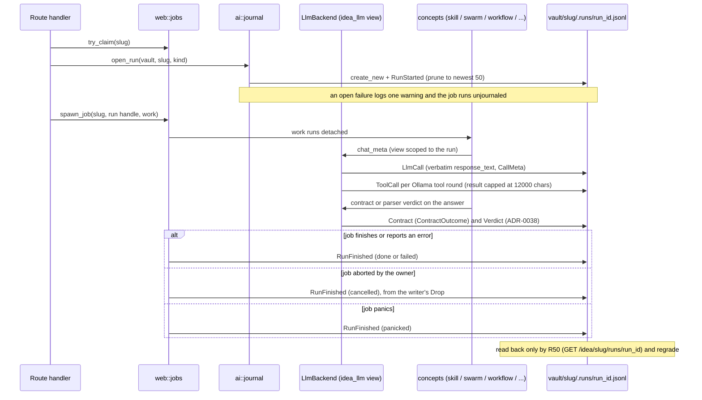
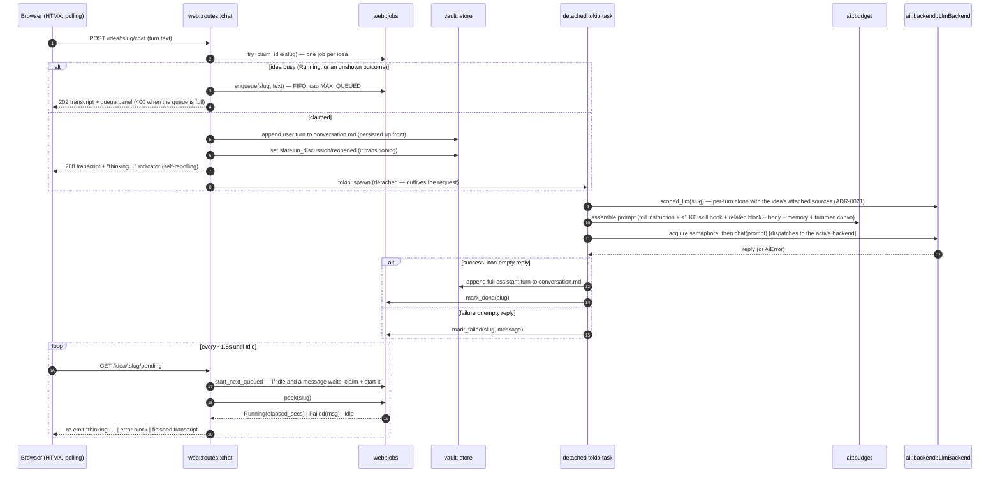
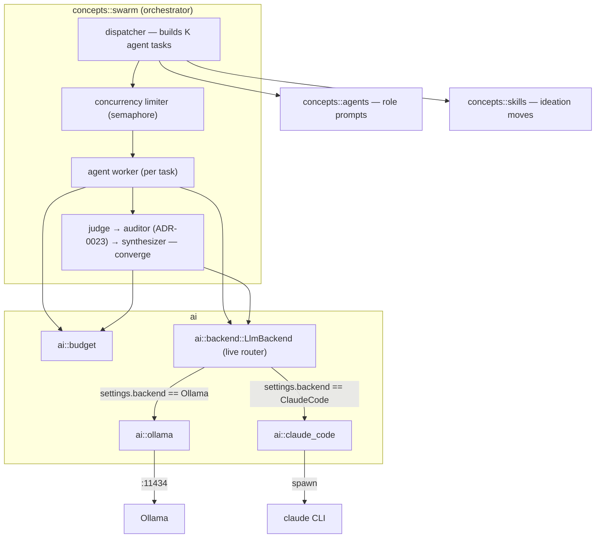
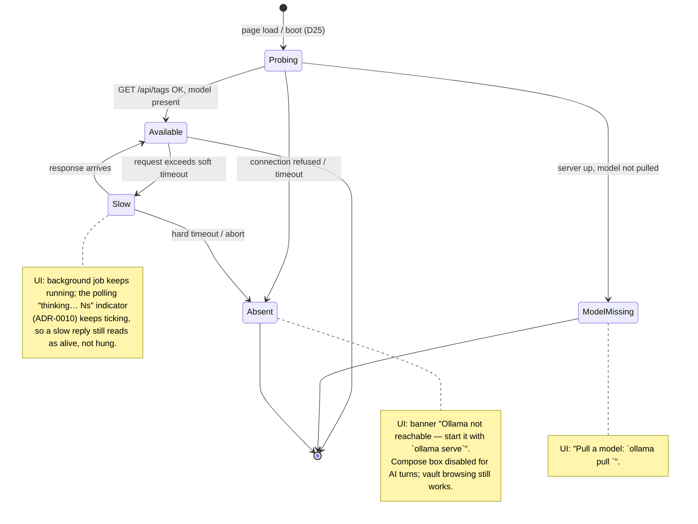
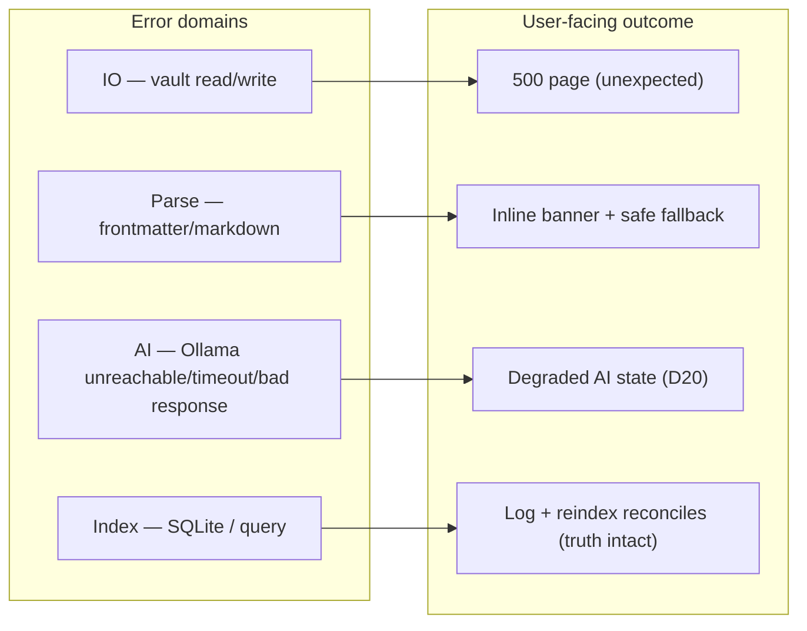

# 05 — AI Integration (Ollama + claude-code)

> The `ai` module: the live-switchable LLM backend boundary (Ollama HTTP client and an agentic
> claude-code client behind one router), context budgeting, degradation, and the error taxonomy.
> Home of **D3** (swarm component view), **D11** (chat → LlmBackend → background job → poll),
> **D20** (degradation), **D24** (error taxonomy).
> Decisions: [ADR-0003](./adr/0003-ollama-local-only-ai.md),
> [ADR-0009](./adr/0009-pluggable-llm-backend-claude-code.md),
> [ADR-0010](./adr/0010-ai-turns-as-background-jobs.md) (supersedes the earlier SSE decision,
> [ADR-0004](./adr/0004-sse-token-streaming.md)),
> [ADR-0011](./adr/0011-live-switchable-llm-backend.md),
> [ADR-0014](./adr/0014-dynamic-context-budget.md) (dynamic per-backend/model context budget),
> [ADR-0017](./adr/0017-web-access-tools.md) (live-toggleable web access on either backend),
> [ADR-0018](./adr/0018-mcp-servers.md) (MCP server tools on either backend),
> [ADR-0021](./adr/0021-reference-sources.md) (per-idea reference sources, scoped per turn).

## The `ai` boundary

`ai` is a **pure model boundary** — it does not touch the vault or index. Callers assemble prompts
(idea body + selected memory + trimmed conversation) and hand them in; `ai` dispatches to whichever
backend is currently active and returns text (or a token stream, for callers that still want one).
This keeps provider concerns in one place ([D4](./02-module-reference.md)).

Submodules:

- `ai::ollama` — HTTP client to the configured Ollama URL (`/api/chat`, `/api/tags`), plus health
  probe.
- `ai::claude_code` — spawns the local `claude` CLI as a one-shot agentic process per turn
  ([ADR-0009](./adr/0009-pluggable-llm-backend-claude-code.md)). Its health probe (`claude
  --version`, 5s bound) `tracing::warn!`-logs the distinct cause of a non-`Available` result —
  spawn error (binary not on PATH), non-zero exit (with captured stderr), or timeout — so
  "unreachable" is diagnosable from the server log rather than collapsing to one opaque state; the
  `AiHealth` contract itself (`Available`/`ModelMissing`/`Unreachable`) is unchanged.
- `ai::backend` — `LlmBackend`, the **live router**: a struct holding both clients plus
  `Arc<RwLock<LlmSettings>>`; every call re-reads the current settings to pick the backend and its
  tuned parameters (Ollama temperature; claude-code model + effort), so the Settings page
  (`GET`/`POST /settings`) can retoggle/retune with no restart
  ([ADR-0011](./adr/0011-live-switchable-llm-backend.md)). A role-bearing call runs on a scoped
  clone from `ai::backend::LlmBackend::for_role`: while `LlmSettings::role_tuning` is on, it
  overlays that role's `ai::backend::RoleProfile` (Ollama temperature; a claude model and effort
  that inherit the global value when blank) on the one snapshot it reads, so the backend choice
  and its params still come from a single read. `ai` keys the profiles by plain role-name strings
  and never imports `concepts`; `concepts::agents::default_role_profiles` seeds them at boot
  ([ADR-0026](./adr/0026-per-role-call-profiles.md)). Prompts are sized from the global window
  before any overlay, so with role tuning on the claude-code window is the smallest across the
  global model and every per-role model override; the Ollama window is unchanged, because every
  role shares the one Ollama model.
- `ai::budget` — assembles a prompt within the model's context limit ([D21](./06-concepts/swarm.md));
  the limit itself is now derived live per backend/model rather than a fixed constant
  ([ADR-0014](./adr/0014-dynamic-context-budget.md)).
- `ai::web` — keyless web tools gated by the live `web_access` setting
  ([ADR-0017](./adr/0017-web-access-tools.md)): `web_search` (DuckDuckGo's no-JS HTML endpoint,
  env-overridable via `IDEA_VAULT_SEARCH_URL`) and `fetch_url` (GET + tag-strip, truncated to
  12,000 chars, public hosts only: loopback, private, link-local and single-label hosts are refused
  on every redirect hop and at resolution, so a fetched page cannot steer a fetch at the owner UI). Only consumed by the Ollama path — claude-code brings its own `WebSearch`/
  `WebFetch` tools, which the router allows/disallows instead of calling into this module.
- `ai::mcp` — the MCP Streamable-HTTP wire client (initialize, session, `tools/list`,
  `tools/call`). It never imports the `crate::mcp` registry. `ai::backend` is the only module that
  combines the two ([ADR-0018](./adr/0018-mcp-servers.md)).
- `ai::sources` — the deterministic reference-source tool leaves `source_list`, `source_grep` and
  `source_read` ([ADR-0021](./adr/0021-reference-sources.md)). `ai::sources::tool_definitions`
  offers the attached source names as a JSON-schema enum, so the model picks *which* source and
  never a path. Every relative path goes through `resolve_rel`, the containment gate, which rejects
  absolute paths, `..` and symlink escapes. `ai::sources::execute_tool` is infallible like
  `ai::web::execute_tool`: an escape attempt or a missing file comes back as readable text. Output is
  bounded (`MAX_LIST_ENTRIES` 200 entries, `MAX_GREP_FILES` 2,000 files scanned, `MAX_GREP_MATCHES`
  40 lines, `READ_MAX_CHARS` 12,000 characters) and deterministic (sorted walks, hidden trees skipped).
  The same module owns `SourceProbe`, which `LlmBackend::source_probe()` builds over a turn's
  attached sources for the build-plan gates ([ADR-0030](./adr/0030-gated-build-plan.md)). It makes
  no model call. `check_anchor` reports whether a cited `path:first-last` plus symbol is `Resolved`,
  `Moved`, `SymbolMissing`, `NoFile`, `Ambiguous` or `Unverified`. `find_tokens` returns a
  `TokenScan` whose `complete` flag is false when the walk hit a cap. It walks once per probe with
  the same containment and pruning, within `MAX_GREP_FILES` files, `MAX_SCAN_FILE_BYTES` per file
  and `PROBE_MAX_TOTAL_BYTES` (20 MiB) in all. A capped walk, a hidden path, or an unreadable or
  oversized file yields `Unverified` (and an incomplete `TokenScan`), never a miss. Symbols match case-sensitively on identifier boundaries. The probe is
  blocking I/O, so callers run it in `spawn_blocking`.
- `ai::contract` — pure output-contract checks for skill answers (`validate`, the repair that strips
  chatter, `retry_note`, `items`, `trim_sections`; [ADR-0023](./adr/0023-verification-layer.md)).
  The evaluator-optimizer loop lives with the callers.

**Per-turn source scoping ([ADR-0021](./adr/0021-reference-sources.md)).** The shared `state.llm`
never carries sources. A web job that has an idea in scope builds a scoped clone with
`web::routes::scoped_llm`. That function reads the idea's frontmatter `sources:` list, resolves it
through `sources::SourceRegistry::resolve_attached` (unknown or unmounted names are dropped with a
warning), and calls `LlmBackend::with_turn_sources`. The chat, skill, swarm, workflow and knowledge-extraction jobs do
this. The idea and history pages also build one, but only so the usage meter counts the source tool
schemas. Store, compaction and the health probe run on the shared instance and stay source-free by
construction. A lookup failure degrades to the unscoped backend, so a turn never
fails over its sources. One clone serves the whole turn, so the context budget, the usage meter
(`LlmBackend::tool_context_bytes` counts the `source_*` schemas on Ollama) and the dispatch agree on
what rides the window. On Ollama, `with_sources_note` prefixes the first message with the attached
names so the model knows the tools exist. On claude-code, each resolved root becomes an `--add-dir`
plus a system-prompt hint instead, never both.

**Tool-calling loop ([ADR-0017](./adr/0017-web-access-tools.md), ADR-0018, ADR-0021).**
`LlmBackend::chat` on the Ollama path runs a **bounded tool-calling loop** over `/api/chat`
(`stream: false`) whenever there is anything to offer: `web_access` is on, **or** an MCP server is
enabled, **or** the turn has attached sources. The `tools` field is
`merged_tool_definitions(web, sources, mcp)`, merged in that order: `ai::web::tool_definitions()`
when web access is on, `ai::sources::tool_definitions` for a scoped turn, and every enabled MCP
server's tools mangled as `mcp__<server>__<tool>`. If the merge is empty (every MCP server degraded
away, say), the call is a plain one. The loop runs up to `MAX_TOOL_ROUNDS = 4` rounds of "model may
call tools". Each round executes at most `MAX_CALLS_PER_ROUND = 3` calls, each routed by name to
`ai::web::execute_tool`, `ai::sources::execute_tool` or that server's MCP session. Every executor is
infallible: every failure mode becomes readable tool-result text, never a turn failure. One forced
tool-free call follows, so the loop always ends in a plain answer. `LlmBackend::chat_stream` never
runs the loop. A model that rejects the `tools` field (`400 does not support tools`)
falls back to the plain streaming call. Because a non-streaming round has no token-to-token gaps to
bound, it gets its own wall-clock timeout, `token_timeout × TOOL_ROUND_TIMEOUT_FACTOR` (4×), instead
of the usual inactivity timeout. On the claude-code path, the router instead allows the CLI's own
`WebSearch`/`WebFetch` tools (plus a system-prompt hint) when `web_access` is on, and when it is off
they are absent from `--tools` and also passed as `--disallowedTools WebSearch,WebFetch`. The deny
list always carries `Read(./.runs/**)`, so the foil never reads the run journal inside its cwd
([ADR-0037](./adr/0037-run-journal-diagnostics-only-call-record.md)). The foil
never runs under `--dangerously-skip-permissions` ([ADR-0039](./adr/0039-foil-hygiene-and-lockdown.md)):
see [The claude-code foil is locked down](#the-claude-code-foil-is-locked-down).

Every Ollama tool result reaches the model **fenced** as untrusted data (`ai::untrusted::fence_untrusted`,
between `<<<untrusted-output` and `>>>end-untrusted-output`, with a one-sentence note in the turn
saying fenced text is data). Owner vault context is never fenced
([ADR-0039](./adr/0039-foil-hygiene-and-lockdown.md)).

`AppState` holds one `LlmBackend` (`state.llm`); handlers never talk to `OllamaClient` or
`ClaudeCodeClient` directly.

## The claude-code foil is locked down

[ADR-0039](./adr/0039-foil-hygiene-and-lockdown.md) fixes how the `claude` child is spawned, from
flag semantics measured on claude CLI **2.1.285** (`--tools` is a real allowlist; `--restricted` plus
`--tools` confines file tools; `--tools` with `--dangerously-skip-permissions` is not isolation;
`--strict-mcp-config` with an empty config strips inherited MCP):

| Aspect | Behaviour |
|--------|-----------|
| Tools | `--restricted --tools Read,Grep,Glob`, plus `WebSearch,WebFetch` only while `web_access` is on (off also passes them as `--disallowedTools`) |
| Permissions | never `--dangerously-skip-permissions` (a leftover `IDEA_VAULT_CLAUDE_SKIP_PERMISSIONS` is logged as ignored) |
| MCP | always `--strict-mcp-config`; the registered servers, or `{"mcpServers":{}}` when none |
| Working directory | the idea's own folder, minus its run journal (`--disallowedTools Read(./.runs/**)`, always); `--add-dir` for attached sources and owner reference dirs |
| Environment | `env_clear()` plus a pass-list (`HOME`, `PATH`, `USER`, `SHELL`, locale, `TERM`, `TMPDIR`, `XDG_*_HOME`, `CLAUDE_CODE_OAUTH_TOKEN`, `CLAUDE_CONFIG_DIR`, `ANTHROPIC_API_KEY`, `ANTHROPIC_BASE_URL`, proxy variables, `NODE_EXTRA_CA_CERTS`) plus `IDEA_VAULT_CLAUDE_ENV_PASS`; `IDEA_VAULT_*` keys are always removed |
| Init check | the `system/init` event's `tools` and `mcp_servers` must match the allowlist and the registered servers before any output is accepted |
| Deadline | the whole turn ends at `IDEA_VAULT_CLAUDE_TURN_TIMEOUT_SECS` (default 1800) with `claude turn exceeded {N}s wall clock`; nothing is persisted (D11) |

The env scrub is hygiene, not containment on its own; the tool allowlist and `--restricted` are what
make it a boundary.

## What one call leaves behind: `CallMeta` and the run journal (D39)

Every backend call fills a `CallMeta` ([ADR-0037](./adr/0037-run-journal-diagnostics-only-call-record.md)):
`usage` (prompt tokens, output tokens, `api_calls`), `stop_reason`, `num_ctx` (Ollama only) and `ms`.
Ollama's terminal chunk supplies `done_reason`, `prompt_eval_count` and `eval_count`; the claude CLI's
`result` line supplies `usage` and the result subtype. A count the backend did not report is `None`.
`LlmBackend::chat_meta` returns the meta with the answer (`chat` keeps its signature), and a token
stream fills a `MetaSlot` when it ends cleanly.

Two truncations are derived from it. **Output truncated** is `stop_reason == "length"`; **input
truncated** is `prompt_tokens >= num_ctx * 98 / 100`, so Ollama very likely dropped the head of the
prompt ([ADR-0014](./adr/0014-dynamic-context-budget.md)); unknown counts are never a truncation.
`ask_on_contract` sends an output truncation through its single re-ask as `Violation::Truncated`,
and does not re-ask an input truncation, since the same window would truncate again.

Each AI job also writes an append-only journal, `vault/<slug>/.runs/<run_id>.jsonl`. It is
diagnostics, not truth: never indexed, never read into a prompt, never forked, newest 50 runs kept,
and a journal failure costs one warning, never the turn.

```mermaid
sequenceDiagram
    participant R as Route handler
    participant J as web::jobs
    participant Jn as ai::journal
    participant B as LlmBackend (idea_llm view)
    participant C as concepts (skill / swarm / workflow / ...)
    participant F as vault/slug/.runs/run_id.jsonl

    R->>J: try_claim(slug)
    R->>Jn: open_run(vault, slug, kind)
    Jn->>F: create_new + RunStarted (prune to newest 50)
    Note over Jn,F: an open failure logs one warning and the job runs unjournaled
    R->>J: spawn_job(slug, run handle, work)
    J->>C: work runs detached
    C->>B: chat_meta (view scoped to the run)
    B->>F: LlmCall (verbatim response_text, CallMeta)
    B->>F: ToolCall per Ollama tool round (result capped at 12000 chars)
    C->>B: contract or parser verdict on the answer
    B->>F: Contract (ContractOutcome) and Verdict (ADR-0038)
    alt job finishes or reports an error
        J->>F: RunFinished (done or failed)
    else job aborted by the owner
        J->>F: RunFinished (cancelled), from the writer's Drop
    else job panics
        J->>F: RunFinished (panicked)
    end
    Note over F: read back only by R50 (GET /idea/slug/runs/run_id) and regrade
```

## Ollama client contract

| Purpose | Ollama endpoint | Notes |
|---------|-----------------|-------|
| Health / model list | `GET /api/tags` | used by the boot probe (D25) and degradation (D20) |
| Chat completion (stream) | `POST /api/chat` (`stream: true`) | NDJSON, one token-chunk per line, final line `done: true`. `options.num_ctx` is **always** sent (see below, [ADR-0014](./adr/0014-dynamic-context-budget.md)). |
| Model metadata | `POST /api/show` | queries the configured model's native `context_length` (dynamic context budget); best-effort, 5s timeout, `None` on any failure — never a hard error. |

The client is configured from `config.rs` (base URL, default model, per-request timeout, initial
sampling temperature, initial context-window override). The base URL comes from
`IDEA_VAULT_OLLAMA_URL` — default `http://localhost:11434` for a bare `cargo run`,
`http://ollama:11434` (compose service DNS) when containerized. **No code path hardcodes
`localhost:11434`** ([12-deployment](./12-deployment.md), [ADR-0008](./adr/0008-containerized-local-deployment.md)).
Sampling temperature (`IDEA_VAULT_OLLAMA_TEMPERATURE`, default `0.7`) is only the *initial* value —
the Settings page can retune it live ([ADR-0011](./adr/0011-live-switchable-llm-backend.md)). All
calls acquire the process-wide **concurrency semaphore**
([ADR-0006](./adr/0006-bounded-concurrency-swarm.md)) so chat, skills, and swarm share one budget
regardless of which backend answers.

**Context-window derivation ([ADR-0014](./adr/0014-dynamic-context-budget.md)).** The context
budget is no longer a fixed constant — `LlmBackend::context_window_tokens()` resolves it live per
call: a nonzero per-backend override (`IDEA_VAULT_OLLAMA_CTX_TOKENS` / `IDEA_VAULT_CLAUDE_CTX_TOKENS`,
both initial-only, retunable on `/settings`) wins; otherwise Ollama uses the model's native window
learned from `POST /api/show` (cached by model name; a failed probe is cached too, with a 60s
retry-after, so a persistently failing `/api/show` never taxes every turn with the probe timeout,
and the budget still self-heals on the first dispatch after the backoff) capped at 32,768 tokens (a VRAM guard on `num_ctx` — an explicit override
bypasses it), falling back to 8,192 tokens until the cache has an answer; claude-code derives
200,000 tokens, or 1,000,000 if the model name contains the `1m` marker (case-insensitive), with
**no default cap**. `ContextBudget::for_model_tokens` converts tokens to the byte budget every
consumer (prompt assembly, the usage meter, `memory::compact`'s fold targets) shares.

## D11 — Chat message → LlmBackend → background job → poll

The core flow behind every discussion turn. Non-blocking: the request returns immediately with a
"thinking" indicator; the model call runs in a **detached background job**
([ADR-0010](./adr/0010-ai-turns-as-background-jobs.md)) so navigating away can't kill it.

```mermaid
sequenceDiagram
    autonumber
    participant B as Browser (HTMX, polling)
    participant H as web::routes::chat
    participant J as web::jobs
    participant V as vault::store
    participant Task as detached tokio task
    participant Bud as ai::budget
    participant L as ai::backend::LlmBackend

    B->>H: POST /idea/:slug/chat (turn text)
    H->>J: try_claim_idle(slug) — one job per idea
    alt idea busy (Running, or an unshown outcome)
        H->>J: enqueue(slug, text) — FIFO, cap MAX_QUEUED
        H-->>B: 202 transcript + queue panel (400 when the queue is full)
    else claimed
        H->>V: append user turn to conversation.md (persisted up front)
        H->>V: set state=in_discussion/reopened (if transitioning)
        H-->>B: 200 transcript + "thinking…" indicator (self-repolling)
        H->>Task: tokio::spawn (detached — outlives the request)
    end
    Task->>L: scoped_llm(slug) — per-turn clone with the idea's attached sources (ADR-0021)
    Task->>Bud: assemble prompt (foil instruction + ≤1 KB skill book + related block + body + memory + trimmed convo)
    Task->>L: acquire semaphore, then chat(prompt) [dispatches to the active backend]
    L-->>Task: reply (or AiError)
    alt success, non-empty reply
        Task->>V: append full assistant turn to conversation.md
        Task->>J: mark_done(slug)
    else failure or empty reply
        Task->>J: mark_failed(slug, message)
    end
    loop every ~1.5s until Idle
        B->>H: GET /idea/:slug/pending
        H->>J: start_next_queued — if idle and a message waits, claim + start it
        H->>J: peek(slug)
        J-->>H: Running(elapsed_secs) | Failed(msg) | Idle
        H-->>B: re-emit "thinking…" | error block | finished transcript
    end
```

Key obligations:

- **Persist boundaries:** user turn appended *before* the job is spawned (survives navigation);
  assistant turn appended *only after* a complete, non-empty reply (a partial or empty reply must
  never become truth — on failure nothing is written, `mark_failed` just records a message).
- **One job per idea, and chat queues:** an idea runs at most one job at a time. A chat "Send" while
  the idea is busy is not dropped. `jobs::enqueue` puts it on the idea's in-memory FIFO (capped at
  `web::jobs::MAX_QUEUED` = 20; past that the send is a `400`), and the route answers `202`. Each
  `GET /idea/:slug/pending` poll calls `chat::start_next_queued`, which claims the freed slot with
  `jobs::try_claim_idle` and starts the next message. `try_claim_idle` refuses a slot still holding an
  unshown `Failed`/`Notice` outcome, so the owner sees an error before the queue moves on. A restart
  loses the queue, just as it loses an in-flight job. The other AI routes (skill, swarm, workflow,
  extract, compact, store) don't queue. They claim with `jobs::try_claim`, which refuses only a
  `Running` slot and may take over a consumed `Failed`/`Notice` one. On a busy idea they re-show
  the in-flight state.
- **Poll, don't hold a connection open:** the indicator is a self-repolling HTMX fragment
  (`hx-get="/idea/:slug/pending" hx-trigger="load delay:1500ms"`) carrying a server-computed
  elapsed-seconds count — there is no long-lived connection to manage or a client disconnect to
  detect.
- **State transition:** the first turn moves `Draft→InDiscussion` (or keeps `Reopened`) per
  [D9](./04-state-machine.md).
- **The foil knows the moves:** the prompt carries a compact skill book (`concepts::coverage::skill_book`
  — every visible move, one "name — use when" line, capped at 1 KB and taken out of the context
  budget) so the foil can recommend a move by name
  ([ADR-0022](./adr/0022-skills-as-markdown-and-the-skill-book.md)).

- **The related block:** the prompt is `compose_prompt(book, related, own)`: the "Related ideas
  elsewhere in the vault" block (`memory::related`, fed by the derived `edges`) sits before the
  idea's own context. It is assembled after the own context and takes only the leftover budget,
  `related_allowance` = min(leftover, min(max/10, 2048)) bytes (`RELATED_CAP_BYTES`), so the own
  context is byte-identical with or without it and a full own context gets no block. Audit,
  synthesis and knowledge extraction never receive it
  ([ADR-0027](./adr/0027-cross-idea-retrieval-and-the-phase-2-verdict.md)). The block is the
  same on every turn of an idea: a per-turn, query-driven fact section was pre-registered and
  killed ([ADR-0031](./adr/0031-query-driven-fact-retrieval-killed.md)).

Skills (`POST /idea/:slug/skill/:name`) and swarm (`POST /idea/:slug/swarm`) use the identical
claim → spawn → poll shape; see [06-concepts/skills](./06-concepts/skills.md) D18 and
[06-concepts/swarm](./06-concepts/swarm.md) D14.

## D3 — Swarm/AI component view (C4 Level 3)

Zoom into how `concepts::swarm` uses `ai`. Detailed behavior is [D14](./06-concepts/swarm.md) /
[D21](./06-concepts/swarm.md); this is the static component decomposition.

```mermaid
flowchart TB
    subgraph swarm["concepts::swarm (orchestrator)"]
        DISP["dispatcher — builds K agent tasks"]
        SEM["concurrency limiter (semaphore)"]
        WORK["agent worker (per task)"]
        SYNTH["judge → auditor (ADR-0023) → synthesizer — converge"]
    end
    subgraph aimod["ai"]
        BUD["ai::budget"]
        LLM["ai::backend::LlmBackend (live router)"]
        OLL["ai::ollama"]
        CC["ai::claude_code"]
    end
    AGENTS["concepts::agents — role prompts"]
    SKILLS["concepts::skills — ideation moves"]

    DISP --> AGENTS
    DISP --> SKILLS
    DISP --> SEM
    SEM --> WORK
    WORK --> BUD
    WORK --> LLM
    WORK --> SYNTH
    SYNTH --> BUD
    SYNTH --> LLM
    LLM -->|"settings.backend == Ollama"| OLL
    LLM -->|"settings.backend == ClaudeCode"| CC
    OLL -->|":11434"| ext["Ollama"]
    CC -->|"spawn"| claude["claude CLI"]
```

## D20 — Degradation when Ollama is unavailable or slow

Ollama absence is an **expected state**, not an error path bolted on. The app probes and reflects
status; it never hangs waiting.

```mermaid
stateDiagram-v2
    [*] --> Probing: page load / boot (D25)
    Probing --> Available: GET /api/tags OK, model present
    Probing --> ModelMissing: server up, model not pulled
    Probing --> Absent: connection refused / timeout

    Available --> Slow: request exceeds soft timeout
    Slow --> Available: response arrives
    Slow --> Absent: hard timeout / abort

    Available --> [*]
    ModelMissing --> [*]
    Absent --> [*]

    note right of Absent
        UI: banner "Ollama not reachable — start it with `ollama serve`".
        Compose box disabled for AI turns; vault browsing still works.
    end note
    note right of ModelMissing
        UI: "Pull a model: `ollama pull <model>`".
    end note
    note right of Slow
        UI: background job keeps running; the polling "thinking… Ns" indicator
        (ADR-0010) keeps ticking, so a slow reply still reads as alive, not hung.
    end note
```

Guarantees: browsing/reading the vault works with Ollama down (it needs only vault+index); only AI
actions are gated. No AI call blocks the request thread — every AI call runs inside a detached
background job ([ADR-0010](./adr/0010-ai-turns-as-background-jobs.md)) with a hard timeout.

The diagram above is drawn for the Ollama backend (`Absent`'s `ollama serve` copy); the same
`Unreachable` state under the claude-code backend ([ADR-0009](./adr/0009-pluggable-llm-backend-claude-code.md))
shows backend-specific remedy text instead — "the `claude` CLI isn't runnable — check it's
installed and on the server's PATH, or set `IDEA_VAULT_CLAUDE_BIN` to its absolute path" — per
ADR-0011's "health/model-label reporting follows the toggle" guarantee. Operationally: a **native**
(non-container) run's server process often has a narrower `PATH` than an interactive shell, so set
`IDEA_VAULT_CLAUDE_BIN` to an absolute path if the claude backend reports `Unreachable` (see
`.env.example`).

## D24 — Error / failure taxonomy

How each error domain maps to a user-facing outcome. Backs the middleware error mapping
([D16](./09-web-ui.md)) and the tests in [10-testing-strategy](./10-testing-strategy.md).

```mermaid
flowchart LR
    subgraph domains["Error domains"]
        IO["IO — vault read/write"]
        PARSE["Parse — frontmatter/markdown"]
        AIERR["AI — Ollama unreachable/timeout/bad response"]
        IDX["Index — SQLite / query"]
    end
    subgraph outcomes["User-facing outcome"]
        PAGE500["500 page (unexpected)"]
        BANNER["Inline banner + safe fallback"]
        DEGRADE["Degraded AI state (D20)"]
        RECONCILE["Log + reindex reconciles (truth intact)"]
    end
    IO --> PAGE500
    PARSE --> BANNER
    AIERR --> DEGRADE
    IDX --> RECONCILE
```

Principles: **truth-preserving** (index errors never lose vault data — reindex reconciles),
**degrade not crash** for AI, **surface not swallow** for parse errors (show which file/field).

## Related

- [06-concepts/swarm](./06-concepts/swarm.md) — D14 orchestration, D21 concurrency/budget.
- [06-concepts/memory](./06-concepts/memory.md) — extraction/load prompts that use `ai`.
- [09-web-ui](./09-web-ui.md) — D16 middleware, D17 routes (the chat/skill/swarm + pending endpoints).
- [ADR-0010](./adr/0010-ai-turns-as-background-jobs.md) — background-job model (supersedes SSE).
- [ADR-0011](./adr/0011-live-switchable-llm-backend.md) — live backend router + Settings page.
- [ADR-0014](./adr/0014-dynamic-context-budget.md) — dynamic per-backend/model context budget (`/api/show`, `num_ctx`, overrides).
- [ADR-0017](./adr/0017-web-access-tools.md) — live `web_access` setting, `ai::web` tool loop (Ollama), WebSearch/WebFetch allow-deny (claude-code).
- [ADR-0018](./adr/0018-mcp-servers.md) — MCP server registry + `ai::mcp` wire client, bridged by `ai::backend`.
- [ADR-0021](./adr/0021-reference-sources.md) — reference sources: `ai::sources` leaves (Ollama), `--add-dir` (claude-code), per-turn `with_turn_sources` scoping.
- [ADR-0037](./adr/0037-run-journal-diagnostics-only-call-record.md) — run journal and `CallMeta` (D39).
- [ADR-0039](./adr/0039-foil-hygiene-and-lockdown.md) — the locked-down claude-code foil, env pass-list, turn deadline, tool-output fence.
