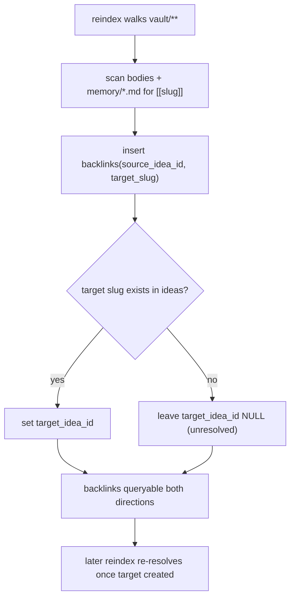

# 06 — Concept: Memory

> The feature that makes an idea *resumable*: distil durable facts when an idea is **Stored**, reload
> them as context when it is **Reopened**. Mirrors an LLM agent's file-based memory. Home of **D12**
> (extraction), **D13** (reload), **D23** (backlink resolution). Module: `memory`.

## Model

- A **memory fact** is one durable conclusion about an idea: a single file `memory/<fact-slug>.md`
  with frontmatter + a short body. One fact per file — small, atomic, individually linkable.
- **`MEMORY.md`** is a one-line-per-fact index, loaded as the cheap always-on context when an idea
  reopens (the fact bodies are pulled in selectively under budget).
- Facts may reference other ideas with `[[slug]]` links, resolved into the `backlinks` table on
  reindex ([D23](#d23--slug-backlink-resolution)).

This deliberately matches the agent-harness convention: file-per-fact, a loaded index, `[[slug]]`
cross-links — see [00-vision](../00-vision.md).

## D12 — Store → memory extraction

Fires on the `InDiscussion→Stored` (or `Reopened→Stored`) transition ([D9](../04-state-machine.md)).
Consolidates the idea and distils memory. Like every other model-calling route, the two AI calls
run as a detached, claim-guarded **background job** ([ADR-0010](../adr/0010-ai-turns-as-background-jobs.md)):
the request returns immediately with the transcript + a "thinking" indicator, and the owner-visible
Stored view only appears once the job lands and the browser's next poll picks up the state flip.

```mermaid
sequenceDiagram
    autonumber
    participant U as Owner ("store it")
    participant H as web::routes::memory (store)
    participant J as web::jobs
    participant Task as detached tokio task
    participant Ex as memory::extract
    participant AI as ai (Ollama)
    participant V as vault::store
    participant Idx as index
    participant B as Browser (HTMX, polling)

    U->>H: POST /idea/:slug/store
    H->>H: guard state (D9): InDiscussion needs ≥1 turn; Draft/Stored rejected
    H->>J: try_claim(slug) — one job per idea
    H-->>U: 200 transcript + "thinking…" indicator (self-repolling)
    H->>Task: tokio::spawn (detached — outlives the request)
    Task->>Ex: extract_and_store(idea, conversation)
    Ex->>AI: prompt: consolidate best statement
    AI-->>Ex: updated idea body
    Ex->>AI: prompt: extract durable facts (bounded set)
    AI-->>Ex: N candidate facts
    alt idea was Reopened (existing memory)
        Ex->>V: read existing memory/*.md
        Ex->>Ex: merge + dedupe against existing
    end
    alt both AI calls succeed
        Ex->>V: write idea.md body (consolidated), state=stored
        Ex->>V: write memory/<fact-slug>.md (one per fact)
        Ex->>V: rebuild MEMORY.md index
        Ex->>Idx: upsert ideas, memory_facts, backlinks, search_fts
        Task->>J: mark_done(slug)
    else failure (either AI call)
        Task->>J: mark_failed(slug, message)
    end
    loop every ~1.5s until Idle
        B->>H: GET /idea/:slug/pending
        H->>J: peek(slug)
        H->>V: read idea state
        alt state == Stored
            H-->>B: Stored view (partial) + OOB badge, HX-Retarget #discussion
        else still running / failed
            H-->>B: re-emit "thinking…" | error block
        end
    end
```

Rules:

- **Consolidate then distil:** the idea body is rewritten to the current best statement *before*
  facts are extracted, so facts reflect conclusions, not raw chat.
- **Bounded set:** extraction targets a small number of high-value facts, not a transcript dump
  (respects context/readability; the conversation already holds the full detail).
- **Merge on re-store:** a `Reopened→Stored` merges and dedupes against existing `memory/` — memory
  only grows or consolidates, never silently drops ([D9](../04-state-machine.md) invariant).
- **Truth first:** markdown written before index upsert ([ADR-0002](../adr/0002-markdown-source-of-truth-sqlite-index.md)).
- **Nothing partial on failure/cancel:** truth is only touched after both AI calls succeed — an
  aborted or failed job leaves the idea in its prior state, still `InDiscussion`/`Reopened`
  ([ADR-0010](../adr/0010-ai-turns-as-background-jobs.md)).
- **One job per idea:** `try_claim` refuses a second concurrent job for the same idea, same as
  chat/skill/swarm ([D11](../05-ai-integration.md)).

## D13 — Reopen → load memory as context

Fires on `Stored→Reopened`. Reassembles context so the AI "remembers", within budget.

```mermaid
sequenceDiagram
    autonumber
    participant U as Owner (reopen)
    participant H as web::routes (reopen)
    participant Ld as memory::load
    participant V as vault::store
    participant Bud as ai::budget

    U->>H: POST /idea/:slug/reopen
    H->>V: read MEMORY.md (index of facts)
    H->>Ld: load(slug)
    Ld->>V: read selected memory/*.md (by relevance/recency)
    Ld->>Bud: assemble context (idea body + facts + recent convo) under budget (D21)
    Bud-->>Ld: budgeted context block
    Ld->>V: set state=reopened
    H-->>U: discussion view; next turn (D11) uses loaded context
```

Rules:

- **Index first, bodies selectively:** `MEMORY.md` is always loaded (cheap); full fact bodies are
  pulled only up to the budget — on small local models this matters ([ADR-0006](../adr/0006-bounded-concurrency-swarm.md)).
- **Reopen is truth-idempotent:** it loads context and flips state; it does **not** rewrite body or
  memory (those change only on Store — [D9](../04-state-machine.md)).

## D23 — `[[slug]]` backlink resolution

Facts and bodies can reference other ideas. Links are resolved during reindex ([D15](../03-data-model.md)),
not at write time, so forward references (to not-yet-created ideas) are allowed.



## Mapping to code

| Piece | Location |
|-------|----------|
| Extraction on Store (D12) | `memory::extract` |
| Reload on Reopen (D13) | `memory::load` |
| Backlink parse/resolve (D23) | `memory::backlinks` + `index::reindex` |
| Fact type | `domain::memory::MemoryFact` |
| On-disk shape | [03-data-model](../03-data-model.md) D7/D8 |

## Related

- [04-state-machine](../04-state-machine.md) — where D12/D13 fire.
- [swarm](./swarm.md) — D21 budgeting used by load/extract.
