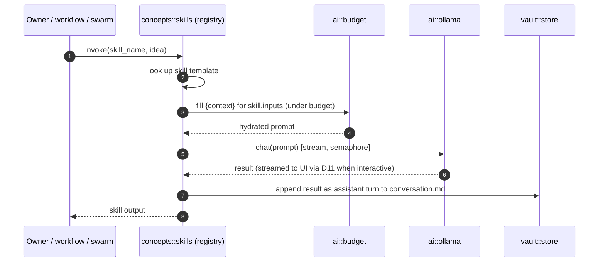

# 06 — Concept: Skills

> A **skill** is a named, reusable ideation move — a parameterized prompt template the AI can apply
> to the current idea on demand (premortem, cheapest-disproof, market-size, devil's advocate…).
> Home of **D18** (skill invocation). Module: `concepts::skills`.

## Model

A skill is data, not code: a name, a description, and a prompt template with slots for idea context.
Skills live in a **registry** loaded at startup; they are the reusable vocabulary of "moves" the
owner (or a workflow/swarm) can invoke against an idea.

```yaml
# conceptual shape of a skill definition
name: premortem
description: Assume the idea failed; enumerate the most likely causes.
inputs: [idea_body, memory, recent_conversation]
prompt: |
  The idea below has failed badly 12 months from now. Working backwards,
  list the most likely causes of failure, ranked by probability × impact.
  {context}
```

Skills are:

- **Composable** — a [workflow](./workflows.md) is often a sequence of skills; a [swarm](./swarm.md)
  can assign a different skill to each agent (diverse lenses).
- **Budget-aware** — the `{context}` slot is filled by `ai::budget` ([D21](./swarm.md)), not the raw
  full history.
- **Stateless** — applying a skill appends its output as an assistant turn; it does not itself change
  idea state.

## D18 — Skill invocation flow



## Registry & discovery

- Built-in skills ship with the binary; the registry is populated at boot.
- A skill is selected in the UI (a menu of moves) or named by a workflow/swarm step.
- Extensibility: skills being plain templates means new ones are additive — no code path changes to
  add a "move".

## Distinction from adjacent concepts

| Concept | What it is | Relation to skills |
|---------|-----------|--------------------|
| **Skill** | one reusable prompt move | the atomic unit |
| **[Agent](./agents.md)** | a scoped role (critic/researcher/…) | an agent *applies* skills within its role |
| **[Workflow](./workflows.md)** | deterministic multi-step pipeline | a sequence/DAG of skills+agents |
| **[Swarm](./swarm.md)** | parallel fan-out | assigns different skills to parallel agents |

## Mapping to code

- Registry + invocation: `concepts::skills`.
- Context hydration: `ai::budget`.
- Output persistence: `vault::store` (append to `conversation.md`).

## Related

- [workflows](./workflows.md) — D19, how skills are sequenced.
- [swarm](./swarm.md) — D14, how skills are parallelized across agents.
