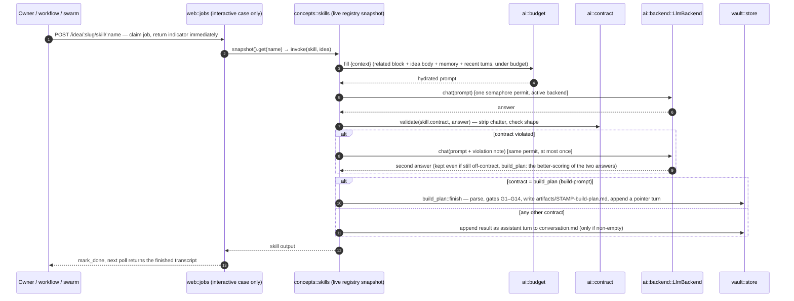
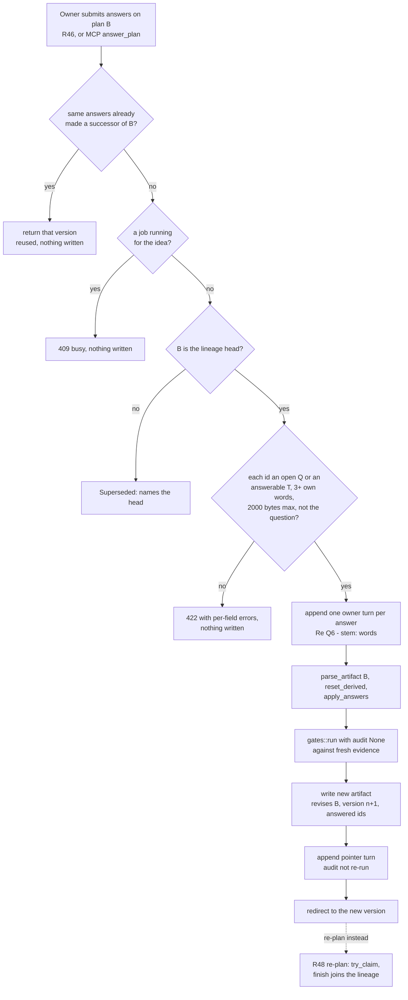

# 06 — Concept: Skills

> A **skill** is a named, reusable ideation move: a markdown file whose frontmatter says what the
> move is for and whose body is the prompt template the AI applies to the current idea on demand
> (steelman, premortem, cheapest-disproof, devil's advocate, market-size…). Home of **D18** (skill
> invocation). Module: `concepts::skills`. Decision record:
> [ADR-0022](../adr/0022-skills-as-markdown-and-the-skill-book.md).

## Model

A skill is data, not code. Each one is a markdown file: YAML frontmatter
(`domain::SkillFrontmatter`, parsed by `domain::frontmatter::parse_skill`) followed by the prompt
template. The template's `{context}` slot is filled with the idea context at invocation time.

```markdown
---
name: premortem
description: "Assume the idea failed; enumerate the most likely causes."
stage: attack            # SkillStage — where the move sits on the spine (below)
role: critic             # SkillRole — the persona it runs under when fanned out
contract: ranked_list    # OutputContract — the answer's required shape (ADR-0023)
use_when: "The idea feels finished and nobody has yet asked how it dies."
avoid_when: "The idea is still one vague sentence — steelman it first."
---

The idea below failed badly 12 months from now. Working backwards from that failure, write its
post-mortem. …
{context}
```

**Frontmatter fields:**

| Field | Required | Values |
|---|---|---|
| `name` | yes | a canonical slug (`[a-z0-9-]`), equal to the file stem |
| `description` | yes | free text |
| `stage` | yes | `steelman` · `attack` · `consequence` · `converge` · `capstone` · `extract` |
| `role` | no, default `critic` | `critic` · `researcher` · `advocate` · `harvester` · `synthesizer` |
| `contract` | no, default `free` | `free` · `bullets_or_empty` · `ranked_list` · `fenced_markdown` · `build_plan` (ADR-0030) |
| `use_when` | no | free text |
| `avoid_when` | no | free text |
| `hidden` | no, default `false` | `true` keeps the skill registered but off the move chips |

Unknown keys are rejected, so a typo is reported rather than silently defaulted.

Skills are:

- **Composable** — a [workflow](./workflows.md) chains and fans out skills; a [swarm](./swarm.md)
  assigns a different skill to each agent (diverse lenses), each running under its skill's `role`.
- **Budget-aware** — the `{context}` slot is the related-ideas block (`memory::related`, sized by
  `ai::budget::related_allowance` from what the own context leaves) followed by the idea's own
  context, filled by `ai::budget` ([D21](./swarm.md)), not the raw
  full history.
- **Shape-checked** — the answer is validated against the skill's `contract`
  (`ai::contract::validate`). Preamble and sign-off are stripped. A single interactive call that
  still violates its contract is retried **once**, with the violation read back to the model.
  For the `build_plan` contract, an answer that parses into no task also counts as a violation, and
  of the two answers the one with more (tasks, settled) wins, a tie going to the retry. A skill that
  declares `fenced_markdown` persists only its fenced block
  ([ADR-0023](../adr/0023-verification-layer.md)); `build-prompt` persists through the build-plan
  gates instead ([ADR-0030](../adr/0030-gated-build-plan.md)).
- **Related-block exclusion** — Audit, synthesis and knowledge extraction never receive the block: those call paths do not
  take it as a parameter ([ADR-0027](../adr/0027-cross-idea-retrieval-and-the-phase-2-verdict.md)).
  A persisted turn may still quote a related idea.
- **Stateless** — applying a skill appends its output as an assistant turn
  (`## assistant (skill: <name>)`); it does not itself change idea state.

## The spine

Stages order the moves an idea should travel through: **steelman → attack → consequence → converge
→ capstone** (`SkillStage::SPINE`). This is the product's version of a skill book's "spine".
`extract` is off-spine: its lenses are knowledge-harvest angles for `concepts::knowledge`, hidden
from the move chips.

| Stage | What it does |
|---|---|
| steelman | Make the strongest honest case first, so the attack has a worthy target |
| attack | Try to break it (failure causes, cheapest disproof, hostile argument) |
| consequence | Ground what survives (constraints, precedents, knock-on effects, size) |
| converge | Fold the findings into one position (the `converge` move; swarm, workflows and extraction all converge too) |
| capstone | Turn a settled idea into something actionable (the build prompt) |

**Coverage.** `concepts::coverage::coverage` derives the idea page's **spine strip** from
`conversation.md`'s turn headings alone. Headings are parsed once, by
`vault::store::parse_turn_heading`. Nothing is persisted, so deleting a turn uncovers its stage.

| Turn heading | Covers |
|---|---|
| `skill: x` | x's stage |
| `swarm: a, b` | each angle's stage, plus converge; a legacy bare `swarm` counts as the default angles |
| `workflow: w` | w's step stages, plus converge if w synthesizes |
| `knowledge` | converge |

The strip shows:

- ✓/○ for each stage;
- a **next ›** move: the first visible skill of the earliest uncovered stage (the swarm stands in
  for converge only when no converge skill is visible);
- soft **wrong-turn** warnings — a build prompt generated before any attack move; the same move
  three times in a row;
- a "no attack move has run yet" note by the Store button.

None of it blocks anything.

**The chat foil** also carries a ≤1 KB skill book (`concepts::coverage::skill_book`: visible moves,
one "name — use when" line each) inside its context budget, so it can recommend a move by name.

## D18 — Skill invocation flow

An interactive skill run (`POST /idea/:slug/skill/:name`) is a **background job**
([ADR-0010](../adr/0010-ai-turns-as-background-jobs.md)), the same claim → spawn → poll shape as
chat. The route claims the per-idea job slot and returns a "thinking" indicator immediately; the
owner sees the appended turn only once `GET /idea/:slug/pending` reports the job done. There is no
token streaming to the UI — the whole skill output lands in one swap.

A workflow or swarm invoking a skill internally does not claim the job registry itself: its
*caller* (R6 or R7) already owns the one job for that idea. It runs the skill through
`agents::run_agent` (repair only, no retry), or `skills::ask_on_contract` for a workflow's chained
step.


```mermaid
sequenceDiagram
    autonumber
    participant U as Owner / workflow / swarm
    participant J as web::jobs (interactive case only)
    participant Reg as concepts::skills (live registry snapshot)
    participant Bud as ai::budget
    participant C as ai::contract
    participant L as ai::backend::LlmBackend
    participant V as vault::store

    U->>J: POST /idea/:slug/skill/:name — claim job, return indicator immediately
    J->>Reg: snapshot().get(name) → invoke(skill, idea)
    Reg->>Bud: fill {context} (related block + idea body + memory + recent turns, under budget)
    Bud-->>Reg: hydrated prompt
    Reg->>L: chat(prompt) [one semaphore permit, active backend]
    L-->>Reg: answer
    Reg->>C: validate(skill.contract, answer) — strip chatter, check shape
    alt contract violated
        Reg->>L: chat(prompt + violation note) [same permit, at most once]
        L-->>Reg: second answer (kept even if still off-contract, build_plan: the better-scoring of the two answers)
    end
    alt contract = build_plan (build-prompt)
        Reg->>V: build_plan::finish — parse, gates G1–G14, write artifacts/STAMP-build-plan.md, append a pointer turn
    else any other contract
        Reg->>V: append result as assistant turn to conversation.md (only if non-empty)
    end
    Reg-->>J: skill output
    J-->>U: mark_done, next poll returns the finished transcript
```

## Registry & discovery

**Where skills live:**

- **Built-ins** ship with the binary: `src/concepts/skills/*.md`, compiled in via `include_str!`
  (`BUILTIN` in `concepts::skills`). Registration order is chip order.
- **Owner skills** live in `vault/.skills/<name>.md` (`IDEA_VAULT_SKILLS_DIR`, default
  `<vault>/.skills`). A file named after a built-in replaces it in place (source "vault override").
  A new name is appended (source "vault"). The folder is app configuration, not idea truth: the
  idea walker skips it (no `idea.md`) and reindex never reads it.

**Loading and reload:**

- `concepts::skills::LiveSkills` loads the built-ins plus owner files at boot.
- `POST /skills/reload` re-reads the folder with no restart and no file watcher.
- Handlers take one `snapshot()` per request and move it into the job, so a reload never changes a
  run in flight.

**Bad files never break anything.** Each of these becomes a `SkillIssue` listed on the skill book
while the built-in (if any) stays active:

- a parse error or unknown key;
- a name that doesn't match the file stem or isn't a slug;
- no `{context}` slot;
- a file over 32 KB.

Boot never fails on a skill file. A skill's name must be a canonical slug because it is spliced into
the `## assistant (skill: <name>)` heading and the route path.

**The skill book** (`GET /skills`) lists every skill by spine stage, with its use-when / not-when
guidance, role, output contract and source, plus any load issues. The move chips carry the same
guidance in their tooltips.

### Built-in skills

| Name | Stage · role | Move |
|------|------|------|
| `steelman` | steelman · advocate | Build the strongest honest case for the idea before anyone attacks it. |
| `premortem` | attack · critic | Assume the idea failed 12 months out; rank 5–8 causes (each with an early warning sign and cheapest mitigation), then restate the idea patched against the top two (contract: ranked list). |
| `cheapest-disproof` | attack · critic | Name the load-bearing assumption and the fastest, cheapest test that could kill it. |
| `devils-advocate` | attack · critic | **Authentic** dissent, not role-play: at most 5 objections the model genuinely holds, each with a confidence and what evidence would change its mind, ending in a pursue / don't / only-if verdict. |
| `pr-faq` | attack · critic | Amazon-style working backwards: a launch-day press release, the 6 hardest FAQ questions answered honestly, then the claims that resisted being written concretely — the idea's soft spots. |
| `dialectical-inquiry` | attack · critic | Dissent as a rival, not a list of objections: name the load-bearing assumptions, build the strongest counter-plan on their negation, weigh the two head to head, and say what to keep, drop, or steal. |
| `constraints` | consequence · researcher | Map the practical constraints, prerequisites, and precedents bearing on the idea. |
| `second-order-effects` | consequence · critic | Assume the idea works; trace the second-order and knock-on effects. |
| `market-size` | consequence · researcher | Bottom-up size of the opportunity, every assumption visible, with the swing factor. |
| `triz` | consequence · researcher | Name the idea's core contradiction (improving X worsens Y), describe the ideal final result, and resolve it **without** a trade-off via at least 3 separation/inversion principles. |
| `converge` | converge · synthesizer | The **converge move**: judge what the earlier moves found rather than summarise it — a first-line verdict (pursue / kill / pursue only if …), the finding that decides it, every finding merged by mechanism and labelled CONFIRMED / UNCERTAIN / REFUTED (refuted ones kept with their reason), what holds up, the trade-off taken with at least one rejected alternative, 2–3 kill criteria, and the open questions with the default assumed until they are settled. |
| `build-prompt` | capstone · synthesizer | The **capstone move**: fold the entire discussion into a gated build plan for a coding agent (e.g. Claude Code). The model writes Goal, Settled (each with a verbatim owner `quote:`), Verify first, Open questions, an optional Fence, Plan (leaf tasks with `depends:`, `touches:` and a runnable `accept:`) and Kill criteria; the code then runs the deterministic gates G1–G14. Contract: `build_plan`. See [The build plan](#the-build-plan-capstone). |

`premortem`, `cheapest-disproof`, `constraints`, and `second-order-effects` are also the default
angle set a swarm run uses when the owner doesn't specify angles ([D14](./swarm.md)). The swarm
picker offers every visible move except capstones and converge (a swarm converges on its own;
`POST /idea/{slug}/swarm` rejects either as an angle with a 400), each label carrying the same tooltip as its chip.

`devils-advocate`, `pr-faq`, `dialectical-inquiry`, and `triz` are the **structured-dissent** moves.
An assigned devil's advocate that merely role-plays objections tends to *bolster* the owner's
original view rather than test it ([Nemeth 2001](https://onlinelibrary.wiley.com/doi/abs/10.1002/ejsp.58)),
so each of these either demands dissent the model actually holds or forces a concrete artifact
(a press release, a rival plan, a named contradiction) the idea has to survive. They are opt-in
swarm angles: listed, unchecked, in the swarm picker. `devils-advocate` keeps its name for
transcript and route stability.

### Orchestrator-only lenses (`extract-*`)

Five more built-ins carry the reserved `extract-` prefix. They have stage `extract`, role
`harvester`, contract `bullets_or_empty`, and `hidden: true`:

- `extract-key-decisions`
- `extract-durable-facts`
- `extract-open-questions`
- `extract-risks-assumptions`
- `extract-next-actions`

`concepts::knowledge::extract_knowledge` fans out one `AgentRole::Harvester` per lens, on
`POST /idea/:slug/extract` ([D30](./swarm.md), [ADR-0015](../adr/0015-knowledge-extraction-artifacts.md)).

`hidden` keeps them off the interactive moves chip row — they're orchestrator angles, not something
the owner picks one at a time — but they stay registered and resolvable. Nothing stops them from
also being used as ordinary swarm angles.

## The build plan (capstone)

`build-prompt` is the `capstone` move and the only built-in skill on the `build_plan` contract
([ADR-0030](../adr/0030-gated-build-plan.md)). It runs at two depths, one chip each in the capstone
row:

- **Quick** (`⌁ quick build prompt`, `POST /idea/{slug}/skill/build-prompt`) — one planner call
  over the hydrated idea, memory and discussion, plus at most one reshape retry, then the gates.
  The plan is labelled `quick · unaudited`.
- **Audited** (`⌁⌁ audited build plan`, the [`ready-to-build` workflow](./workflows.md#ready-to-build))
  — five harvesters, one audit, then the same `build-prompt` step as the planner, then the gates.

Both depths persist through one `build_plan::finish`:
1. parse the answer (`plan::parse`; derived fields and `⟨…⟩` markers in it are ignored, and a
   model-written `T0` is renumbered);
2. run the deterministic gates G1–G14 against the idea statement and the discussion, minus earlier
   build-plan turns. The gates make no model call and run no command;
3. write `artifacts/<stamp>-build-plan.md` (`kind: build_plan`), with the mode label, model, time,
   sources, audit tally and gate tally in its header;
4. append a pointer turn: the artifact link, the mode label, the gate tally and the open questions,
   each linking to the plan page's workbench (`#work`, `#q-Q6`). The plan body never enters
   `conversation.md`.

Before step 2, `finish` joins the run to the idea's plan **lineage**
([ADR-0032](../adr/0032-plan-workbench-answers-and-versions.md)): the new plan revises the current
head (`revises`, `version`), `carry_answers` puts every owner answer on the head's chain back into
the plan if the model dropped it, and `suppress_answered` removes an Open question that re-asks one
(each drop is noted in the gate report). For a capstone prompt only, `hydrate_context` adds a
`## Prior plan (ids only — not evidence)` block (the head's open ids and texts, each
`answered Qn → words`; at most 1500 bytes) so the model keeps ids stable. The block is prompt
context, never evidence: the gates ground only in the idea and the discussion.

An answer with neither a goal nor a task is `PlanUnusable`, and nothing is persisted.

### The plan workbench (D33)

The plan page (R19) shows a **Work this plan** section above the plan body: one field per open
question and per answerable owner-held task, and a lineage line (`v3 · revises <base> · answered
Q6, Q7`). Saving answers makes a new plan version **deterministically** — no model call, no job
slot ([ADR-0032](../adr/0032-plan-workbench-answers-and-versions.md)). The other way forward is a
model re-plan (R48, a background job) that rewrites the whole plan around the answers.


```mermaid
flowchart TD
    A[Owner submits answers on plan B<br/>R46, or MCP answer_plan] --> R{same answers already<br/>made a successor of B?}
    R -- yes --> RE[return that version<br/>reused, nothing written]
    R -- no --> J{a job running<br/>for the idea?}
    J -- yes --> BUSY[409 busy, nothing written]
    J -- no --> H{B is the lineage head?}
    H -- no --> SUP[Superseded: names the head]
    H -- yes --> V{each id an open Q or an<br/>answerable T, 3+ own words,<br/>2000 bytes max, not the question?}
    V -- no --> ERR[422 with per-field errors,<br/>nothing written]
    V -- yes --> T[append one owner turn per answer<br/>Re Q6 - stem: words]
    T --> P[parse_artifact B, reset_derived,<br/>apply_answers]
    P --> G[gates::run with audit None<br/>against fresh evidence]
    G --> W[write new artifact<br/>revises B, version n+1, answered ids]
    W --> PT[append pointer turn<br/>audit not re-run]
    PT --> NEW[redirect to the new version]
    NEW -. re-plan instead .-> RP[R48 re-plan: try_claim,<br/>finish joins the lineage]
```

- **Answerable.** A `Q#` in Open is answerable. A `T#` is answerable only when every hold is the
  model's own `[?]` or the marker `needs you`; a Q-block, cycle, `no runnable accept`, destructive
  command or fenced path shows its reason and a re-plan instead.
- **What an answer does.** A `Q#` leaves Open for a Settled item holding the owner's words (fields
  `answers`, `asked`, `in`) and is removed from every task's `depends`; a `T#` gains `unblocked`,
  loses its `[?]`, and gets a Settled item with `unblocks`. Owner-provenance answers are exempt
  from G2's audit and model-open collision signals, but a hedge still keeps them open (the page
  warns inline).
- **The base is never modified**, and only the head takes answers; an older page shows a
  "superseded by" banner and no forms.

The template (`src/concepts/skills/build-prompt.md`) asks for one field per line and a backtick on
every path and command. It also carries a leaf rule: a task title is one commit subject with no
"and", and a task is one diff under one top-level directory with at most 3 non-test files, at most
8 tasks in all. The model never writes `wave`, `score` or `model`; G14 derives them. The artifact
page derives a `PROMPT.md` run protocol and an `/attack`-style `plan.md` from the stored plan
([09-web-ui](../09-web-ui.md)).

## Distinction from adjacent concepts

| Concept | What it is | Relation to skills |
|---------|-----------|--------------------|
| **Skill** | one reusable prompt move | the atomic unit |
| **[Agent](./agents.md)** | a scoped role (critic/researcher/advocate/…) | an agent *applies* skills within its role |
| **[Workflow](./workflows.md)** | deterministic staged pipeline | a sequence of fan-out / chained skill stages |
| **[Swarm](./swarm.md)** | parallel fan-out + audit + converge | assigns different skills to parallel agents |

## Mapping to code

- **Skill files:** `src/concepts/skills/*.md` (built-in) and `vault/.skills/*.md` (owner).
- **Frontmatter types:** `domain::SkillFrontmatter`, `domain::skill::{SkillStage, SkillRole, OutputContract}`.
- **Registry and invocation:** `concepts::skills` (`SkillRegistry`, `LiveSkills`, `invoke`, `ask_on_contract`).
- **Output contracts:** `ai::contract`.
- **Spine coverage and the chat skill book:** `concepts::coverage`.
- **Skill book page:** `web::routes::skills`.
- **Context hydration:** `ai::budget`.
- **Output persistence:** `vault::store` (append to `conversation.md`); a `build_plan` skill
  persists through `concepts::build_plan::finish` (artifact plus pointer turn). Plan lineage and
  the deterministic answer path: `concepts::build_plan::{lineage, workbench}`; the routes are
  `web::routes::plans`.

## Related

- [workflows](./workflows.md) — D19/D32, how skills are staged.
- [swarm](./swarm.md) — D14, how skills are parallelized across agents and audited.
- [ADR-0010](../adr/0010-ai-turns-as-background-jobs.md) — interactive skill runs are background jobs.
- [ADR-0011](../adr/0011-live-switchable-llm-backend.md) — the `LlmBackend` router skills call through.
- [ADR-0015](../adr/0015-knowledge-extraction-artifacts.md) — the `extract-*` lenses and why they're
  hidden from the moves row.
- [ADR-0022](../adr/0022-skills-as-markdown-and-the-skill-book.md) — skills as markdown, owner
  overrides, the skill book and the spine.
- [ADR-0023](../adr/0023-verification-layer.md) — output contracts and the one-retry rule.
- [ADR-0032](../adr/0032-plan-workbench-answers-and-versions.md) — the plan workbench and lineage (D33).
