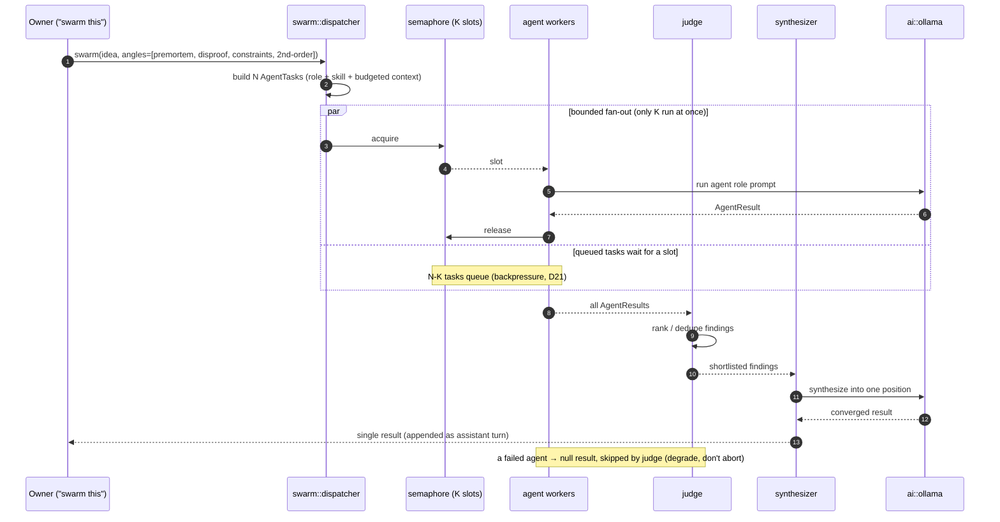

# 06 — Concept: Subagent Swarming

> **Swarming** runs many [agents](./agents.md) concurrently against one idea — each attacking from an
> independent angle — then **converges** their outputs into one view. On a single local machine this
> must be *bounded*. Home of **D14** (fan-out → converge) and **D21** (concurrency & context budget).
> Module: `concepts::swarm`. Decision: [ADR-0006](../adr/0006-bounded-concurrency-swarm.md).

## Why swarm

Some ideas deserve breadth, not depth-first chat: interrogate the same idea simultaneously as a
premortem, a cheapest-disproof, a market-sizing, and a second-order-effects analysis, then merge.
Fan-out gets coverage that sequential chat would take many turns to reach; each agent is blind to the
others, so they surface different things.

## The hard constraint

There is **one local Ollama server** ([ADR-0003](../adr/0003-ollama-local-only-ai.md)). Naive
parallelism thrashes it. So swarming is governed by two limits, both in `config.rs`:

- **Bounded concurrency** — a semaphore caps how many Ollama calls run at once (K). Fan-out may
  create N > K tasks; the excess **queues**.
- **Context budget** — each agent gets a *budgeted* slice of context (`ai::budget`), not the full
  history, so prompts fit small local models.

## D14 — Swarm: fan-out → converge / synthesize



## D21 — Concurrency & context-budget model

How the semaphore and per-agent budget interact — the resource view behind every swarm and workflow
fan-out.

```mermaid
sequenceDiagram
    autonumber
    participant D as dispatcher
    participant Sem as semaphore (limit=K)
    participant Bud as ai::budget
    participant Ol as Ollama

    Note over D: N tasks created (N may be ≫ K)
    loop for each task
        D->>Sem: acquire (blocks if K in flight)
        Sem-->>D: permit
        D->>Bud: build prompt ≤ budget (body + top memory + trimmed convo)
        Bud-->>D: budgeted prompt
        D->>Ol: call (counts toward the K in flight)
        Ol-->>D: result
        D->>Sem: release (wakes a queued task)
    end
    Note over D,Ol: steady state = K concurrent Ollama calls; rest queued (bounded latency)
```

Budget composition per agent (priority order when trimming to fit):

1. the idea's current best statement (`idea.md` body) — always included;
2. top memory facts (`MEMORY.md` + selected `memory/*.md`);
3. the most recent conversation turns (trimmed from the oldest).

## Guarantees

- **Machine stays responsive:** at most K concurrent Ollama calls, process-wide (chat + swarm share
  the semaphore).
- **Bounded latency, not unbounded fan-out:** N tasks complete in ⌈N/K⌉ waves, not all-at-once
  meltdown.
- **Degrade, don't abort:** a failed/timed-out agent yields a null result the judge skips.
- **Reproducibility:** fixed K + budget + fixed angle set → comparable runs.

## Mapping to code

| Piece | Location |
|-------|----------|
| Dispatcher, workers, judge, synthesizer | `concepts::swarm` |
| Semaphore (shared, process-wide) | `AppState` / `config.rs` |
| Per-agent budgeting | `ai::budget` |
| Agent roles applied | `concepts::agents` + `concepts::skills` |

## Related

- [workflows](./workflows.md) — D19 uses this fan-out as its parallel stage.
- [05-ai-integration](../05-ai-integration.md) — D3 component view, D11 streaming.
- [ADR-0006](../adr/0006-bounded-concurrency-swarm.md) — the bounding decision.
