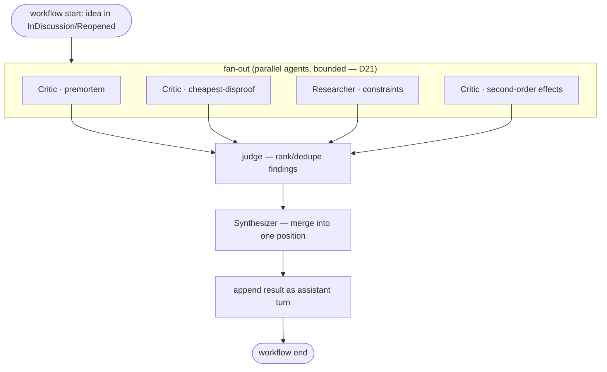

# 06 — Concept: Workflows

> A **workflow** is a *deterministic* multi-step orchestration over an idea — a fixed graph of
> [skill](./skills.md)/[agent](./agents.md) steps (fan-out → judge → synthesize), as opposed to
> free-form chat. Home of **D19** (workflow DAG). Module: `concepts::workflows`.

## Model

Where free chat is model-driven (the AI decides what to do next), a workflow is **script-driven**:
the *control flow* is fixed by the workflow definition, and only the *content* of each step is
generated. This makes runs reproducible and debuggable — the same idea through the same workflow
takes the same path.

A workflow is a DAG of steps; each step is either a single skill/agent call or a fan-out over
parallel agents whose results feed a downstream judge/synthesize step.

## D19 — Workflow orchestration (DAG)

The canonical "interrogate an idea" workflow: fan out diverse critics, judge/rank their findings,
then synthesize a single position.

## Determinism & failure

- **Deterministic control flow:** the node graph is fixed by the workflow definition; only step
  outputs vary. Contrast with a swarm invoked ad hoc from chat.
- **Bounded fan-out:** the parallel stage runs under the same concurrency semaphore and context
  budget as any swarm ([D21](./swarm.md), [ADR-0006](../adr/0006-bounded-concurrency-swarm.md)).
- **Step failure:** a failed agent step drops to a null result and is skipped by the judge (the
  workflow degrades rather than aborting) — mirrors the swarm failure model ([D14](./swarm.md)).
- **Persistence:** the final synthesized output is appended to `conversation.md`; intermediate agent
  outputs may be logged but are not necessarily persisted as turns (kept out of truth to reduce
  noise).

## Workflow vs swarm

They share machinery (bounded parallel agents), but:

| | Workflow | Swarm |
|--|----------|-------|
| Control flow | fixed DAG, deterministic | a fan-out primitive used *within* steps or ad hoc |
| Invocation | run a named pipeline | "swarm this idea" from chat, or a workflow's fan-out stage |
| Reproducibility | high (same path) | high per-wave, but composed freely |

A workflow *uses* the swarm fan-out as its parallel stage; a swarm is the lower-level primitive
([D14](./swarm.md)).

## Mapping to code

- Workflow definitions + runner: `concepts::workflows`.
- Fan-out stage: delegates to `concepts::swarm`.
- Steps: `concepts::agents` applying `concepts::skills`.

## Related

- [swarm](./swarm.md) — D14/D21, the parallel primitive and its limits.
- [agents](./agents.md) — the roles sequenced here.
- The host tool's own Workflow concept is the inspiration; here it is applied to one idea.
