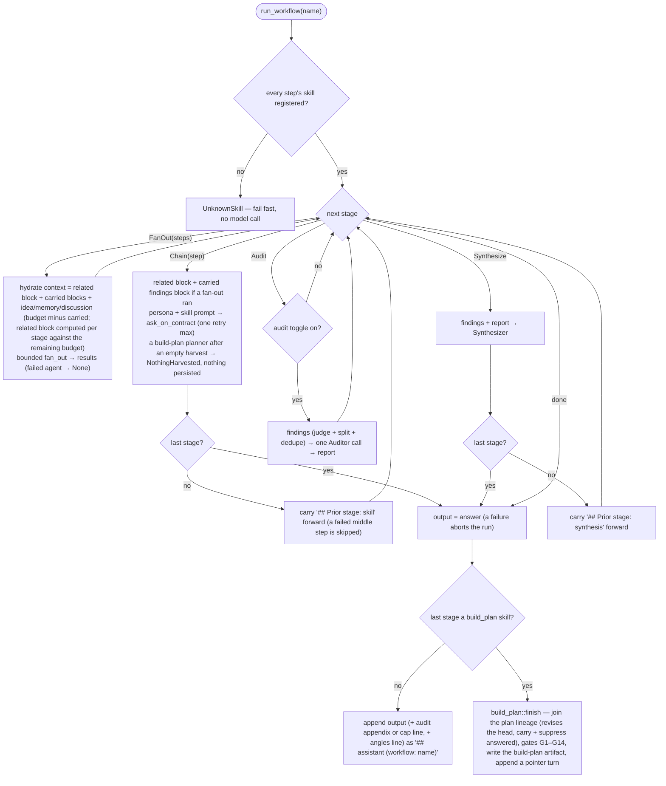

# 06 — Concept: Workflows

> A **workflow** is a *deterministic* multi-stage orchestration over an idea — a fixed sequence of
> [skill](./skills.md)/[agent](./agents.md) stages (fan-out, chained step, audit, synthesize), as
> opposed to free-form chat. Home of **D19** (the canonical interrogate pipeline) and **D32** (the
> stage model). Module: `concepts::workflows`.

## Model

Free chat is model-driven: the AI decides what to do next. A workflow is **script-driven**: the
*control flow* is fixed by the workflow definition, and only the *content* of each stage is
generated. That makes runs reproducible and debuggable — the same idea through the same workflow
takes the same path.

A workflow is an ordered list of `Stage`s:

| Stage | What it does |
|---|---|
| `FanOut(steps)` | Parallel agents over the same context, via the swarm's bounded fan-out primitive. Their answers become **findings**. |
| `Chain(step)` | One agent alone. Mid-workflow, its output is **carried forward** as a `## Prior stage: <skill>` block into every later stage. As the last stage, its output is the result. A chained step after a fan-out reads the findings (with verdicts, if audited) as a `## Prior stage: findings` block. |
| `Audit` | The factored audit over the findings so far ([ADR-0023](../adr/0023-verification-layer.md)). Skipped while the Settings toggle is off, and skipped without a model call when the fan-out harvested nothing, except before a build-plan planner, whose run fails on an empty harvest (see Failure handling). |
| `Synthesize` | Converge the findings into one position. |

These are the skill book's named recipes (its "hot maps", [ADR-0022](../adr/0022-skills-as-markdown-and-the-skill-book.md)).

## Built-in workflows

| Name | Stages | Use when |
|---|---|---|
| `interrogate` | FanOut(Critic·premortem, Critic·cheapest-disproof, Researcher·constraints, Critic·second-order-effects) → Audit → Synthesize | the canonical run-it-into-the-ground pass (D19) |
| `steelman-then-attack` | Chain(Advocate·steelman) → FanOut(Critic·premortem, Critic·cheapest-disproof, Critic·devils-advocate) → Audit → Synthesize | the idea is still vague: give the critics its best version to attack |
| `ready-to-build` | FanOut(Harvester × the five `extract-*` lenses) → Audit → Chain(Synthesizer·build-prompt) | the discussion is settled: fold the audited findings into a gated build plan ([below](#ready-to-build)) |

## D19 — The interrogate workflow

The canonical "interrogate an idea" pipeline:

1. Fan out diverse critics and a researcher.
2. Split their answers into findings; merge near-duplicates across lenses.
3. Audit the findings against the discussion.
4. Synthesize a single position.

```mermaid
flowchart TD
    START(["workflow start: idea in InDiscussion/Reopened"]) --> FANOUT

    subgraph FANOUT["fan-out (parallel agents, bounded — D21)"]
        A1["Critic · premortem"]
        A2["Critic · cheapest-disproof"]
        A3["Researcher · constraints"]
        A4["Critic · second-order effects"]
    end

    A1 --> JUDGE
    A2 --> JUDGE
    A3 --> JUDGE
    A4 --> JUDGE

    JUDGE["judge — drop failed/empty, split into findings, merge near-duplicates (lens kept)"] --> AUDIT
    AUDIT["Auditor — CONFIRMED / UNCERTAIN / REFUTED per finding (skipped if toggled off)"] --> SYNTH
    SYNTH["Synthesizer — idea + labelled findings → one position"] --> APPEND["append result + audit tally + disproven objections as one assistant turn"]
    APPEND --> END(["workflow end"])
```

## D32 — The stage model

How `run_workflow` walks a workflow's stages, and what flows between them.

```mermaid
flowchart TD
    START(["run_workflow(name)"]) --> CHECK{"every step's skill registered?"}
    CHECK -->|no| UNK["UnknownSkill — fail fast, no model call"]
    CHECK -->|yes| NEXT{"next stage"}

    NEXT -->|"FanOut(steps)"| FO["hydrate context = related block + carried blocks + idea/memory/discussion (budget minus carried; related block computed per stage against the remaining budget)<br/>bounded fan_out → results (failed agent → None)"]
    FO --> NEXT
    NEXT -->|"Chain(step)"| CH["related block + carried findings block if a fan-out ran<br/>persona + skill prompt → ask_on_contract (one retry max)<br/>a build-plan planner after an empty harvest → NothingHarvested, nothing persisted"]
    CH --> LASTC{"last stage?"}
    LASTC -->|"no"| CARRY["carry '## Prior stage: skill' forward (a failed middle step is skipped)"] --> NEXT
    LASTC -->|"yes"| OUT["output = answer (a failure aborts the run)"]
    NEXT -->|"Audit"| AUD{"audit toggle on?"}
    AUD -->|"no"| NEXT
    AUD -->|"yes"| AU["findings (judge + split + dedupe) → one Auditor call → report"] --> NEXT
    NEXT -->|"Synthesize"| SY["findings + report → Synthesizer"]
    SY --> LASTS{"last stage?"}
    LASTS -->|"no"| CARRY2["carry '## Prior stage: synthesis' forward"] --> NEXT
    LASTS -->|"yes"| OUT
    NEXT -->|"done"| OUT
    OUT --> PLAN{"last stage a build_plan skill?"}
    PLAN -->|"no"| PERSIST["append output (+ audit appendix or cap line, + angles line) as '## assistant (workflow: name)'"]
    PLAN -->|"yes"| FINISH["build_plan::finish — join the plan lineage (revises the head, carry + suppress answered), gates G1–G14, write the build-plan artifact, append a pointer turn"]
```

## Ready-to-build

`ready-to-build` is the audited depth of the build plan
([ADR-0030](../adr/0030-gated-build-plan.md)); the quick depth is the `build-prompt` skill alone
([skills](./skills.md#the-build-plan-capstone)). Its cost is five harvester calls, one audit call
and one planner call (plus at most one reshape retry), all under the shared semaphore.

- **Harvest:** the five `extract-*` lenses fan out unchanged; they are shared with knowledge
  extraction.
- **Audit:** the factored audit labels each finding CONFIRMED / UNCERTAIN / REFUTED, unless the
  Settings toggle is off.
- **Planner:** the chained `build-prompt` step gets a code-owned "How to use the findings" preamble,
  then the findings block. Each finding line leads with its kind (decision, open question, risk,
  next action, fact) and, when audited, its verdict and the auditor's clipped reason. The
  preamble routes them: a REFUTED finding never becomes Settled or a task; a CONFIRMED decision
  is Settled only with a verbatim owner quote; open questions and UNCERTAIN decisions go to
  Open questions; risks go to Verify first or Kill criteria; CONFIRMED next actions become task
  candidates; facts are background. Preamble and findings take at most a third of the stage
  budget, above a small floor for the findings block, so quotable discussion survives. When hydration clipped the discussion, the planner's
  context says how many turns are shown.
- **Persist:** the answer goes through `build_plan::finish` with the audited harvest, so G3 moves a
  Settled claim that matches a REFUTED finding to Quarantined, with the auditor's reason. The plan
  lands as `artifacts/<stamp>-build-plan.md` and the transcript gets a
  `## assistant (workflow: ready-to-build)` pointer turn.
- **Lineage and answers** ([ADR-0032](../adr/0032-plan-workbench-answers-and-versions.md),
  [D33](./skills.md#the-plan-workbench-d33)): `finish` links the plan to the idea's head
  (`revises`, `version`), carries every owner answer on the head's chain into it and drops an Open
  question that re-asks one. The planner step's carried context also gets the
  `## Prior plan (ids only — not evidence)` block (the head's open ids and answered `Qn → words`,
  at most 1500 bytes), which keeps ids stable and is never evidence. Re-planning from the
  workbench (R48, audited) runs this same workflow.

## Determinism & failure

- **Deterministic control flow:** the stage list is fixed by the workflow definition; only stage
  outputs vary. Contrast with a swarm invoked ad hoc.
- **Bounded fan-out:** the parallel stage runs under the same concurrency semaphore and context
  budget as any swarm ([D21](./swarm.md), [ADR-0006](../adr/0006-bounded-concurrency-swarm.md)).
  A chained step's single retry happens under the permit its first call holds.
- **Related block:** every fan-out and chained stage prepends the related-ideas block to its
  context, computed per stage against the budget that stage has left after carried blocks.
  Audit, synthesis and knowledge extraction never receive the block: those call paths do not
  take it as a parameter ([ADR-0027](../adr/0027-cross-idea-retrieval-and-the-phase-2-verdict.md)).
  A persisted turn may still quote a related idea.
- **Failure handling:**
  - A failed fan-out agent drops to a null result the judge skips; the workflow degrades rather
    than aborting, mirroring the swarm failure model ([D14](./swarm.md)).
  - A failed *middle* chained step is skipped with nothing carried forward.
  - A failed *final* stage, or a fan-out with no usable result before a synthesis, fails
    the run with nothing persisted. An audit stage over an empty harvest is skipped, not failed,
    unless the final stage is the build-plan planner: then the run fails with `harvest produced
    nothing; use the quick build prompt` (`ConceptError::NothingHarvested`) and persists
    nothing. The plan's mode label names what ran: `ready-to-build · audit skipped (audit off in
    Settings)`, `ready-to-build · audit failed`, `audited · uniform pass (weak)` or plain
    `audited`. Without audit verdicts the planner routes findings by kind, so next actions stay
    task candidates marked unchecked. A planner answer with neither a goal nor a task fails the
    run with `ConceptError::PlanUnusable`, and nothing is persisted. Either error fails the
    background job, and its message shows on the next `/pending` poll.
- **Persistence:** only the final stage's output — plus the audit appendix, if an audit ran — is
  appended to `conversation.md`. Intermediate stage outputs are never persisted as turns; they are
  kept out of truth to reduce noise. Two code-owned lines may follow the output: the cap line
  (`_N further findings not audited (cap 20)_`, or `left out` when no audit ran) when the judge's
  shortlist ran past `audit::MAX_AUDIT_FINDINGS`, and the angles line
  (`_k of N angles answered; missing: …_`) when a fan-out angle failed or came back empty. A
  workflow ending in a `build_plan` skill persists through `build_plan::finish` instead: an
  artifact plus a pointer turn.

## UI trigger

Every `builtin_workflows()` entry is UI-triggerable, not just a library call:
`POST /idea/{slug}/workflow/{name}` ([R22](../09-web-ui.md#d17--route-map),
`web::routes::memory::run_workflow`). It follows the same claim → spawn → poll background-job shape
as the skill (R6) and swarm (R7) routes ([D11](../05-ai-integration.md),
[ADR-0010](../adr/0010-ai-turns-as-background-jobs.md)), with a per-stage progress note in the
thinking indicator.

**Synchronous guards** run before the job is claimed:

- the idea must be `InDiscussion` or `Reopened` (400 otherwise);
- `name` must resolve via `get_workflow` (404 if unknown), so a bad name never becomes a
  background job at all.

**Transcript:** only the final output is persisted, as one `## assistant (workflow: {name})` turn.
The transcript label keeps the workflow kind (`foil · workflow {name}`), so a workflow run stays
visually distinct from a same-named skill turn (`foil · {name}`).

**Buttons:** `templates/_actions.html` renders one `chip chip--workflow` button per
`builtin_workflows()` entry except `ready-to-build`, which sits in the capstone row as
`⌁⌁ audited build plan`, paired with the quick `⌁ quick build prompt` chip.

## Workflow vs swarm

They share machinery (bounded parallel agents, the judge, the audit, the synthesizer), but:

| | Workflow | Swarm |
|--|----------|-------|
| Control flow | fixed stage list, deterministic | one fan-out + audit + converge |
| Invocation | run a named pipeline | "swarm this idea" with owner-picked angles |
| Composition | chains stages; carries output forward | a single wave |

A workflow *uses* the swarm fan-out as its parallel stage; a swarm is the lower-level primitive
([D14](./swarm.md)).

## Mapping to code

- **Workflow definitions and runner:** `concepts::workflows` (`Stage`, `Workflow`,
  `builtin_workflows`, `run_workflow`).
- **Fan-out, judge, synthesizer:** delegate to `concepts::swarm`.
- **Audit stage:** `concepts::audit`.
- **Chained step:** `concepts::skills::ask_on_contract` over `concepts::agents::build_prompt`.
- **Build-plan persist boundary:** `concepts::skills::persist_plan` →
  `concepts::build_plan::finish::finish_as` (gates in `concepts::build_plan::gates`).
- **Steps:** `concepts::agents` applying `concepts::skills`.

## Related

- [swarm](./swarm.md) — D14/D21, the parallel primitive and its limits.
- [agents](./agents.md) — the roles staged here.
- [ADR-0023](../adr/0023-verification-layer.md) — the audit stage and the one-retry rule.
- The host tool's own Workflow concept is the inspiration; here it is applied to one idea.
