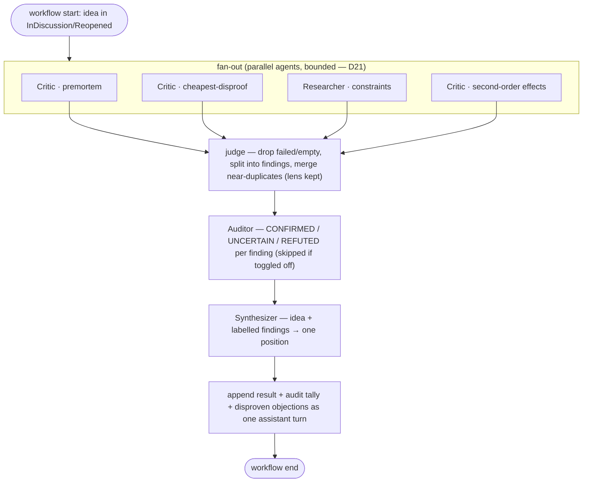
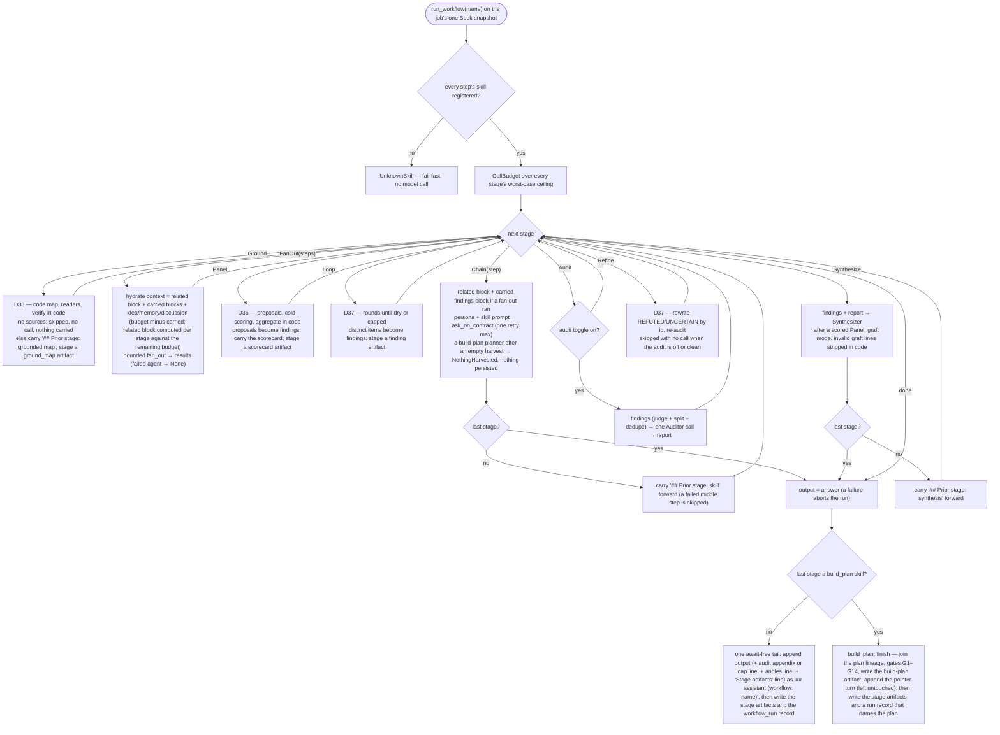
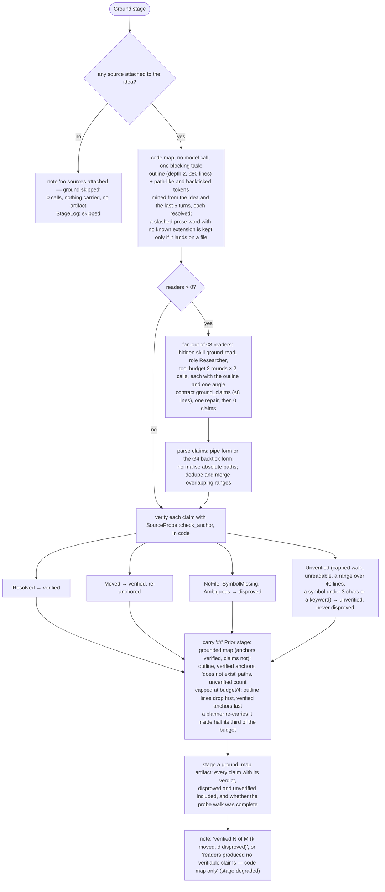
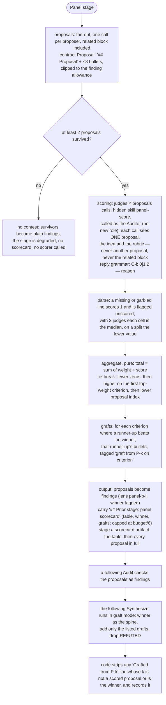
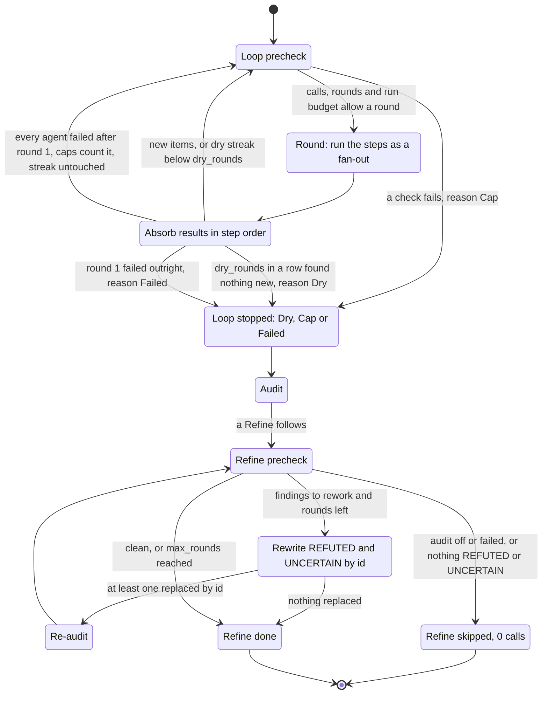
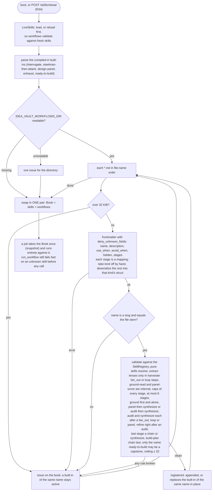

# 06 — Concept: Workflows

> A **workflow** is a *deterministic* multi-stage orchestration over an idea — a fixed sequence of
> [skill](./skills.md)/[agent](./agents.md) stages (fan-out, chained step, audit, synthesize, and the
> grounded, ranked and bounded stages Ground, Panel, Loop and Refine), as opposed to free-form chat.
> A workflow is a markdown file. Home of **D19** (the canonical interrogate pipeline), **D32** (the
> stage model), **D35** (Ground), **D36** (Panel), **D37** (Loop and Refine) and **D38** (the workflow
> registry). Module: `concepts::workflows`
> ([ADR-0034](../adr/0034-grounded-ranked-and-bounded-workflow-stages.md),
> [ADR-0035](../adr/0035-workflows-as-markdown-and-the-workflow-book.md)).

## Model

Free chat is model-driven: the AI decides what to do next. A workflow is **script-driven**: the
*control flow* is fixed by the workflow definition, and only the *content* of each stage is
generated. That makes runs reproducible and debuggable — the same idea through the same workflow
takes the same path.

A workflow is an ordered list of `Stage`s:

| Stage | What it does |
|---|---|
| `FanOut(steps)` | Parallel agents over the same context, via the swarm's bounded fan-out primitive. Their answers become **findings**. |
| `Chain(step)` | One agent alone. Mid-workflow, its output is **carried forward** as a `## Prior stage: <skill>` block into every later stage. As the last stage, its output is the result. A chained step after a fan-out reads the findings (with verdicts, if audited) as a `## Prior stage: findings` block. |
| `Audit` | The factored audit over the findings so far ([ADR-0023](../adr/0023-verification-layer.md)). Skipped while the Settings toggle is off, and skipped without a model call when the fan-out harvested nothing, except before a build-plan planner, whose run fails on an empty harvest (see Failure handling). A fan_out, loop or panel after an audit discards its report: the re-gathered findings are unaudited, never paired with the old verdicts by index. |
| `Synthesize` | Converge the findings into one position. Straight after a Panel it runs in **graft mode**: the winning proposal is the spine and only the listed grafts are added. |
| `Ground` | Map the idea's attached [reference sources](../adr/0021-reference-sources.md) and verify, in code, every anchor a reader cites ([D35](#d35--the-ground-stage)). Skipped, with no model call, when no source is attached. |
| `Panel` | Competing proposals, each scored alone against a weighted rubric; code picks the winner and the grafts ([D36](#d36--the-panel-stage)). |
| `Loop` | Rerun a set of steps in rounds until a round finds nothing new or a cap is hit ([D37](#d37--the-loop-and-refine-stages)). |
| `Refine` | Right after an `Audit`: rewrite the REFUTED and UNCERTAIN findings by id and re-audit ([D37](#d37--the-loop-and-refine-stages)). |

These are the skill book's named recipes (its "hot maps", [ADR-0022](../adr/0022-skills-as-markdown-and-the-skill-book.md)).
The stage vocabulary is closed: a workflow file names one of these eight kinds, never a new one
([D38](#d38--the-workflow-registry-load-validate-reload)).

## Built-in workflows

| Name | Stages | Use when |
|---|---|---|
| `interrogate` | FanOut(Critic·premortem, Critic·cheapest-disproof, Researcher·constraints, Critic·second-order-effects) → Audit → Synthesize | the canonical run-it-into-the-ground pass (D19) |
| `steelman-then-attack` | Chain(Advocate·steelman) → FanOut(Critic·premortem, Critic·cheapest-disproof, Critic·devils-advocate) → Audit → Synthesize | the idea is still vague: give the critics its best version to attack |
| `design-panel` | Ground(2 readers) → Panel(3 proposers: Advocate·steelman, Critic·cheapest-disproof, Researcher·"the smallest version that ships this week"; criteria cost ×2, risk ×2, fit, evidence; 1 judge) → Audit → Synthesize | there are several credible ways to build this and you want them compared on cost, risk, fit and evidence rather than argued |
| `exhaust` | Loop(Critic·premortem, Critic·devils-advocate, Researcher·second-order-effects; dry 1, ≤3 rounds, ≤12 calls) → Audit → Refine(Advocate·steelman, 1 round) → Synthesize | one pass of critics feels thin and you want the idea run into the ground until the objections stop being new |
| `ready-to-build` | Ground(2 readers: "where the change lands", "scripts, config and tests") → FanOut(Harvester × the five `extract-*` lenses) → Audit → Chain(Synthesizer·build-prompt) | the discussion is settled: fold the audited findings into a gated build plan ([below](#ready-to-build)) |

The first two rows and `ready-to-build` are markdown files, `src/concepts/workflows/*.md`, compiled in;
the file order is the chip order. The worst-case call counts each one shows on its chip are
[below](#call-ceiling-and-budget).

## D19 — The interrogate workflow

The canonical "interrogate an idea" pipeline:

1. Fan out diverse critics and a researcher.
2. Split their answers into findings; merge near-duplicates across lenses.
3. Audit the findings against the discussion.
4. Synthesize a single position.

```mermaid
flowchart TD
    START(["workflow start: idea in InDiscussion/Reopened"]) --> FANOUT

    subgraph FANOUT["fan-out (parallel agents, bounded — D21)"]
        A1["Critic · premortem"]
        A2["Critic · cheapest-disproof"]
        A3["Researcher · constraints"]
        A4["Critic · second-order effects"]
    end

    A1 --> JUDGE
    A2 --> JUDGE
    A3 --> JUDGE
    A4 --> JUDGE

    JUDGE["judge — drop failed/empty, split into findings, merge near-duplicates (lens kept)"] --> AUDIT
    AUDIT["Auditor — CONFIRMED / UNCERTAIN / REFUTED per finding (skipped if toggled off)"] --> SYNTH
    SYNTH["Synthesizer — idea + labelled findings → one position"] --> APPEND["append result + audit tally + disproven objections as one assistant turn"]
    APPEND --> END(["workflow end"])
```

## D32 — The stage model

How `run_workflow` walks a workflow's stages, and what flows between them. The four stages added by
[ADR-0034](../adr/0034-grounded-ranked-and-bounded-workflow-stages.md) are shown as single nodes here
and expanded in D35–D37.

```mermaid
flowchart TD
    START(["run_workflow(name) on the job's one Book snapshot"]) --> CHECK{"every step's skill registered?"}
    CHECK -->|no| UNK["UnknownSkill — fail fast, no model call"]
    CHECK -->|yes| BUD["CallBudget over every stage's worst-case ceiling"]
    BUD --> NEXT{"next stage"}

    NEXT -->|"Ground"| GR["D35 — code map, readers, verify in code<br/>no sources: skipped, no call, nothing carried<br/>else carry '## Prior stage: grounded map'; stage a ground_map artifact"]
    GR --> NEXT
    NEXT -->|"FanOut(steps)"| FO["hydrate context = related block + carried blocks + idea/memory/discussion (budget minus carried; related block computed per stage against the remaining budget)<br/>bounded fan_out → results (failed agent → None)"]
    FO --> NEXT
    NEXT -->|"Panel"| PA["D36 — proposals, cold scoring, aggregate in code<br/>proposals become findings; carry the scorecard; stage a scorecard artifact"]
    PA --> NEXT
    NEXT -->|"Loop"| LP["D37 — rounds until dry or capped<br/>distinct items become findings; stage a finding artifact"]
    LP --> NEXT
    NEXT -->|"Chain(step)"| CH["related block + carried findings block if a fan-out ran<br/>persona + skill prompt → ask_on_contract (one retry max)<br/>a build-plan planner after an empty harvest → NothingHarvested, nothing persisted"]
    CH --> LASTC{"last stage?"}
    LASTC -->|"no"| CARRY["carry '## Prior stage: skill' forward (a failed middle step is skipped)"] --> NEXT
    LASTC -->|"yes"| OUT["output = answer (a failure aborts the run)"]
    NEXT -->|"Audit"| AUD{"audit toggle on?"}
    AUD -->|"no"| NEXT
    AUD -->|"yes"| AU["findings (judge + split + dedupe) → one Auditor call → report"] --> NEXT
    NEXT -->|"Refine"| RF["D37 — rewrite REFUTED/UNCERTAIN by id, re-audit<br/>skipped with no call when the audit is off or clean"]
    RF --> NEXT
    NEXT -->|"Synthesize"| SY["findings + report → Synthesizer<br/>after a scored Panel: graft mode, invalid graft lines stripped in code"]
    SY --> LASTS{"last stage?"}
    LASTS -->|"no"| CARRY2["carry '## Prior stage: synthesis' forward"] --> NEXT
    LASTS -->|"yes"| OUT
    NEXT -->|"done"| OUT
    OUT --> PLAN{"last stage a build_plan skill?"}
    PLAN -->|"no"| PERSIST["one await-free tail: append output (+ audit appendix or cap line, + angles line, + 'Stage artifacts' line) as '## assistant (workflow: name)', then write the stage artifacts and the workflow_run record"]
    PLAN -->|"yes"| FINISH["build_plan::finish — join the plan lineage, gates G1–G14, write the build-plan artifact, append the pointer turn (left untouched); then write the stage artifacts and a run record that names the plan"]
```

A failure anywhere before the tail (including a cancel) leaves the vault exactly as it was: stage
artifacts are held in memory as they are produced and written only once the final stage has
succeeded.

## D35 — The Ground stage

Ground runs first (the registry allows it nowhere else) and answers one question before anyone argues
about an idea that changes code: *does the code the idea talks about exist?* It verifies existence,
never meaning — the audit stays the check on meaning. Parameters: `readers` 0–3 (default 2),
`tool_rounds` 1–2 (default 2), and optionally one `angles` line of at most 120 characters per reader.

```mermaid
flowchart TD
    G0(["Ground stage"]) --> SRC{"any source attached to the idea?"}
    SRC -->|"no"| SKIP["note 'no sources attached — ground skipped'<br/>0 calls, nothing carried, no artifact<br/>StageLog: skipped"]
    SRC -->|"yes"| MAP["code map, no model call, one blocking task:<br/>outline (depth 2, ≤80 lines) + path-like and backticked tokens<br/>mined from the idea and the last 6 turns, each resolved;<br/>a slashed prose word with no known extension is kept only if it lands on a file"]
    MAP --> RD{"readers > 0?"}
    RD -->|"no"| VER
    RD -->|"yes"| READ["fan-out of ≤3 readers: hidden skill ground-read, role Researcher,<br/>tool budget 2 rounds × 2 calls, each with the outline and one angle<br/>contract ground_claims (≤8 lines), one repair, then 0 claims"]
    READ --> PARSE["parse claims: pipe form or the G4 backtick form;<br/>normalise absolute paths; dedupe and merge overlapping ranges"]
    PARSE --> VER["verify each claim with SourceProbe::check_anchor, in code"]
    VER --> V1["Resolved → verified"]
    VER --> V2["Moved → verified, re-anchored"]
    VER --> V3["NoFile, SymbolMissing, Ambiguous → disproved"]
    VER --> V4["Unverified (capped walk, unreadable, a range over 40 lines,<br/>a symbol under 3 chars or a keyword) → unverified, never disproved"]
    V1 --> CARRY
    V2 --> CARRY
    V3 --> CARRY
    V4 --> CARRY
    CARRY["carry '## Prior stage: grounded map (anchors verified, claims not)':<br/>outline, verified anchors, 'does not exist' paths, unverified count<br/>capped at budget/4; outline lines drop first, verified anchors last<br/>a planner re-carries it inside half its third of the budget"] --> ART["stage a ground_map artifact: every claim with its verdict,<br/>disproved and unverified included, and whether the probe walk was complete"]
    ART --> SUM["note: 'verified N of M (k moved, d disproved)', or 'readers produced no verifiable claims — code map only' (stage degraded)"]
```

A disproved claim's *text* is never carried forward — only its anchor and why it failed — so a model
that invented a file cannot have the invention repeated to the later stages. On the claude-code
backend a reader can read outside the attached sources (the CLI's own agent loop is not bounded here);
an out-of-source claim fails to resolve under a source root and is disproved, never carried.

## D36 — The Panel stage

A Panel makes competing designs *compete* instead of being argued. Proposers answer from their own
skill or angle; each proposal is then scored **alone**, cold, against a fixed rubric; code does all
the arithmetic. Parameters: `proposers` 2–4 (each a role plus a skill and/or an angle), `criteria`
2–5 (a unique slug `name`, `weight` 1–3, and the `zero` / `two` anchors), `judges` 1–2 (default 1).

```mermaid
flowchart TD
    P0(["Panel stage"]) --> PROP["proposals: fan-out, one call per proposer, related block included<br/>contract Proposal: '## Proposal' + ≤8 bullets, clipped to the finding allowance"]
    PROP --> ENOUGH{"at least 2 proposals survived?"}
    ENOUGH -->|"no"| NOC["no contest: survivors become plain findings,<br/>the stage is degraded, no scorecard, no scorer called"]
    ENOUGH -->|"yes"| SCORE["scoring: judges × proposals calls, hidden skill panel-score,<br/>called as the Auditor (no new role); each call sees ONE proposal,<br/>the idea and the rubric — never another proposal, never the related block<br/>reply grammar: C-i: 0|1|2 — reason"]
    SCORE --> PARSE["parse: a missing or garbled line scores 1 and is flagged unscored;<br/>with 2 judges each cell is the median, on a split the lower value"]
    PARSE --> AGG["aggregate, pure: total = sum of weight × score<br/>tie-break: fewer zeros, then higher on the first top-weight criterion, then lower proposal index"]
    AGG --> GRAFT["grafts: for each criterion where a runner-up beats the winner,<br/>that runner-up's bullets, tagged 'graft from P-k on criterion'"]
    GRAFT --> OUTP["output: proposals become findings (lens panel-p-i, winner tagged)<br/>carry '## Prior stage: panel scorecard' (table, winner, grafts; capped at budget/6)<br/>stage a scorecard artifact: the table, then every proposal in full"]
    OUTP --> AUDQ["a following Audit checks the proposals as findings"]
    AUDQ --> SYNQ["the following Synthesize runs in graft mode: winner as the spine,<br/>add only the listed grafts, drop REFUTED"]
    SYNQ --> STRIP["code strips any 'Grafted from P-k' line whose k is not a scored proposal or is the winner, and records it"]
```

The name "judge" already belongs to `swarm::judge`, a deterministic dedupe, so the Panel's scorers are
the existing **Auditor** role running a hidden skill — no `AgentRole::Judge`. Scoring is cold and one
proposal per call, which removes position bias without any rotation bookkeeping. A uniform scorecard
(every cell the same) is flagged and the stage marked degraded, because it ranked nothing; cells a
weak model left unscored are starred in the table and count as 1.

## D37 — The Loop and Refine stages

Both stages are bounded repetition whose every stop is decided in code. A **Loop**
(`steps` 1–4 each with a skill, `dry_rounds` 1–2 default 1, `max_rounds` 2–4 default 3, `max_calls`
at most 16) reruns its steps; a **Refine** (`role`, `skill`, `max_rounds` 1–2 default 1) may only
follow an Audit.

```mermaid
stateDiagram-v2
    state "Loop precheck" as Precheck
    state "Round: run the steps as a fan-out" as Round
    state "Absorb results in step order" as Absorb
    state "Loop stopped: Dry, Cap or Failed" as LoopDone
    state "Audit" as Audit
    state "Refine precheck" as RefineCheck
    state "Rewrite REFUTED and UNCERTAIN by id" as Rewrite
    state "Re-audit" as Reaudit
    state "Refine done" as RefineDone
    state "Refine skipped, 0 calls" as RefineSkipped

    [*] --> Precheck
    Precheck --> Round : calls, rounds and run budget allow a round
    Precheck --> LoopDone : a check fails, reason Cap
    Round --> Absorb
    Absorb --> Precheck : new items, or dry streak below dry_rounds
    Absorb --> Precheck : every agent failed after round 1, caps count it, streak untouched
    Absorb --> LoopDone : dry_rounds in a row found nothing new, reason Dry
    Absorb --> LoopDone : round 1 failed outright, reason Failed
    LoopDone --> Audit
    Audit --> RefineCheck : a Refine follows
    RefineCheck --> RefineSkipped : audit off or failed, or nothing REFUTED or UNCERTAIN
    RefineCheck --> Rewrite : findings to rework and rounds left
    Rewrite --> Reaudit : at least one replaced by id
    Rewrite --> RefineDone : nothing replaced
    Reaudit --> RefineCheck
    RefineCheck --> RefineDone : clean, or max_rounds reached
    RefineSkipped --> [*]
    RefineDone --> [*]
```

**Loop.** The novelty test is `audit::near_duplicate` over `audit::words`, judged in step order (never
completion order) so the answer does not depend on which call finished first. A round in which every
agent failed spends its calls and **resets nothing**: it neither ends the loop nor extends a dry
streak. The reasons are `Dry`, `Cap` and `Failed` and appear in the run record. Distinct items become
one result per step lens and join the run's findings, capped by `audit::MAX_AUDIT_FINDINGS` with the
dropped count reported; the stage's artifact is a `finding` with lens `loop` — a table of item, first
round and lens, plus the stop reason — written only if at least one item was found. Loop items do not
add to the angles line.

**Refine.** The replacements are a `- F<k>: text` bullet each; code replaces only findings that were
REFUTED or UNCERTAIN, by id, and ignores every other line, so a model cannot rewrite a finding the
audit passed. A round costs two calls (the rewrite and the re-audit); the stage stops early when a
rewrite replaces nothing.

## Ready-to-build

`ready-to-build` is the audited depth of the build plan
([ADR-0030](../adr/0030-gated-build-plan.md)); the quick depth is the `build-prompt` skill alone
([skills](./skills.md#the-build-plan-capstone)). Its cost is five harvester calls, one audit call
and one planner call (plus at most one reshape retry), all under the shared semaphore. With
sources attached it opens with a Ground stage too: up to four more calls (two readers, each with at
most one repair), worst case 12 in all, and none when no source is attached.

- **Ground:** with sources attached, [Ground](#d35--the-ground-stage) maps where the change lands
  (reader angles "where the change lands" and "scripts, config and tests") and verifies every
  anchor in code. Its grounded map is carried ahead of the findings, and the planner re-carries it
  inside half of its own third of the budget, so verified anchors and "does not exist" paths reach
  the plan while the discussion keeps its room. With no source attached the stage is skipped with no
  call and nothing carried, so the run is the same as before Ground existed.
- **Harvest:** the five `extract-*` lenses fan out unchanged; they are shared with knowledge
  extraction.
- **Audit:** the factored audit labels each finding CONFIRMED / UNCERTAIN / REFUTED, unless the
  Settings toggle is off.
- **Planner:** the chained `build-prompt` step gets a code-owned "How to use the findings" preamble,
  then the findings block. Each finding line leads with its kind (decision, open question, risk,
  next action, fact) and, when audited, its verdict and the auditor's clipped reason. The
  preamble routes them: a REFUTED finding never becomes Settled or a task; a CONFIRMED decision
  is Settled only with a verbatim owner quote; open questions and UNCERTAIN decisions go to
  Open questions; risks go to Verify first or Kill criteria; CONFIRMED next actions become task
  candidates; facts are background. Preamble and findings take at most a third of the stage
  budget, above a small floor for the findings block, so quotable discussion survives. When hydration clipped the discussion, the planner's
  context says how many turns are shown.
- **Persist:** the answer goes through `build_plan::finish` with the audited harvest, so G3 moves a
  Settled claim that matches a REFUTED finding to Quarantined, with the auditor's reason. The plan
  lands as `artifacts/<stamp>-build-plan.md` and the transcript gets a
  `## assistant (workflow: ready-to-build)` pointer turn.
- **Lineage and answers** ([ADR-0032](../adr/0032-plan-workbench-answers-and-versions.md),
  [D33](./skills.md#the-plan-workbench-d33)): `finish` links the plan to the idea's head
  (`revises`, `version`), carries every owner answer on the head's chain into it and drops an Open
  question that re-asks one. The planner step's carried context also gets the
  `## Prior plan (ids only — not evidence)` block (the head's open ids and answered `Qn → words`,
  at most 1500 bytes), which keeps ids stable and is never evidence. Re-planning from the
  workbench (R48, audited) runs this same workflow.

## Call ceiling and budget

Every workflow has an exact worst-case number of model calls, repair retries included
(`Workflow::call_ceiling`), shown on its chip and on the skill book before anything runs
([ADR-0034](../adr/0034-grounded-ranked-and-bounded-workflow-stages.md)).

| Stage | Worst-case calls |
|---|---|
| FanOut | one per step |
| Chain | 2 (the step and one repair) |
| Audit | 1 |
| Synthesize | 1 |
| Ground | readers × 2 (each reader may be repaired once); 0 with no sources |
| Panel | proposers + judges × proposers (a proposal is not repaired; nor is a score) |
| Loop | min(`max_calls`, `max_rounds` × steps) |
| Refine | 2 × `max_rounds` (one rewrite and one re-audit per round) |

A definition whose ceiling is over `WORKFLOW_MAX_CALLS` (32) is rejected at load, never clamped. At
run time a `CallBudget` counts calls against the ceiling and holds in reserve the ceiling of every
stage still to come, so an elastic stage (a Loop) can never starve the final one. The count is of
**billed requests** ([ADR-0037](../adr/0037-run-journal-diagnostics-only-call-record.md)): the run's
backend view carries a meter, so a retry, each Ollama tool round and each claude process is charged
as it goes out. A tool-using call can therefore cost more than the one call its stage's ceiling
assumed, and the reserve check then funds fewer elastic rounds. The Audit stage (and every Refine
re-audit) may make one targeted re-ask of a malformed or partial audit
([ADR-0040](../adr/0040-recipe-provenance-and-audit-re-ask.md)), but only when `CallBudget::can_fund(2)`
holds, so the re-ask is paid for out of slack and the workflow's ceiling is never exceeded. The
built-ins:

| Workflow | Worst case |
|---|---|
| `interrogate` | 6 |
| `steelman-then-attack` | 7 |
| `design-panel` | 4 + 3 + 3 + 1 + 1 = **12** (8 without sources: Ground makes no call) |
| `exhaust` | loop min(12, 3 × 3) = 9, audit 1, refine 2, synthesize 1 = **13** |
| `ready-to-build` | 4 + 5 + 1 + 2 = **12** with sources (8 without) |

Width matters as much as count on a small local model: a stage's width divided by the shared bound K
([ADR-0006](../adr/0006-bounded-concurrency-swarm.md)), rounded up, is how many **waves** it waits
through. The chips and the book print `up to N model calls · widest stage W → ⌈W/K⌉ waves at K=k`.
`design-panel` can take ten minutes or more on a CPU-only Ollama at K=2, which is why the ceiling is
shown first.

## Persistence of stage artifacts

The persistence rule below ("only the final stage's output is a turn") stands. One scoped exception
([ADR-0034](../adr/0034-grounded-ranked-and-bounded-workflow-stages.md), an amendment to the D14
discard-intermediates rule): the Ground, Panel and Loop stages each stage one artifact
(`ground_map`, `scorecard`, or a `finding` with lens `loop`), and a `workflow_run` record lists every
stage's kind, status (ran, skipped or degraded, with the reason), calls and detail, the calls spent
against the ceiling and where the final output went.

- **All-or-nothing.** They are held in memory and written only after the final persist succeeds, in
  the same await-free tail as the turn (or the capstone's plan). A cancel or a failed final stage
  writes none of them. Empty final output writes none either.
- **Slugs.** `<run-stamp>-<workflow>-<stage number>-<stage kind>` for a stage (`ground`, `panel`,
  `loop`), and `<run-stamp>-<workflow>-run` for the record, each disambiguated against the vault.
- **Named on the turn.** A trailing `Stage artifacts: [[slug]] · [[slug]]` line, added after all
  model output. The capstone's pointer turn is not modified (its `POINTER_PREFIX` must stay first,
  and `CAPSTONE_TURNS` stays a pure list of names), so the run record lists the plan instead.
- **Never turns, never evidence.** They are ordinary `artifacts/*.md` files, indexed for search by
  the generic artifact walk like any artifact, and never memory evidence. A workflow made only of
  the classic four stages, or a Ground that found no sources, writes none and leaves exactly the
  vault it always did.

## Progress

The thinking indicator's single note string is written per stage as
`workflow · {name} · {i}/{n} {kind}: {detail} · calls {used}/{ceiling}`, for example
`1/4 ground: reader 2/2`, `1/4 ground: verified 9 of 14 (3 moved, 2 disproved)`,
`2/4 panel: scoring 2/3`, `2/4 panel: P2 wins 9/12` and `1/4 loop: round 2/3 · +4 new (11 total)`.
No new job-progress API exists; the note is rendered verbatim.

## D38 — The workflow registry: load, validate, reload

A workflow is a markdown file, exactly as a skill is ([ADR-0035](../adr/0035-workflows-as-markdown-and-the-workflow-book.md)).
Built-ins live in `src/concepts/workflows/*.md` and are compiled in; the owner's live in
`IDEA_VAULT_WORKFLOWS_DIR`, default `<vault>/.workflows/` — a dot-dir reindex never enters. Loading
follows the skill loader (ADR-0022): a new name is appended in file-name order after the built-ins, a
file whose name matches a built-in replaces it in place (keeping its chip position), and a file that
fails validation is an issue on the book while the built-in of that name stays active. A built-in
revalidates against the owner's skill overrides too; one an override breaks (say `premortem` moved to
stage `extract`) is left out, and its issue is prefixed `built-in disabled by your skill overrides`,
since nothing stays active in its place.

```mermaid
flowchart TD
    BOOT(["boot, or POST /skills/reload (R34)"]) --> SK["LiveSkills: load, or reload first,<br/>so workflows validate against fresh skills"]
    SK --> B1["parse the compiled-in built-ins (interrogate, steelman-then-attack, design-panel, exhaust, ready-to-build)"]
    B1 --> DIR{"IDEA_VAULT_WORKFLOWS_DIR readable?"}
    DIR -->|"missing"| PAIR
    DIR -->|"unreadable"| ISS0["one issue for the directory"] --> PAIR
    DIR -->|"yes"| FILES["each *.md in file-name order"]
    FILES --> CAP{"over 32 KiB?"}
    CAP -->|"yes"| ISS["issue on the book; a built-in of the same name stays active"]
    CAP -->|"no"| PARSE["frontmatter with deny_unknown_fields: name, description, use_when, avoid_when, hidden, stages<br/>each stage is a mapping: take kind off by hand, deserialize the rest into that kind's struct"]
    PARSE -->|"error"| ISS
    PARSE -->|"ok"| NAME{"name is a slug and equals the file stem?"}
    NAME -->|"no"| ISS
    NAME -->|"yes"| VAL["validate against the SkillRegistry, pure:<br/>skills resolve, extract lenses only in harvester fan_out or loop steps,<br/>ground-read and panel-score are internal, caps of every stage, at most 8 stages,<br/>ground first and alone, panel then synthesize or audit then synthesize,<br/>audit and synthesize each after a fan_out, loop or panel, refine right after an audit,<br/>last stage a chain or synthesize, build-plan chain last, only the name ready-to-build may be a capstone, ceiling ≤ 32"]
    VAL -->|"any rule broken"| ISS
    VAL -->|"clean"| REG["registered: appended, or replaces the built-in of the same name in place"]
    REG --> FILES
    ISS --> FILES
    FILES -->|"done"| PAIR["swap in ONE pair: Book = skills + workflows"]
    PAIR --> JOB["a job takes the Book once (snapshot) and runs entirely against it;<br/>run_workflow still fails fast on an unknown skill before any call"]
```

The kind is dispatched by hand, not through a serde internally-tagged enum, whose interaction with
`deny_unknown_fields` is unreliable: an owner's typo must surface on the book as
`stages[i] (<kind>): …`, never fall back to a default. A **capstone** is derived, never declared: a
workflow whose stages chain a build-plan skill, allowed only under the name `ready-to-build`; an owner
forks the capstone by overriding that name. The book keeps the skills and the workflows as one pair
so a running job can never see workflows validated against different skills than it runs.

## Determinism & failure

- **Deterministic control flow:** the stage list is fixed by the workflow definition; only stage
  outputs vary. Contrast with a swarm invoked ad hoc.
- **Bounded fan-out:** the parallel stage runs under the same concurrency semaphore and context
  budget as any swarm ([D21](./swarm.md), [ADR-0006](../adr/0006-bounded-concurrency-swarm.md)).
  A chained step's single retry happens under the permit its first call holds.
- **Related block:** every fan-out, chained, Panel-proposal, Loop and Refine stage prepends the
  related-ideas block to its context, computed per stage against the budget that stage has left
  after carried blocks. Audit, synthesis, Ground readers, Panel scorers and knowledge extraction
  never receive the block: those call paths do not
  take it as a parameter ([ADR-0027](../adr/0027-cross-idea-retrieval-and-the-phase-2-verdict.md)).
  A persisted turn may still quote a related idea.
- **Failure handling:**
  - A failed fan-out agent drops to a null result the judge skips; the workflow degrades rather
    than aborting, mirroring the swarm failure model ([D14](./swarm.md)).
  - A failed *middle* chained step is skipped with nothing carried forward.
  - Ground with no sources is skipped, not failed. Ground readers that fail or produce nothing
    verifiable leave the code map (the stage is marked degraded); a probe walk that hit its cap leaves
    misses **unverified**, never disproved. A Panel with fewer than two surviving proposals is
    "no contest" (no scorer is called and no scorecard is written); a scorer call that fails leaves its
    cells unscored (1, starred). A Loop whose first round fails outright stops with reason `Failed`
    and finds nothing, so the next stage that needs findings reports nothing to synthesize; a later
    fully-failed round only spends calls. A Refine with the audit off, failed or clean is skipped with
    no call.
  - A failed *final* stage, or a fan-out with no usable result before a synthesis, fails
    the run with nothing persisted. An audit stage over an empty harvest is skipped, not failed,
    unless the final stage is the build-plan planner: then the run fails with `harvest produced
    nothing; use the quick build prompt` (`ConceptError::NothingHarvested`) and persists
    nothing. The plan's mode label names what ran: `ready-to-build · audit skipped (audit off in
    Settings)`, `ready-to-build · audit failed`, `audited · uniform pass (weak)` or plain
    `audited`. Without audit verdicts the planner routes findings by kind, so next actions stay
    task candidates marked unchecked. A planner answer with neither a goal nor a task fails the
    run with `ConceptError::PlanUnusable`, and nothing is persisted. Either error fails the
    background job, and its message shows on the next `/pending` poll.
- **Persistence:** only the final stage's output — plus the audit appendix, if an audit ran — is
  appended to `conversation.md`. Intermediate stage outputs are never persisted as turns; they are
  kept out of truth to reduce noise. (The stage artifacts and run record are a separate, scoped
  exception: [above](#persistence-of-stage-artifacts).) Two code-owned lines may follow the output: the cap line
  (`_N further findings not audited (cap 20)_`, or `left out` when no audit ran) when the judge's
  shortlist ran past `audit::MAX_AUDIT_FINDINGS`, and the angles line
  (`_k of N angles answered; missing: …_`) when a fan-out angle failed or came back empty. A
  workflow ending in a `build_plan` skill persists through `build_plan::finish` instead: an
  artifact plus a pointer turn.

## UI trigger

Every workflow in the book is UI-triggerable, not just a library call:
`POST /idea/{slug}/workflow/{name}` ([R22](../09-web-ui.md#d17--route-map),
`web::routes::memory::run_workflow`). It follows the same claim → spawn → poll background-job shape
as the skill (R6) and swarm (R7) routes ([D11](../05-ai-integration.md),
[ADR-0010](../adr/0010-ai-turns-as-background-jobs.md)), with a per-stage progress note in the
thinking indicator.

**Synchronous guards** run before the job is claimed:

- the idea must be `InDiscussion` or `Reopened` (400 otherwise);
- `name` must resolve in the job's one `Book` snapshot (404 if unknown — including a name present only
  as an invalid owner file), so a bad name never becomes a background job at all
  (`web::routes::memory::guard_workflow`, shared with the MCP `run_workflow`, [ADR-0036](../adr/0036-mcp-list-workflows-and-run-workflow.md)).

**Transcript:** only the final output is persisted, as one `## assistant (workflow: {name})` turn
(with the stage artifacts and run record beside it, [above](#persistence-of-stage-artifacts)).
The transcript label keeps the workflow kind (`foil · workflow {name}`), so a workflow run stays
visually distinct from a same-named skill turn (`foil · {name}`).

**Buttons:** `templates/_actions.html` renders one `chip chip--workflow` button per visible workflow
in the book except the capstone (`ready-to-build`), which sits in the capstone row as
`⌁⌁ audited build plan`, paired with the quick `⌁ quick build prompt` chip. Each chip's tooltip
carries the worst-case ceiling and waves; on an idea with no attached source, a workflow that opens
with Ground also gets a one-line hint that it will skip that stage. The book at `/skills#workflows`
and the detail page R49 (`GET /skills/workflow/{name}`, `templates/workflow_detail.html`) show each
workflow in full ([09-web-ui](../09-web-ui.md)).

**MCP:** `list_workflows` and `run_workflow` put the book on the inbound MCP server; the capstone is
refused with a pointer to `build_plan` ([13-mcp-server-inbound](../13-mcp-server-inbound.md),
[ADR-0036](../adr/0036-mcp-list-workflows-and-run-workflow.md)).

## Workflow vs swarm

They share machinery (bounded parallel agents, the judge, the audit, the synthesizer), but:

| | Workflow | Swarm |
|--|----------|-------|
| Control flow | fixed stage list, deterministic | one fan-out + audit + converge |
| Invocation | run a named pipeline | "swarm this idea" with owner-picked angles |
| Composition | chains stages; carries output forward | a single wave |

A workflow *uses* the swarm fan-out as its parallel stage; a swarm is the lower-level primitive
([D14](./swarm.md)).

## Provenance and the run journal

A workflow file has a **digest** like a skill (12 hex digits of its raw markdown, shown on the
workflow book and on R49). Every artifact a workflow run writes (stage artifacts and the run record,
and a build plan when the capstone is the planner) carries a `recipe:` naming the workflow, its digest,
the parse-coupled templates used, the build id and any off-contract lens, and the artifact page shows a
"recipe changed since" badge when the digest differs from the live workflow's
([ADR-0040](../adr/0040-recipe-provenance-and-audit-re-ask.md)). A workflow run is one journaled run of
kind `workflow` ([ADR-0037](../adr/0037-run-journal-diagnostics-only-call-record.md), D39): each stage's
calls, contract outcomes and audit verdicts land in `vault/<slug>/.runs/<run_id>.jsonl` and are shown
by R50.

## Mapping to code

- **Workflow definitions:** markdown files parsed by `domain::frontmatter::parse_workflow` into the
  `domain::workflow` vocabulary (`StageKind`, the per-stage spec structs), resolved to
  `concepts::workflows::{Stage, Workflow}` and validated by `concepts::workflows::registry`
  (`WorkflowRegistry`, `Book`, `LiveWorkflows`; D38).
- **Runner:** `concepts::workflows::run` (`run_workflow`, `RunCtx`, `CallBudget`, `StageLog`, the
  persist tail); stages in `workflows::ground` (D35), `workflows::panel` (D36) and `workflows::rounds`
  (Loop and Refine, D37).
- **Source probe and tool budget:** `ai::sources::SourceProbe` (`outline`, `normalize`,
  `resolve_path`, `check_anchor`) and `ai::LlmBackend::with_tool_budget`.
- **Fan-out, judge, synthesizer:** delegate to `concepts::swarm`.
- **Audit stage:** `concepts::audit`.
- **Chained step:** `concepts::skills::ask_on_contract` over `concepts::agents::build_prompt`.
- **Build-plan persist boundary:** `concepts::skills::persist_plan` →
  `concepts::build_plan::finish::finish_as` (gates in `concepts::build_plan::gates`).
- **Steps:** `concepts::agents` applying `concepts::skills`.

## Related

- [swarm](./swarm.md) — D14/D21, the parallel primitive and its limits.
- [agents](./agents.md) — the roles staged here.
- [ADR-0023](../adr/0023-verification-layer.md) — the audit stage and the one-retry rule.
- [ADR-0034](../adr/0034-grounded-ranked-and-bounded-workflow-stages.md) — Ground, Panel, Loop, Refine, the call ceiling and stage artifacts.
- [ADR-0035](../adr/0035-workflows-as-markdown-and-the-workflow-book.md) — workflows as markdown files, the workflow book, R49.
- [ADR-0036](../adr/0036-mcp-list-workflows-and-run-workflow.md) — the MCP `list_workflows` and `run_workflow` tools.
- [ADR-0037](../adr/0037-run-journal-diagnostics-only-call-record.md) — the run journal, and the call budget charged by billed requests.
- [ADR-0040](../adr/0040-recipe-provenance-and-audit-re-ask.md) — the workflow digest, the artifact recipe and the audit re-ask.
- The host tool's own Workflow concept is the inspiration; here it is applied to one idea.
