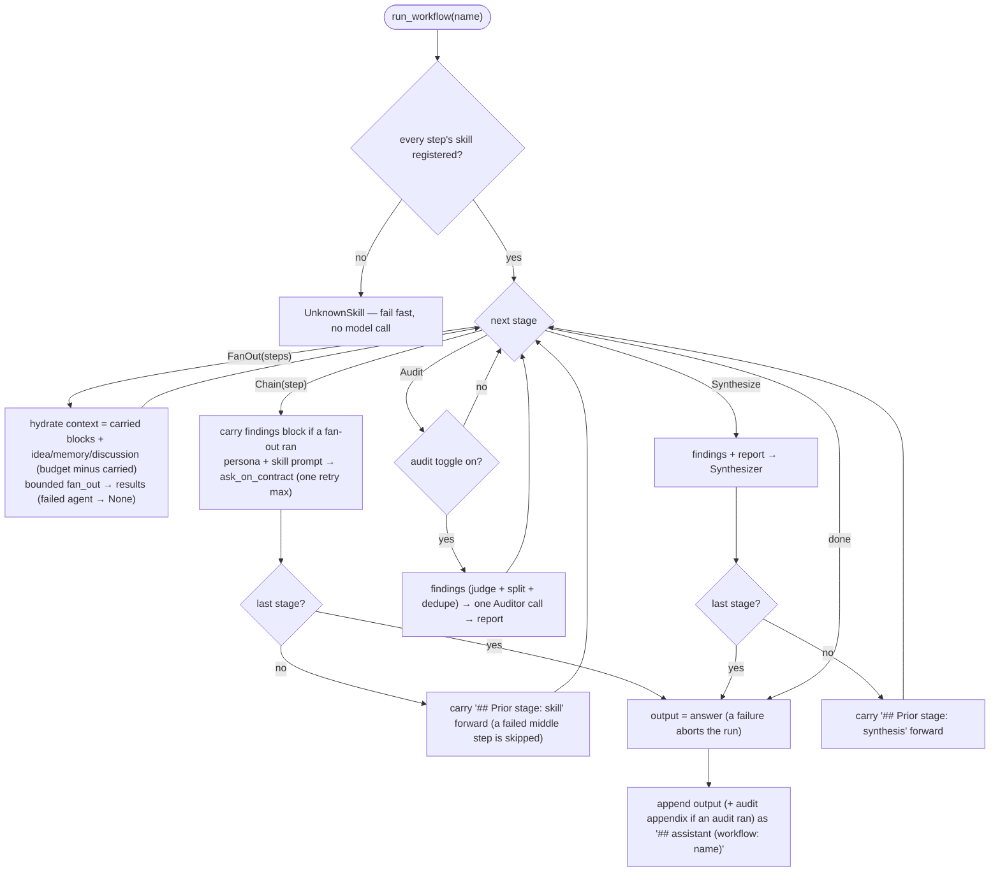

# 06 — Concept: Workflows

> A **workflow** is a *deterministic* multi-stage orchestration over an idea — a fixed sequence of
> [skill](./skills.md)/[agent](./agents.md) stages (fan-out, chained step, audit, synthesize), as
> opposed to free-form chat. Home of **D19** (the canonical interrogate pipeline) and **D32** (the
> stage model). Module: `concepts::workflows`.

## Model

Free chat is model-driven: the AI decides what to do next. A workflow is **script-driven**: the
*control flow* is fixed by the workflow definition, and only the *content* of each stage is
generated. That makes runs reproducible and debuggable — the same idea through the same workflow
takes the same path.

A workflow is an ordered list of `Stage`s:

| Stage | What it does |
|---|---|
| `FanOut(steps)` | Parallel agents over the same context, via the swarm's bounded fan-out primitive. Their answers become **findings**. |
| `Chain(step)` | One agent alone. Mid-workflow, its output is **carried forward** as a `## Prior stage: <skill>` block into every later stage. As the last stage, its output is the result. A chained step after a fan-out reads the findings (with verdicts, if audited) as a `## Prior stage: findings` block. |
| `Audit` | The factored audit over the findings so far ([ADR-0023](../adr/0023-verification-layer.md)). Skipped while the Settings toggle is off. |
| `Synthesize` | Converge the findings into one position. |

These are the skill book's named recipes (its "hot maps", [ADR-0022](../adr/0022-skills-as-markdown-and-the-skill-book.md)).

## Built-in workflows

| Name | Stages | Use when |
|---|---|---|
| `interrogate` | FanOut(Critic·premortem, Critic·cheapest-disproof, Researcher·constraints, Critic·second-order-effects) → Audit → Synthesize | the canonical run-it-into-the-ground pass (D19) |
| `steelman-then-attack` | Chain(Advocate·steelman) → FanOut(Critic·premortem, Critic·cheapest-disproof, Critic·devils-advocate) → Audit → Synthesize | the idea is still vague: give the critics its best version to attack |
| `ready-to-build` | FanOut(Harvester × the five `extract-*` lenses) → Audit → Chain(Synthesizer·build-prompt) | the discussion is settled: fold the surviving findings into a build prompt |

## D19 — The interrogate workflow

The canonical "interrogate an idea" pipeline:

1. Fan out diverse critics and a researcher.
2. Split their answers into findings; merge near-duplicates across lenses.
3. Audit the findings against the discussion.
4. Synthesize a single position.

```mermaid
flowchart TD
    START(["workflow start: idea in InDiscussion/Reopened"]) --> FANOUT

    subgraph FANOUT["fan-out (parallel agents, bounded — D21)"]
        A1["Critic · premortem"]
        A2["Critic · cheapest-disproof"]
        A3["Researcher · constraints"]
        A4["Critic · second-order effects"]
    end

    A1 --> JUDGE
    A2 --> JUDGE
    A3 --> JUDGE
    A4 --> JUDGE

    JUDGE["judge — drop failed/empty, split into findings, merge near-duplicates (lens kept)"] --> AUDIT
    AUDIT["Auditor — CONFIRMED / UNCERTAIN / REFUTED per finding (skipped if toggled off)"] --> SYNTH
    SYNTH["Synthesizer — idea + labelled findings → one position"] --> APPEND["append result + audit tally + disproven objections as one assistant turn"]
    APPEND --> END(["workflow end"])
```

## D32 — The stage model

How `run_workflow` walks a workflow's stages, and what flows between them.

```mermaid
flowchart TD
    START(["run_workflow(name)"]) --> CHECK{"every step's skill registered?"}
    CHECK -->|no| UNK["UnknownSkill — fail fast, no model call"]
    CHECK -->|yes| NEXT{"next stage"}

    NEXT -->|"FanOut(steps)"| FO["hydrate context = carried blocks + idea/memory/discussion (budget minus carried)<br/>bounded fan_out → results (failed agent → None)"]
    FO --> NEXT
    NEXT -->|"Chain(step)"| CH["carry findings block if a fan-out ran<br/>persona + skill prompt → ask_on_contract (one retry max)"]
    CH --> LASTC{"last stage?"}
    LASTC -->|"no"| CARRY["carry '## Prior stage: skill' forward (a failed middle step is skipped)"] --> NEXT
    LASTC -->|"yes"| OUT["output = answer (a failure aborts the run)"]
    NEXT -->|"Audit"| AUD{"audit toggle on?"}
    AUD -->|"no"| NEXT
    AUD -->|"yes"| AU["findings (judge + split + dedupe) → one Auditor call → report"] --> NEXT
    NEXT -->|"Synthesize"| SY["findings + report → Synthesizer"]
    SY --> LASTS{"last stage?"}
    LASTS -->|"no"| CARRY2["carry '## Prior stage: synthesis' forward"] --> NEXT
    LASTS -->|"yes"| OUT
    NEXT -->|"done"| OUT
    OUT --> PERSIST["append output (+ audit appendix if an audit ran) as '## assistant (workflow: name)'"]
```

## Determinism & failure

- **Deterministic control flow:** the stage list is fixed by the workflow definition; only stage
  outputs vary. Contrast with a swarm invoked ad hoc.
- **Bounded fan-out:** the parallel stage runs under the same concurrency semaphore and context
  budget as any swarm ([D21](./swarm.md), [ADR-0006](../adr/0006-bounded-concurrency-swarm.md)).
  A chained step's single retry happens under the permit its first call holds.
- **Failure handling:**
  - A failed fan-out agent drops to a null result the judge skips; the workflow degrades rather
    than aborting, mirroring the swarm failure model ([D14](./swarm.md)).
  - A failed *middle* chained step is skipped with nothing carried forward.
  - A failed *final* stage, or a fan-out with no usable result before an audit or synthesis, fails
    the run with nothing persisted.
- **Persistence:** only the final stage's output — plus the audit appendix, if an audit ran — is
  appended to `conversation.md`. Intermediate stage outputs are never persisted as turns; they are
  kept out of truth to reduce noise.

## UI trigger

Every `builtin_workflows()` entry is UI-triggerable, not just a library call:
`POST /idea/{slug}/workflow/{name}` ([R22](../09-web-ui.md#d17--route-map),
`web::routes::memory::run_workflow`). It follows the same claim → spawn → poll background-job shape
as the skill (R6) and swarm (R7) routes ([D11](../05-ai-integration.md),
[ADR-0010](../adr/0010-ai-turns-as-background-jobs.md)), with a per-stage progress note in the
thinking indicator.

**Synchronous guards** run before the job is claimed:

- the idea must be `InDiscussion` or `Reopened` (400 otherwise);
- `name` must resolve via `get_workflow` (404 if unknown), so a bad name never becomes a
  background job at all.

**Transcript:** only the final output is persisted, as one `## assistant (workflow: {name})` turn.
The transcript label keeps the workflow kind (`foil · workflow {name}`), so a workflow run stays
visually distinct from a same-named skill turn (`foil · {name}`).

**Buttons:** `templates/_actions.html` renders one `chip chip--workflow` button per
`builtin_workflows()` entry.

## Workflow vs swarm

They share machinery (bounded parallel agents, the judge, the audit, the synthesizer), but:

| | Workflow | Swarm |
|--|----------|-------|
| Control flow | fixed stage list, deterministic | one fan-out + audit + converge |
| Invocation | run a named pipeline | "swarm this idea" with owner-picked angles |
| Composition | chains stages; carries output forward | a single wave |

A workflow *uses* the swarm fan-out as its parallel stage; a swarm is the lower-level primitive
([D14](./swarm.md)).

## Mapping to code

- **Workflow definitions and runner:** `concepts::workflows` (`Stage`, `Workflow`,
  `builtin_workflows`, `run_workflow`).
- **Fan-out, judge, synthesizer:** delegate to `concepts::swarm`.
- **Audit stage:** `concepts::audit`.
- **Chained step:** `concepts::skills::ask_on_contract` over `concepts::agents::build_prompt`.
- **Steps:** `concepts::agents` applying `concepts::skills`.

## Related

- [swarm](./swarm.md) — D14/D21, the parallel primitive and its limits.
- [agents](./agents.md) — the roles staged here.
- [ADR-0023](../adr/0023-verification-layer.md) — the audit stage and the one-retry rule.
- The host tool's own Workflow concept is the inspiration; here it is applied to one idea.
