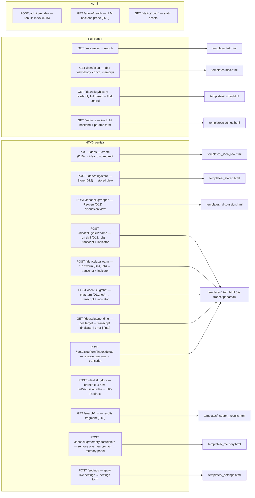
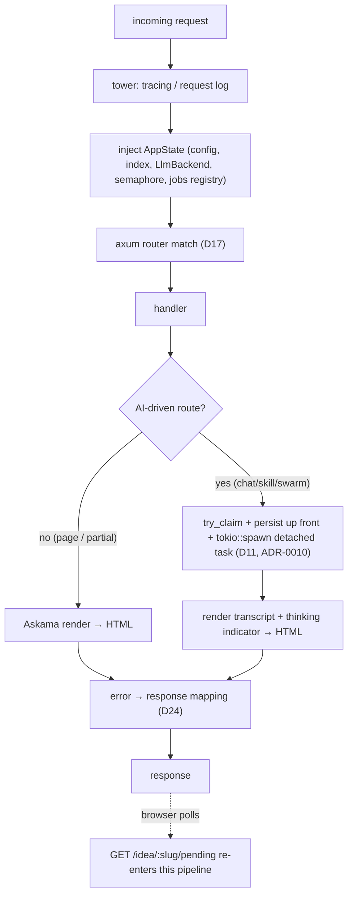

# 09 — Web UI

> The HTTP surface: the route map, the request/middleware pipeline, the Askama template hierarchy,
> and the HTMX interaction patterns (background-job polling, not SSE). Home of **D16** (request
> lifecycle) and **D17** (route map). Module: `web`. Decisions:
> [ADR-0001](./adr/0001-server-rendered-htmx-over-spa.md),
> [ADR-0010](./adr/0010-ai-turns-as-background-jobs.md) (supersedes the earlier SSE decision,
> [ADR-0004](./adr/0004-sse-token-streaming.md)),
> [ADR-0011](./adr/0011-live-switchable-llm-backend.md).

## Interaction model

Server-rendered HTML + HTMX, no SPA. Two response shapes — there is no long-lived streaming
response anywhere in the app:

- **Full page** — initial navigations (list, idea view, history, settings). Rendered from a base
  Askama layout.
- **Partial** — an HTML fragment swapped into the DOM by HTMX (e.g. a new idea row, an appended
  turn, a re-rendered transcript/memory panel). AI-driven routes (chat/skill/swarm) return a
  partial immediately — a transcript plus a "thinking" indicator — and the indicator self-repolls
  `GET /idea/:slug/pending` until the background job finishes
  ([ADR-0010](./adr/0010-ai-turns-as-background-jobs.md), [D11](./05-ai-integration.md)).

## D17 — Route map

Every route, its method, response shape, and the template it renders.



Route groups map to `web::routes` submodules: `ideas` (R1, R2, R3, R8, R9b, R12, R14), `chat` (R9),
`memory`/idea-actions (R4–R7, R15, R16 — the module name predates the delete routes but still owns
them), `settings` (R13, R13b), `admin` (R10, R11, R17).

## D16 — HTTP request / middleware pipeline

How a request traverses tower middleware to a handler and back, and where the two response shapes
diverge. Error mapping here implements the taxonomy [D24](./05-ai-integration.md).



## Template hierarchy (Askama)

Compile-time templates under `templates/`, backed by `web::templates` structs.

```
templates/
  base.html              # layout: head, vendored htmx.min.js, nav, 
  list.html              # extends base — idea list + search box
  idea.html              # extends base — one idea: body (rendered md), conversation, memory panel
  history.html            # extends base — the "btw" read-only full thread + Fork control
  settings.html           # extends base — live LLM backend + params page
  _idea_row.html         # partial — a single idea in the list
  _turn.html             # partial — one conversation turn (user/assistant); also the poll-target shape
  _discussion.html       # partial — the discussion pane (compose box + transcript/poll target)
  _actions.html          # partial — the #idea-actions block (moves/swarm/store); also sent OOB
  _stored.html           # partial — stored view (consolidated body + memory facts)
  _search_results.html   # partial — FTS results
  _memory.html            # partial — the memory panel (re-rendered after a fact delete)
  _settings.html          # partial — the settings form (re-rendered after a save)
```

Convention: files prefixed `_` are HTMX partials (never a full page); everything else `extends
base.html`.

## HTMX / polling patterns

- **Create / actions:** `hx-post` on forms/buttons; server returns a partial that `hx-swap` inserts.
- **Chat / skill / swarm (background job + poll):** the compose form (or a skill/swarm button)
  posts to its route; the handler claims the per-idea job slot, persists what it can up front,
  spawns a detached task, and immediately returns a transcript partial ending in a "thinking…"
  indicator block. That block is itself an HTMX fragment
  (`hx-get="/idea/:slug/pending" hx-trigger="load delay:1500ms" hx-target="#transcript"`) that
  re-fires ~1.5s after it lands; each poll response either re-emits the same self-triggering
  indicator (job still running, with an updated elapsed-seconds count), an error block (job
  failed — consumed on read), or the finished transcript with no further trigger (job done). This
  survives navigation because the underlying model call runs in a task detached from any one
  request ([ADR-0010](./adr/0010-ai-turns-as-background-jobs.md)).
- **Out-of-band state refresh:** transcript responses (chat, poll, cancel, skill, swarm, compact,
  delete-turn) append two top-level `hx-swap-oob="true"` fragments after the `#transcript` inner
  HTML: the `#idea-state` subhead badge and the `#idea-actions` block (`_actions.html`, an
  always-present container so a Draft page still has the OOB target). This is how the first chat
  turn's Draft → InDiscussion flip becomes visible — badge and moves/store controls update without
  a reload, while the composer (outside `#transcript`) survives a poll completing mid-typing.
  Store and reopen swap all of `#discussion`, so they carry only the OOB badge.
- **Markdown rendering:** idea bodies and memory facts are rendered server-side (markdown → sanitized
  HTML) before templating; the browser only receives HTML.
- **Degraded AI:** when `/admin/health` (or the boot probe) reports the active LLM backend absent,
  the compose box is rendered disabled with the banner from [D20](./05-ai-integration.md);
  read-only browsing is unaffected. Which backend counts as "active" follows the live Settings
  toggle ([ADR-0011](./adr/0011-live-switchable-llm-backend.md)).

## Mapping to code

| Piece | Location |
|-------|----------|
| Router + AppState + middleware | `app.rs` |
| Route handlers | `web::routes::{ideas,chat,memory,settings,admin}` |
| Background job registry + poll | `web::jobs` (shared by chat R9, skill R6, swarm R7, and the R9b poll endpoint) |
| Template structs | `web::templates` |
| Template sources | `templates/*.html` |

## Related

- [05-ai-integration](./05-ai-integration.md) — D11 background-job flow, D20 degradation, D24 errors.
- [07-flows](./07-flows.md) — the flows that enter through these routes.
- [ADR-0010](./adr/0010-ai-turns-as-background-jobs.md), [ADR-0011](./adr/0011-live-switchable-llm-backend.md).
