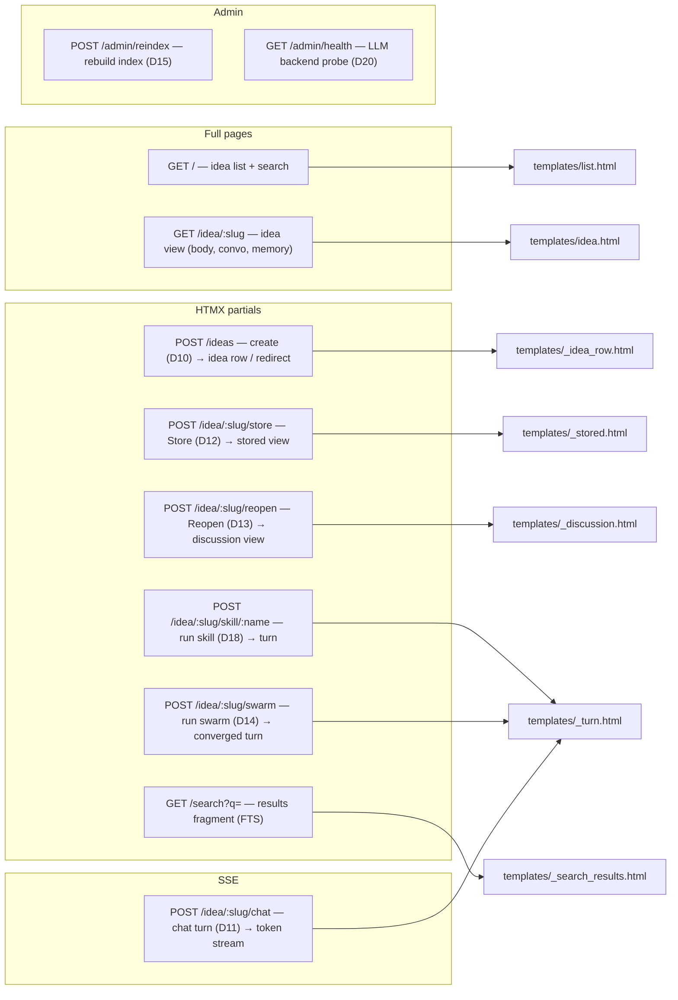
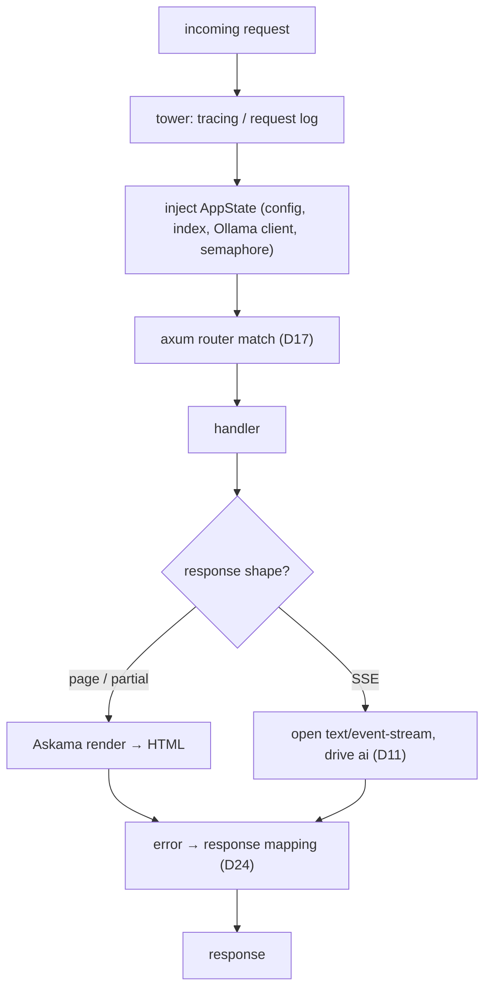

# 09 — Web UI

> The HTTP surface: the route map, the request/middleware pipeline, the Askama template hierarchy,
> and the HTMX/SSE interaction patterns. Home of **D16** (request lifecycle) and **D17** (route map).
> Module: `web`. Decisions: [ADR-0001](./adr/0001-server-rendered-htmx-over-spa.md),
> [ADR-0004](./adr/0004-sse-token-streaming.md).

## Interaction model

Server-rendered HTML + HTMX, no SPA. Three response shapes:

- **Full page** — initial navigations (list, idea view). Rendered from a base Askama layout.
- **Partial** — an HTML fragment swapped into the DOM by HTMX (e.g. a new idea row, an appended turn).
- **SSE stream** — long-lived `text/event-stream` for AI token streaming ([D11](./05-ai-integration.md)).

## D17 — Route map

Every route, its method, response shape, and the template it renders.



Route groups map to `web::routes` submodules: `ideas` (R1–R3), `chat` (R9), `memory`/idea-actions
(R4–R7), `admin` (R10–R11), search (R8).

## D16 — HTTP request / middleware pipeline

How a request traverses tower middleware to a handler and back, and where the two response shapes
diverge. Error mapping here implements the taxonomy [D24](./05-ai-integration.md).



## Template hierarchy (Askama)

Compile-time templates under `templates/`, backed by `web::templates` structs.

```
templates/
  base.html              # layout: head, vendored htmx.min.js, nav, 
  list.html              # extends base — idea list + search box
  idea.html              # extends base — one idea: body (rendered md), conversation, memory panel
  _idea_row.html         # partial — a single idea in the list
  _turn.html             # partial — one conversation turn (user/assistant)
  _discussion.html       # partial — the discussion pane (compose box + SSE target)
  _stored.html           # partial — stored view (consolidated body + memory facts)
  _search_results.html   # partial — FTS results
```

Convention: files prefixed `_` are HTMX partials (never a full page); everything else `extends
base.html`.

## HTMX / SSE patterns

- **Create / actions:** `hx-post` on forms/buttons; server returns a partial that `hx-swap` inserts.
- **Chat streaming:** the compose form posts to `/idea/:slug/chat`; the discussion pane subscribes
  with the HTMX **SSE extension** (`hx-ext="sse"`, `sse-connect`), appending each token event into
  the transcript target. On the `done` event the stream closes.
- **Markdown rendering:** idea bodies and memory facts are rendered server-side (markdown → sanitized
  HTML) before templating; the browser only receives HTML.
- **Degraded AI:** when `/admin/health` (or the boot probe) reports the LLM backend absent, the compose box is
  rendered disabled with the banner from [D20](./05-ai-integration.md); read-only browsing is
  unaffected.

## Mapping to code

| Piece | Location |
|-------|----------|
| Router + AppState + middleware | `app.rs` |
| Route handlers | `web::routes::{ideas,chat,memory,admin}` |
| SSE plumbing | `web::sse` (shared by chat R9 and swarm R7) |
| Template structs | `web::templates` |
| Template sources | `templates/*.html` |

## Related

- [05-ai-integration](./05-ai-integration.md) — D11 streaming, D20 degradation, D24 errors.
- [07-flows](./07-flows.md) — the flows that enter through these routes.
