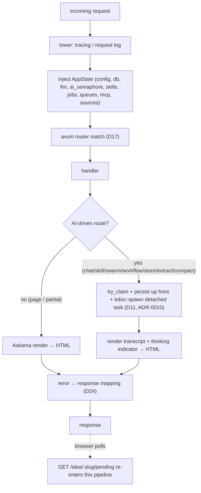

# 09 — Web UI

> The HTTP surface: the route map, the request/middleware pipeline, the Askama template hierarchy,
> and the HTMX interaction patterns (background-job polling, not SSE). Home of **D16** (request
> lifecycle) and **D17** (route map). Module: `web`. Decisions:
> [ADR-0001](./adr/0001-server-rendered-htmx-over-spa.md),
> [ADR-0010](./adr/0010-ai-turns-as-background-jobs.md) (supersedes the earlier SSE decision,
> [ADR-0004](./adr/0004-sse-token-streaming.md)),
> [ADR-0011](./adr/0011-live-switchable-llm-backend.md),
> [ADR-0016](./adr/0016-forced-compact-folds-fully.md) (the compact route's `Notice` pending state),
> [ADR-0017](./adr/0017-web-access-tools.md) (the Settings page's `web_access` checkbox),
> [ADR-0018](./adr/0018-mcp-servers.md) (the `/mcp` server management page),
> [ADR-0022](./adr/0022-skills-as-markdown-and-the-skill-book.md) (the `/skills` skill book),
> [ADR-0023](./adr/0023-verification-layer.md) (the Settings page's `audit` checkbox),
> [ADR-0026](./adr/0026-per-role-call-profiles.md) (the Settings page's role-tuning table).

## Interaction model

Server-rendered HTML + HTMX, no SPA. Two response shapes — there is no long-lived streaming
response anywhere in the app:

- **Full page** — initial navigations (list, idea view, history, settings). Rendered from a base
  Askama layout.
- **Partial** — an HTML fragment swapped into the DOM by HTMX (e.g. a new idea row, an appended
  turn, a re-rendered transcript/memory panel). AI-driven routes (chat/skill/swarm/store) return a
  partial immediately — a transcript plus a "thinking" indicator — and the indicator self-repolls
  `GET /idea/:slug/pending` until the background job finishes
  ([ADR-0010](./adr/0010-ai-turns-as-background-jobs.md), [D11](./05-ai-integration.md)); store's
  poll response widens to the stored view once its job lands (D12).

## D17 — Route map

Every route, its method, response shape, and the template it renders.


```mermaid
flowchart LR
    subgraph pages["Full pages"]
        R1["GET / — idea list + search"]
        R2["GET /idea/:slug — idea view (body, convo, memory)"]
        R12["GET /idea/:slug/history — read-only full thread + Fork control"]
        R13["GET /settings — live LLM backend + params form (incl. web_access checkbox, ADR-0017; audit checkbox, ADR-0023; role-tuning table, ADR-0026)"]
        R19["GET /idea/:slug/artifact/:name — view one artifact (.md full page | .html served raw)"]
        R24["GET /mcp — MCP server management page (ADR-0018)"]
        R33["GET /skills — the skill book: every move by spine stage (ADR-0022)"]
        R36["GET /sources — named reference sources page (ADR-0021)"]
    end
    subgraph partials["HTMX partials"]
        R3["POST /ideas — create (D10) → idea row / redirect"]
        R4["POST /idea/:slug/store — Store (D12, job) → transcript + indicator"]
        R5["POST /idea/:slug/reopen — Reopen (D13) → discussion view"]
        R6["POST /idea/:slug/skill/:name — run skill (D18, job) → transcript + indicator"]
        R7["POST /idea/:slug/swarm — run swarm (D14, job; angles= from the picker) → transcript + indicator"]
        R8["GET /search?q= — results fragment (ranked FTS: weighted bm25 + backlink prior + highlight)"]
        R9["POST /idea/:slug/chat — chat turn (D11, job) → 200 transcript + indicator | 202 queued if busy"]
        R9b["GET /idea/:slug/pending — poll target; drains the next queued message → transcript (indicator | error | final)"]
        R32["POST /idea/:slug/queue/:id/delete — drop one queued chat message before it sends → #queue panel"]
        R14["POST /idea/:slug/fork — branch to a new InDiscussion idea → HX-Redirect"]
        R15["POST /idea/:slug/turn/:index/delete — remove one turn → transcript"]
        R16["POST /idea/:slug/memory/:fact/delete — remove one memory fact → memory panel"]
        R13b["POST /settings — apply live settings (incl. role_<name>_{temperature,model,effort}) → settings form"]
        R18["POST /idea/:slug/extract — run knowledge extraction (D30, job) → transcript + indicator"]
        R20["POST /idea/:slug/artifact/:name/delete — remove one artifact file → artifacts panel"]
        R21["POST /idea/:slug/compact — fold now (ADR-0012/0016, job) → transcript + indicator | notice"]
        R22["POST /idea/:slug/workflow/:name — run workflow (D19, job) → transcript + indicator"]
        R23["POST /idea/:slug/rename — retitle in place (slug unchanged, every state) → title block"]
        R25["POST /mcp/add — add an MCP server (ADR-0018) → #mcp panel"]
        R26["GET /mcp/:name/edit — swap one row into its edit form → row"]
        R27["GET /mcp/:name/view — swap the edit form back to a view row → row"]
        R28["POST /mcp/:name/update — apply a url/token edit → #mcp panel"]
        R29["POST /mcp/:name/toggle — flip enabled → #mcp panel"]
        R30["POST /mcp/:name/delete — remove a server → #mcp panel"]
        R31["POST /mcp/:name/probe — connect + tools/list, inline (not a job) → status slot"]
        R34["POST /skills/reload — re-read vault/.skills/, inline (not a job) → #skills panel (ADR-0022)"]
        R37["POST /sources/add — register a source (ADR-0021) → #sources panel"]
        R38["GET /sources/:name/edit — swap one row into its edit form → row"]
        R39["GET /sources/:name/view — swap the edit form back to a view row → row"]
        R40["POST /sources/:name/update — apply a host-path edit → #sources panel"]
        R41["POST /sources/:name/delete — remove a source → #sources panel"]
        R42["POST /idea/:slug/tags — replace the idea's tag set → tag row"]
        R43["POST /idea/:slug/sources — replace the idea's attached-source set → sources row"]
        R44["POST /idea/:slug/cancel — abort the running job, idempotent → transcript | stored view"]
        R45["POST /idea/:slug/delete — permanently delete the idea (forced reindex) → HX-Redirect /"]
    end
    subgraph admin["Admin"]
        R10["POST /admin/reindex — rebuild index (D15)"]
        R11["GET /admin/health — LLM backend probe (D20)"]
        R17["GET /static/{*path} — static assets"]
    end
    subgraph mcp_inbound["Inbound MCP (ADR-0024) — not HTML"]
        R35["POST /api/mcp — MCP protocol endpoint (rmcp Streamable HTTP, Bearer-gated); JSON-RPC, no template"]
    end

    R1 --> T_LIST["templates/list.html"]
    R2 --> T_IDEA["templates/idea.html"]
    R3 --> T_ROW["templates/_idea_row.html"]
    R4 --> T_TURN["templates/_turn.html (via transcript partial)"]
    R5 --> T_DISC["templates/_discussion.html"]
    R6 --> T_TURN
    R7 --> T_TURN
    R8 --> T_RESULTS["templates/_search_results.html"]
    R9 --> T_TURN
    R9b --> T_TURN
    R9b -.->|"store job lands"| T_STORED["templates/_stored.html (HX-Retarget #discussion)"]
    R12 --> T_HIST["templates/history.html"]
    R13 --> T_SET["templates/settings.html"]
    R13b --> T_SETF["templates/_settings.html"]
    R15 --> T_TURN
    R16 --> T_MEM["templates/_memory.html"]
    R18 --> T_TURN
    R19 --> T_ART["templates/artifact.html (.md) | raw .html export"]
    R20 --> T_ARTS["templates/_artifacts.html"]
    R21 --> T_TURN
    R22 --> T_TURN
    R23 --> T_TITLE["templates/_idea_title.html"]
    R24 --> T_MCP["templates/mcp.html"]
    R25 --> T_MCPLIST["templates/_mcp_list.html"]
    R26 --> T_MCPEDIT["templates/_mcp_edit_row.html"]
    R27 --> T_MCPROW["templates/_mcp_row.html"]
    R28 --> T_MCPLIST
    R29 --> T_MCPLIST
    R30 --> T_MCPLIST
    R31 --> T_MCPSTATUS["templates/_mcp_status.html"]
    R32 --> T_QUEUE["templates/_queue.html"]
    R33 --> T_SKILLS["templates/skills.html"]
    R34 --> T_SKILLSLIST["templates/_skills_list.html"]
    R36 --> T_SOURCES["templates/sources.html"]
    R37 --> T_SRCLIST["templates/_sources_list.html"]
    R38 --> T_SRCEDIT["templates/_source_edit_row.html"]
    R39 --> T_SRCROW["templates/_source_row.html"]
    R40 --> T_SRCLIST
    R41 --> T_SRCLIST
    R42 --> T_TAGS["templates/_idea_tags.html"]
    R43 --> T_IDEASRC["templates/_idea_sources.html"]
    R44 --> T_TURN
    R44 -.->|"store job lands"| T_STORED
    R45 --> T_REDIRECT["HX-Redirect / (no template)"]
```

Route groups map to `web::routes` submodules: `ideas` (R1, R2, R3, R8, R9b, R12, R14, R23, R42–R45 —
`set_tags`/`set_sources`/`cancel_job`/`delete_idea`), `chat`
(R9, R32 — the send path and its pending-message queue), `memory`/idea-actions (R4–R7, R15, R16, R22 — the module name predates the delete/workflow
routes but still owns them; R22 (`run_workflow`) runs the D19 deterministic workflow DAG behind the
same claim → spawn → poll job shape as R6/R7), `settings` (R13, R13b), `admin` (R10, R11, R17),
`artifacts` (R18, R19, R20 — knowledge extraction and its per-idea artifact files,
[ADR-0015](./adr/0015-knowledge-extraction-artifacts.md)), `compact` (R21 — the manual "compact
now" fold, [ADR-0012](./adr/0012-auto-compact.md)/[ADR-0016](./adr/0016-forced-compact-folds-fully.md)),
`mcp` (R24–R31 — the MCP server management page, [ADR-0018](./adr/0018-mcp-servers.md)), `skills`
(R33, R34 — the skill book and its live reload, [ADR-0022](./adr/0022-skills-as-markdown-and-the-skill-book.md)),
`mcp_server` (R35 — the **inbound** MCP protocol endpoint, [ADR-0024](./adr/0024-mcp-server-inbound.md);
the mirror image of `mcp`'s outbound registry), `sources` (R36–R41 — the owner's named read-only
reference-source registry, mirroring `mcp`'s shape, [ADR-0021](./adr/0021-reference-sources.md)).
R23 (`rename_idea`) is deliberately **not** a job route (D11) — it is a synchronous frontmatter
edit, not an AI call, so it returns its partial directly like R3/R14/R15/R16 rather than going
through claim → spawn → poll. **R24–R31 are idea-agnostic** — they manage the owner-global MCP
server registry, not any one idea, so they carry no `:slug` and sit outside the per-idea job
registry entirely. R32 (`remove_queued`) is not a job route either: it edits the in-memory queue and
returns the refreshed `#queue` panel directly. R31 (`probe_server`) is likewise **not** a job route despite touching the
network: an MCP probe is one bounded HTTP round trip already capped by `ai::mcp`'s own connect/request
timeouts, not a model call that can run for minutes, so the handler awaits it inline
([ADR-0018](./adr/0018-mcp-servers.md)). R34 (`reload_skills`) is not a job route either: it re-reads
a handful of small files under `vault/.skills/` synchronously, no model call, and returns the
refreshed `#skills` panel directly — the same shape as R23/R32. **R35** is a single mounted protocol
endpoint, not a page or partial — it carries its own MCP-level `tools/call`/`tasks/*` dispatch
(`web::mcp_server`), and its two long-running tools (`chat`, `store_idea`) still go through the same
`web::jobs` claim → spawn → poll machinery every other AI route uses, bridged onto the MCP Tasks
primitive rather than exposed as HTML ([ADR-0024](./adr/0024-mcp-server-inbound.md), [docs/13](./13-mcp-server-inbound.md)).
**R36–R41 (`/sources`, ADR-0021) never run docker** (the app never invokes docker at all, ADR-0020). A mutation only rewrites the generated
`vault/.docker-compose.sources.yml` override (`web::routes::sources::add_source`/`update_source`/
`delete_source` → `crate::sources::SourceRegistry`); the saved-vs-applied gap surfaces as the
panel's "you run: `docker compose up -d`" banner copy, same as `/mcp`'s pattern but with no probe
route and no toggle — every `GET` render stat-probes the registry directly
(`SourceRegistry::statuses`), so a source is either registered or removed, never "disabled". R42
(`set_tags`) and R43 (`set_sources`) are whole-file read-modify-writes on `idea.md`, so — like R23
— they claim the per-idea job slot before writing and return `400` ("a run is in progress for this
idea") if a job is already `Running`, releasing the slot in every path (including a `404` on a
missing idea) so the idea never reads as stuck busy. R42 slugifies each comma-separated token
(dropping junk silently, capping at `MAX_IDEA_TAGS`); R43 reads the raw urlencoded body by hand
(`axum::Form` can't collect a repeated `sources=` key) and only checks a newly-checked name against
the registry — an already-attached name the registry no longer knows may persist, since frontmatter
is truth. R44 (`cancel_job`) aborts the in-flight detached task (dropping the model future so
nothing partial persists) and is idempotent: cancelling an idle idea just re-renders current state
through the same `respond_discussion_or_stored` the R9b poll uses, including widening to the stored
view if a store job won the race first. R45 (`delete_idea`) removes the whole idea folder and then
runs a **forced** reindex (`web::routes::reindex_logged_forced`, bypassing the empty-vault guard
[ADR-0019](./adr/0019-vault-mount-verified-not-created.md) would otherwise apply) before an `HX-Redirect`
home, since deleting the last idea legitimately empties the vault.

## D16 — HTTP request / middleware pipeline

How a request traverses tower middleware to a handler and back, and where the two response shapes
diverge. Error mapping here implements the taxonomy [D24](./05-ai-integration.md).


```mermaid
flowchart TD
    REQ["incoming request"] --> TRACE["tower: tracing / request log"]
    TRACE --> STATE["inject AppState (config, db, llm, ai_semaphore, skills, jobs, queues, mcp, sources)"]
    STATE --> ROUTE["axum router match (D17)"]
    ROUTE --> HANDLER["handler"]
    HANDLER --> BRANCH{"AI-driven route?"}
    BRANCH -- "no (page / partial)" --> RENDER["Askama render → HTML"]
    BRANCH -- "yes (chat/skill/swarm/workflow/store/extract/compact)" --> JOBBR["try_claim + persist up front + tokio::spawn detached task (D11, ADR-0010)"]
    JOBBR --> RENDER2["render transcript + thinking indicator → HTML"]
    RENDER --> ERRMAP
    RENDER2 --> ERRMAP
    ERRMAP["error → response mapping (D24)"] --> RESP["response"]
    RESP -.->|"browser polls"| POLL["GET /idea/:slug/pending re-enters this pipeline"]
```

## Template hierarchy (Askama)

Compile-time templates under `templates/`, backed by `web::templates` structs.

```
templates/
  base.html              # layout: head, vendored htmx.min.js, nav, 
  list.html              # extends base — idea list + search box
  idea.html              # extends base — one idea: body (rendered md), conversation, memory panel,
                         #   and the related panel (related_html, pre-rendered from _related.html)
  history.html            # extends base — the "btw" read-only full thread + Fork control
  settings.html           # extends base — live LLM backend + params page
  _idea_row.html         # partial — a single idea in the list
  _idea_title.html        # partial — the idea page's h1 + inline rename disclosure (R23); also
                          #   -d by idea.html so the page and the rename swap match
  _turn.html             # partial — one conversation turn (user/assistant); also the poll-target shape
  _discussion.html       # partial — the discussion pane (compose box + transcript/poll target + queue)
  _queue.html            # partial — the #queue panel: chat messages waiting for the foil, each
                          #   removable (R32); also sent OOB with every transcript response
  _actions.html          # partial — the #idea-actions block (moves/swarm + angle picker/store);
                          #   also sent OOB
  _stored.html           # partial — stored view (consolidated body + memory facts); delivered by
                          #   the R9b poll once a store job (R4) lands truth as Stored, via
                          #   HX-Retarget #discussion (respond_discussion_or_stored)
  _search_results.html   # partial — FTS results
  _related.html          # partial — the #related panel: related ideas (title, hop label, reasons,
                         #   latest fact titles) from memory::related::related_entries, then "Tag
                         #   drift" notes: only this idea's own tags that near-duplicate another
                         #   vault tag (index::queries::own_tag_near_duplicates, judged by
                         #   domain::tag::near_duplicate; web::routes::ideas::build_related_panel
                         #   shows at most 5 notes, 5 carrier slugs each, never merged), or an
                         #   "unavailable" note
                         #   when the index or its lock fails (web::templates::RelatedPanel)
  _memory.html            # partial — the memory panel (re-rendered after a fact delete)
  _settings.html          # partial — the settings form (re-rendered after a save)
  artifact.html           # extends base — one .md artifact rendered as a full page (R19)
  _artifacts.html         # partial — the artifacts panel (re-rendered after an artifact delete)
  artifact_export.html    # standalone (no base) — the opt-in .html knowledge report, written to
                          #   disk by R18, not served directly by any route
  mcp.html                 # extends base — the MCP server management page (R24, ADR-0018)
  _mcp_list.html           # partial — the #mcp panel (server rows + add-server form; R25/R28/R29/R30)
  _mcp_row.html            # partial — one server's normal view row (R27)
  _mcp_edit_row.html       # partial — one server's url/token edit form (R26)
  _mcp_status.html         # partial — one row's probe status slot (R31)
  skills.html               # extends base — the skill book page shell (R33, ADR-0022)
  _skills_list.html         # partial — the #skills panel: every move grouped by spine stage,
                            #   with use_when/avoid_when/source/role/contract, plus load issues;
                            #   re-rendered by reload (R34)
  _idea_tags.html           # partial — the idea page's #idea-tags-row: tag chips + inline editor;
                            #   pre-rendered into idea.html (tags_html) and swapped whole by R42
  _idea_sources.html        # partial — the #idea-sources-row: attached-source chips + checkbox
                            #   editor (web::templates::IdeaSources); idea.html (sources_html) + R43
  sources.html              # extends base — the reference-sources page shell (R36, ADR-0021)
  _sources_list.html        # partial — the #sources panel: saved-vs-applied banner (the
                            #   `docker compose up -d` the owner runs, or the bare-mode note), the
                            #   source rows, then the add form; re-rendered by R37/R40/R41
  _source_row.html          # partial — one source's normal view row (R39), -d by the list
  _source_edit_row.html     # partial — one source's host-path edit form (R38)
```

Convention: files prefixed `_` are HTMX partials (never a full page); everything else `extends
base.html`.

## HTMX / polling patterns

- **Create / actions:** `hx-post` on forms/buttons; server returns a partial that `hx-swap` inserts.
- **Chat / skill / swarm / workflow / store / extract / compact (background job + poll):** the
  compose form (or a skill/swarm/workflow/store/compact button) posts to its route; the handler
  claims the per-idea job slot, persists what it can up front, spawns a detached task, and
  immediately returns a transcript partial ending in a "thinking…" indicator block. That block is
  itself an HTMX fragment
  (`hx-get="/idea/:slug/pending" hx-trigger="load delay:1500ms" hx-target="#transcript"`) that
  re-fires ~1.5s after it lands; each poll response either re-emits the same self-triggering
  indicator (job still running, with an updated elapsed-seconds count), an error block (job
  failed — consumed on read), a neutral notice block (job completed as a genuine no-op — consumed
  on read the same way, currently only emitted by the manual compact route's `NothingToFold`
  outcome, [ADR-0016](./adr/0016-forced-compact-folds-fully.md)), or the finished transcript with
  no further trigger (job done). This survives navigation because the underlying model call runs in
  a task detached from any one request ([ADR-0010](./adr/0010-ai-turns-as-background-jobs.md)). The
  workflow route (R22, D19) only persists its converged synthesis as one
  `## assistant (workflow: {name})` turn — intermediate fan-out/judge steps are not written to
  `conversation.md`, mirroring the swarm's discard-intermediates rule — and the finished turn's
  label keeps the workflow kind (`foil · workflow {name}`, distinguishing it from a same-named
  skill turn's `foil · {name}`). A running workflow's indicator note reports live per-stage
  progress rather than one fixed string. The swarm route (R7) writes its converged turn as
  `## assistant (swarm: a, b, …)` (`vault::store::parse_turn_heading` → `TurnSource::Swarm`, label
  "foil · swarm (a, b)"); the legacy bare `## assistant (swarm)` still parses as an empty angle
  list. The store route (R4, D12) is the one exception to "finished
  transcript with no further trigger": when its job lands, truth has already flipped to `Stored`,
  so the poll response instead widens to the stored view — see the next bullet.
- **Chat queue — a send while busy is queued, not dropped:** each idea still holds one in-flight
  job, but R9 no longer re-shows the busy state and throws the message away. If the slot is free
  (`jobs::try_claim_idle` — empty, with no unshown `Failed`/`Notice` outcome) the turn starts at
  once (`200`). Otherwise the message joins a per-idea FIFO (`jobs::enqueue`, capped at
  `jobs::MAX_QUEUED` = 20; past that R9 returns `400`) and R9 answers `202 Accepted` with the
  current transcript. The composer resets on any 2xx, so a queued message clears the box just like
  a sent one. The drain point is the poll: every R9b request first calls
  `chat::start_next_queued`, which claims the slot with the same `try_claim_idle` gate (a racing
  poll can't double-start, and an error the owner hasn't seen yet holds the queue), pops the oldest
  message, and starts it through the same `spawn_chat_turn` path as a direct send. One message runs
  per completion. A message whose idea was stored or deleted while it waited is dropped. When the
  idea is idle or showing an error/notice but messages are still waiting, `transcript_inner`
  appends a bare `queue_poller` (same `hx-get`/`hx-target` as the indicator) so polling survives
  the gap between jobs. The `#queue` panel (`_queue.html`) lists each waiting message as an
  80-char one-line preview with a ✕ that posts R32. It renders on page load (queue state lives in
  the process, so it survives navigation) and refreshes out-of-band on every transcript response.
  The queue is in-memory like the job slots: a restart loses unsent messages. It covers chat
  only. Skill/swarm/workflow buttons on a busy idea still just re-show the in-flight state.
- **Swarm angle picker:** the swarm chip in `_actions.html` carries an `angles ▾` disclosure with
  one checkbox per visible, non-capstone skill (`SkillRegistry::visible()` minus the `Capstone`
  stage) — that's ten today (steelman, premortem, cheapest-disproof, devils-advocate, pr-faq,
  dialectical-inquiry, constraints, second-order-effects, market-size, triz), each label titled
  with the same `skill_tooltip` as its move chip; the hidden `extract-*` lenses stay off the
  picker because they are `hidden`, not because of any swarm-specific filter. The canonical four
  `concepts::swarm::DEFAULT_ANGLES` are pre-checked. The checkboxes deliberately have no `name`: an
  `hx-on::config-request` hook joins the checked values into the single comma-separated `angles`
  field R7 already accepted. That keeps the picker additive: with JS off, or nothing checked, the
  form posts no `angles` and `memory::run_swarm` falls back to `DEFAULT_ANGLES`. R7 still
  validates synchronously before claiming the slot: an unknown angle, more than `MAX_ANGLES` (8),
  or a capstone-stage angle (e.g. `build-prompt`) is a `400`, not an error turn. The menu also
  carries that cap (`web::templates::Actions::max_angles`, rendered as `data-max-angles`), and an
  `hx-on:change` hook disables the unchecked boxes once that many are checked. The offered list is
  unbounded (owner skills in `vault/.skills/` join it), so the picker can't build a selection R7
  would reject. The route check stays authoritative.
- **The spine strip:** `_actions.html` also renders a `spine` strip above the move chips
  (`concepts::coverage::coverage`, derived purely from `conversation.md`'s turn headings — nothing
  new is persisted): a ✓/○ per ideation-spine stage (steelman → attack → consequence → converge →
  capstone), a `next ›` chip (posts the suggested skill, or the swarm once only convergence is
  missing), soft "wrong turn" warnings (e.g. a build prompt generated before any attack move, or
  the same move run three times in a row), and — by the Store button — a "no attack move has run
  yet" note when the foil has answered but nothing has tried to break the idea. Warnings never
  block anything; they read like the skill book's own guidance. The move chips themselves render
  from every visible, non-capstone skill, with a tooltip built from its description plus
  `use_when`, and the caption under them links to `/skills`.
- **Store's finish path — poll widens to the stored view:** because only the store job can leave an
  idea `Stored` (every other job route guards on the discussion states), the shared poll handler
  (`web::routes::ideas::respond_discussion_or_stored`, serving both R9b and cancel) checks the
  on-disk state on every poll: while `InDiscussion`/`Reopened` it returns the normal transcript
  poll response, but once state is `Stored` it instead renders `_stored.html` (the dormant marker +
  reopen control only — see the next bullet for why the consolidated writeup isn't in it) plus the
  OOB `state--stored` badge, and sends `HX-Retarget: #discussion` / `HX-Reswap: innerHTML` response
  headers so HTMX swaps the *whole* discussion panel (composer and actions included) instead of just
  `#transcript` — the same swap the old synchronous store response used to perform directly. A store
  that held back facts behind the evidence gate (quarantined to an artifact) or read a truncated
  discussion during memory extraction leaves a one-shot `stored_outcome` notice under the stored
  panel (`web::routes::ideas::stored_outcome`) — the quiet `notice_block` styling, consumed on read
  like the compact route's `NothingToFold` notice; while the store job is still wrapping up,
  `stored_outcome` instead emits a short follow-up poller targeting `#discussion` so the widened
  swap still lands once truth catches up.
- **`_stored.html` no longer carries the consolidated body.** The store job rewrites `idea.md`'s
  body to the consolidated writeup, which is *already* rendered once in the page's top
  `<div class="statement" id="idea-statement">` ([D8](./03-data-model.md) frontmatter, memory
  extraction on Store, [D12](./06-concepts/memory.md)); `_stored.html` used to repeat that same body
  inside `#discussion`, rendering it twice on every stored page. It now renders only the
  `stored · dormant` label and the reopen control, and the store-completion poll response
  (`respond_discussion_or_stored`) instead OOB-refreshes `#idea-statement` directly with the newly
  consolidated markdown — the one `.statement` block on the page updates in place instead of being
  duplicated.
- **Out-of-band state refresh:** transcript responses (chat, poll, cancel, skill, swarm, workflow,
  store, extract, compact, delete-turn) append four top-level `hx-swap-oob="true"` fragments after the
  `#transcript` inner HTML: the `#idea-state` subhead badge, the `#idea-actions` block
  (`_actions.html`, an always-present container so a Draft page still has the OOB target), the
  artifacts panel (so a finished extraction shows up without a reload), and the `#queue` panel (so
  a queued send, a drain, or a removal shows live; the discussion pane renders it `hidden` when
  empty rather than omitting it, so the OOB target exists). This is
  how the first chat turn's Draft → InDiscussion flip becomes visible — badge and moves/store
  controls update without a reload, while the composer (outside `#transcript`) survives a poll
  completing mid-typing. Store's own immediate response follows this same shape (transcript +
  indicator + OOB badge/actions, `hx-target="#transcript"`); it's only the poll response once the
  store job *lands* that swaps all of `#discussion` (previous bullet). Reopen still swaps all of
  `#discussion` synchronously, so it carries only the OOB badge.
- **Markdown rendering:** idea bodies and memory facts are rendered server-side (markdown → sanitized
  HTML) before templating; the browser only receives HTML.
- **R8 search result rendering:** `index::queries::search` ranks google-style (per-`kind` bm25
  weighting + a capped inbound-backlink prior + a small multi-kind-corroboration bonus — see
  `index/queries.rs` for the exact algebra) and returns each hit's snippet as plain text with
  Private-Use-Area sentinel codepoints (not HTML) delimiting the matched span, plus the winning
  `kind` (`title`/`tags`/`idea_body`/`conversation`/`memory`/`artifact`). `routes::ideas::search`
  turns that into the `_search_results.html` view: HTML-escape the *whole* snippet first, then
  translate the sentinel pair into `<mark>`/`</mark>` — escape-then-mark, never the reverse, is the
  XSS boundary (`routes::ideas::highlight_snippet`) — and renders a small mono provenance chip for
  non-obvious kinds (`tags`/`memory`/`artifact`/`conversation`; `title`/`idea_body` get no chip,
  since the owner already expects a match there).
- **MCP servers and the usage meter's "(+N KB tools)" term:** the `/mcp` page
  ([ADR-0018](./adr/0018-mcp-servers.md)) manages the owner's registry of MCP endpoints outside any
  one idea's discussion — its routes (R24–R31) carry no `:slug` and don't touch `web::jobs`, except
  that an enabled server's tools ride every subsequent chat/skill/swarm/workflow turn on whichever
  backend is active. The usage meter (`~X KB of ~Y KB`, [ADR-0014](./adr/0014-dynamic-context-budget.md))
  grows a `(+N KB tools)` term summing the last-known serialized size of every *enabled* server's
  tool definitions — populated by a `POST /mcp/{name}/probe` (R31) or by a turn's own connect,
  whichever happened most recently, so the figure can be a turn or two stale but never invents a
  cost for a server that was never listed.
- **Degraded AI:** when `/admin/health` (or the boot probe) reports the active LLM backend absent,
  the compose box is rendered disabled with the banner from [D20](./05-ai-integration.md);
  read-only browsing is unaffected. Which backend counts as "active" follows the live Settings
  toggle ([ADR-0011](./adr/0011-live-switchable-llm-backend.md)).
- **The skill book (`/skills`, ADR-0022):** `GET /skills` (R33) renders every registered skill
  grouped by ideation-spine stage (steelman → attack → consequence → converge → capstone, plus the
  off-spine `extract` lenses shown but never offered as moves), each card carrying its
  `use_when`/`avoid_when` guidance, role, output contract, and source (`built-in` / `vault
  override` / `vault`), plus any owner file under `vault/.skills/` that failed to load. `POST
  /skills/reload` (R34) re-reads that folder live and swaps in the refreshed `#skills` panel — no
  restart needed to pick up an edited or new owner skill.

## Mapping to code

| Piece | Location |
|-------|----------|
| Router + middleware | `app.rs` |
| AppState (shared handler state) | `web::state` (re-exported as `app::AppState`) |
| Route handlers | `web::routes::{ideas,chat,memory,settings,admin,artifacts,compact,mcp,skills,sources}` |
| Inbound MCP server (R35) | `web::mcp_server::{mod,auth,handler,tools,tasks,prompts}` — `rmcp::ServerHandler` + Bearer `AuthLayer`, [ADR-0024](./adr/0024-mcp-server-inbound.md), [docs/13](./13-mcp-server-inbound.md) |
| Background job registry + poll | `web::jobs` (shared by chat R9, skill R6, swarm R7, workflow R22, store R4, extract R18, compact R21, and the R9b poll endpoint — **not** R31's inline MCP probe, [ADR-0018](./adr/0018-mcp-servers.md); also driven by R35's `chat`/`store_idea` MCP tasks via `web::mcp_server::tasks::TaskRegistry`) |
| Pending chat-message queue | `web::jobs` queue half (`Queues`, `enqueue`/`dequeue`/`remove_queued`/`list_queued`, `MAX_QUEUED`); drained by `web::routes::chat::start_next_queued` from R9b; rendered by `web::routes::ideas::render_queue_panel` |
| Swarm angle defaults | `concepts::swarm::DEFAULT_ANGLES` (picker pre-check + R7's empty-request fallback) |
| Skill registry (skill book + move chips + angle picker) | `concepts::skills::LiveSkills` (`AppState.skills`; `load`/`snapshot`/`reload`), `SkillRegistry` (`load`/`visible`), spine coverage `concepts::coverage::coverage` |
| Template structs | `web::templates` |
| Template sources | `templates/*.html` |

## Related

- [05-ai-integration](./05-ai-integration.md) — D11 background-job flow, D20 degradation, D24 errors.
- [06-concepts/swarm](./06-concepts/swarm.md) — D30, the extraction flow R18/R19/R20 drive.
- [06-concepts/workflows](./06-concepts/workflows.md) — D19, the deterministic DAG R22 runs.
- [06-concepts/skills](./06-concepts/skills.md) — the ideation spine, the skill book (R33/R34), and
  the move/angle-picker filter (`SkillRegistry::visible()`).
- [07-flows](./07-flows.md) — the flows that enter through these routes.
- [ADR-0010](./adr/0010-ai-turns-as-background-jobs.md), [ADR-0011](./adr/0011-live-switchable-llm-backend.md),
  [ADR-0012](./adr/0012-auto-compact.md), [ADR-0015](./adr/0015-knowledge-extraction-artifacts.md),
  [ADR-0016](./adr/0016-forced-compact-folds-fully.md), [ADR-0017](./adr/0017-web-access-tools.md),
  [ADR-0018](./adr/0018-mcp-servers.md), [ADR-0022](./adr/0022-skills-as-markdown-and-the-skill-book.md),
  [ADR-0023](./adr/0023-verification-layer.md).
