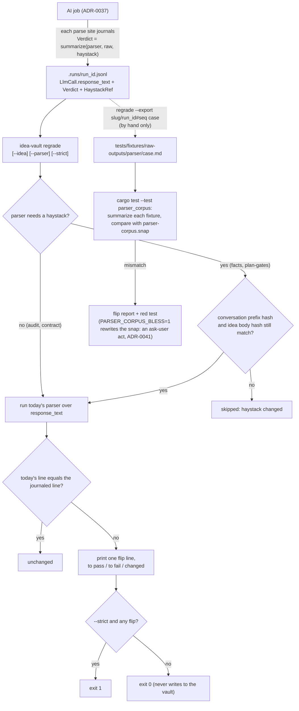

# 10 — Testing Strategy

> How the design's invariants are protected by tests. It names *what* must be tested and *how*,
> keyed to the invariants the other docs establish. The suite exists: in-crate `#[cfg(test)]`
> modules, the integration binaries under `tests/` (sharing `tests/support/`), and the unit tests
> of the `xidea_bench` example. `cargo test` runs all of them.

## What must be true (the invariants under test)

| Invariant | Source | How tested |
|-----------|--------|------------|
| Index is fully reconstructable from `vault/**` | [ADR-0002](./adr/0002-markdown-source-of-truth-sqlite-index.md), [D15](./03-data-model.md) | keystone fixture test (below) |
| State is canonical in frontmatter; re-derivable | [ADR-0007](./adr/0007-state-in-frontmatter-not-db.md), [D9](./04-state-machine.md) | golden-vault + reindex test |
| `conversation.md` is append-only | [D9](./04-state-machine.md) | store/reopen never shrink the file |
| Memory only grows/merges on re-store | [D9](./04-state-machine.md), [D12](./06-concepts/memory.md) | re-store dedupe test |
| Swarm concurrency never exceeds K | [ADR-0006](./adr/0006-bounded-concurrency-swarm.md), [D21](./06-concepts/swarm.md) | semaphore max-in-flight test |
| AI absence degrades, never hangs | [D20](./05-ai-integration.md) | mocked-Ollama absence/timeout test |
| Slugs are unique + stable | [D22](./03-data-model.md) | collision + rename test |
| `[[slug]]` backlinks resolve (incl. forward refs) | [D23](./06-concepts/memory.md) | reindex resolution test |
| An answered plan question is never reopened, by a later re-plan or an audit finding | [ADR-0032](./adr/0032-plan-workbench-answers-and-versions.md), [D33](./06-concepts/skills.md#the-plan-workbench-d33) | `claims::tests::carry_open_findings_skips_answered`, `lineage::tests::suppress_answered_drops_reasked_q_and_rewrites_depends`, `finish::tests::capstone_run_links_to_head_and_suppresses_answered` |
| A plan version never mutates its base | [ADR-0032](./adr/0032-plan-workbench-answers-and-versions.md) | `workbench::tests::base_file_bytes_unchanged`, `tests/plan_workbench.rs` (base bytes unchanged) |
| Re-gating a plan is idempotent (no duplicate markers, no second G10 question) | [ADR-0032](./adr/0032-plan-workbench-answers-and-versions.md) | `plan::tests::regate_is_idempotent`, `workbench::tests::identical_resubmit_returns_existing_version` |
| A workflow file is validated against the skill registry it is paired with; an invalid owner file is a book issue and the built-in stays active | [ADR-0035](./adr/0035-workflows-as-markdown-and-the-workflow-book.md), [D38](./06-concepts/workflows.md#d38--the-workflow-registry-load-validate-reload) | `workflows::registry::tests`: `every_builtin_parses_and_validates_clean`, `validation_rules_each_yield_one_issue`, `vault_override_keeps_position_and_invalid_override_keeps_builtin`, `skill_reload_invalidates_dependent_workflow`, `snapshot_pair_is_stable_across_reload`; `tests/web_concepts.rs`: `r22_404s_workflow_present_only_as_invalid_file` |
| The markdown conversion of `interrogate` and `steelman-then-attack` kept their shape | [ADR-0035](./adr/0035-workflows-as-markdown-and-the-workflow-book.md) | `workflows::registry::tests::migration_equivalence_interrogate_and_steelman_match_pre_migration_shape` |
| A workflow's worst-case call count is exact and capped at 32; stage widths and caps hold | [ADR-0034](./adr/0034-grounded-ranked-and-bounded-workflow-stages.md) | `workflows::registry::tests::call_ceilings_of_builtins`; `workflows::rounds::tests::precheck_prevents_round_over_max_calls` |
| Ground verifies anchors in code: a moved anchor is re-anchored, a missing one disproved, an unsettled one unverified (never disproved); only verified anchors are carried | [ADR-0034](./adr/0034-grounded-ranked-and-bounded-workflow-stages.md), [D35](./06-concepts/workflows.md#d35--the-ground-stage) | `workflows::ground::tests`: `probe_outcomes_map_to_verdicts`, `parses_pipe_backtick_and_absolute_anchors`, `dedupe_merges_overlapping_ranges_deterministically`, `token_mining_resolves_chat_rs_suffix_and_lists_src_chat_rs_absent`, `carried_block_respects_budget_quarter_dropping_outline_first`; `tests/workflow_stages.rs`: `design_panel_with_sources_carries_only_verified_claims`, `design_panel_without_sources_skips_ground_zero_calls`, `ready_to_build_without_sources_matches_prior_calls_and_prompts` |
| A Panel's ranking is pure code: cold one-proposal scoring, weighted totals, deterministic tie-break, grafts only where a runner-up wins, invalid graft ids stripped | [ADR-0034](./adr/0034-grounded-ranked-and-bounded-workflow-stages.md), [D36](./06-concepts/workflows.md#d36--the-panel-stage) | `workflows::panel::tests` (`aggregate_weighted_totals_and_tiebreak_order`, `median_of_two_takes_lower_on_split`, `grafts_only_where_runner_up_beats_winner`, `invalid_graft_ids_stripped`, `fewer_than_two_proposals_is_no_contest`, `shuffled_score_lines_give_identical_ranking`); `tests/workflow_stages.rs`: `scorer_prompt_holds_exactly_one_proposal_and_no_related_block`, `scorer_uses_auditor_profile` |
| A Loop stops in code (dry, cap, failed) and a failed round never extends the dry streak; Refine replaces by id and is skipped clean | [ADR-0034](./adr/0034-grounded-ranked-and-bounded-workflow-stages.md), [D37](./06-concepts/workflows.md#d37--the-loop-and-refine-stages) | `workflows::rounds::tests` (`loop_stops_dry_near_duplicates_not_new`, `failed_round_does_not_extend_dry_streak`, `refine_skips_with_zero_calls_when_clean`, `refine_replaces_by_id_and_caps_rounds`); `tests/workflow_stages.rs::exhaust_stops_on_dry_round` |
| Stage artifacts and the run record are all-or-nothing, never evidence, and reindex stays idempotent with the new kinds | [ADR-0034](./adr/0034-grounded-ranked-and-bounded-workflow-stages.md) | `tests/workflow_stages.rs`: `design_panel_writes_groundmap_scorecard_run_artifacts`, `cancel_mid_panel_persists_nothing`, `final_stage_failure_persists_nothing`, `stage_artifacts_are_never_memory_evidence`, `stage_concurrency_never_exceeds_k`; `index::reindex::tests::reindex_idempotent_with_new_artifact_kinds` |
| The workflow book and R49 show each workflow's ceiling; the chips offer owner workflows and hint when sources are missing; progress notes follow one grammar | [ADR-0035](./adr/0035-workflows-as-markdown-and-the-workflow-book.md) | `tests/web_skills.rs`: `book_lists_workflows_with_ceiling_and_issue_banner`, `reload_revalidates_workflows_same_response`, `r49_renders_builtin_and_vault_workflow_and_404s_unknown`; `tests/web_idea_page.rs`: `chips_include_owner_workflow_and_capstone_row_holds_ready_to_build`, `no_sources_hint_on_ground_workflow_chip`; `tests/workflow_stages.rs::progress_note_sequence_for_design_panel` |
| MCP `list_workflows` / `run_workflow`: unknown or invalid names claim nothing, a capstone points to `build_plan`, a served result replays | [ADR-0036](./adr/0036-mcp-list-workflows-and-run-workflow.md) | `tests/mcp_server.rs`: `list_workflows_shape`, `run_workflow_task_round_trip_returns_artifact_slugs`, `run_workflow_unknown_or_invalid_is_invalid_params_no_claim`, `run_workflow_capstone_points_to_build_plan`, `run_workflow_replay_is_idempotent` |
| An identical MCP retry after a served result creates no job, turn or artifact | [ADR-0033](./adr/0033-mcp-idempotent-replay-and-plan-tools.md), [D34](./13-mcp-server-inbound.md) | `tests/mcp_server.rs`: `plain_run_skill_build_prompt_retry_after_served_replays_without_second_plan`, `store_idea_retry_after_served_replays`, `failed_run_is_not_cached_and_retry_runs_again` |
| A model call's text, tokens, stop reason and contract outcome are journaled; the journal is append-only, never fails a turn, never indexed, forked or read into a prompt | [ADR-0037](./adr/0037-run-journal-diagnostics-only-call-record.md), [D39](./05-ai-integration.md) | `ai::journal::tests` (`create_new_refuses_existing_file`, `every_line_is_flushed_and_parseable_prefix_survives_drop`, `drop_without_finish_writes_cancelled`, `no_floats_in_serialized_entries`, `read_run_tolerates_torn_last_line`), `ai::call::tests::input_truncated_at_98_percent_of_num_ctx_and_unknown_is_false`; `tests/journal_flow.rs` (`skill_job_writes_started_llmcall_contract_finished`, `cancelled_job_leaves_run_finished_cancelled`, `tool_loop_rounds_count_as_api_calls`, `journal_open_failure_does_not_fail_turn`, `reindex_ignores_runs_dir`, `fork_does_not_copy_runs`); the `runs-not-truth` invariant rule |
| Today's parsers give the same verdicts on recorded and curated raw model output; regrade never writes | [ADR-0038](./adr/0038-parser-corpus-and-read-only-regrade.md), [D40](#d40--parser-corpus-and-regrade) | `regrade::tests` (`unchanged_parser_yields_zero_flips`, `changed_audit_parser_reports_flip_line`, `edited_idea_body_skips_facts_verdict`, `appended_conversation_still_regrades_via_prefix_hash`, `never_writes_to_vault`); `tests/parser_corpus.rs`; `tests/cli_regrade.rs::strict_exits_1_on_flip` |
| The claude foil sees only the pass-list environment, its init event matches the tool allowlist, and a turn ends at its deadline; every Ollama tool result is fenced | [ADR-0039](./adr/0039-foil-hygiene-and-lockdown.md) | `claude_code::tests` (`child_env_*`, `args_*`, `init_*`); `tests/claude_backend.rs` (`claude_child_does_not_see_mcp_token`, `busy_tool_events_hit_turn_deadline`); `untrusted::tests`; `tests/tool_loop_flow.rs`; the `tool-fence` and `no-skip-permissions` invariant rules |
| An artifact's recipe round-trips, an old artifact shows "provenance unknown", parse-coupled prompts are pinned by goldens, a malformed audit gets one targeted re-ask | [ADR-0040](./adr/0040-recipe-provenance-and-audit-re-ask.md) | `domain::frontmatter::tests` (`artifact_without_recipe_still_parses`, `recipe_roundtrips`); `provenance::tests` (goldens); `audit::tests` (`garbled_then_valid_merges_to_full`, `partial_then_fills_gaps_first_wins`, `reask_error_keeps_first_report`, `reask_also_garbled_stays_failed_uncertain`); the goldens in `tests/fixtures/prompt-goldens/` |
| The gate is fixed, every invariant rule has a seeded violation that flags exactly it, and an undeclared expectation change is red | [ADR-0041](./adr/0041-no-mistakes-gate.md), [D41](./14-no-mistakes-gate.md) | `tests/gate_invariants.rs`, `tests/gate_script.rs` (see [The gate under test](#the-gate-under-test)); `plan::tests` for the product side |
| A truth write's failure is the route's error, never discarded; shutdown drains and aborts jobs; the index waits out a busy lock; SQL is literal; lint exceptions carry a reason | [ADR-0041](./adr/0041-no-mistakes-gate.md) (Tier 1 amendment), [ADR-0007](./adr/0007-state-in-frontmatter-not-db.md) | `tests/web_chat.rs::a_failed_state_write_fails_the_send_and_frees_the_slot`, `web::jobs::tests::abort_all_stops_running_jobs_and_leaves_outcomes_alone`, `index::schema::tests::open_or_create_waits_out_a_busy_database`; the `discard-truth-write`, `graceful-shutdown`, `busy-timeout`, `sql-literal`, `anyhow-edge`, `no-deep-super` and `allow-reason` invariant rules; `Cargo.toml` `[lints]` under gate step 6 |
| An `idempotency_key` reused with different arguments is rejected | [ADR-0033](./adr/0033-mcp-idempotent-replay-and-plan-tools.md) | `tests/mcp_server.rs`: `idempotency_key_with_different_args_is_invalid_params` |

## The keystone: reindex invariant (fixture test)

The single most important test, protecting [ADR-0002](./adr/0002-markdown-source-of-truth-sqlite-index.md):

```text
for the fixture vault V:
  reindex(V) == reindex(reindex(V))                  # idempotent
  and  reindex(V) on a fresh index  ==  index(V)     # rebuildable from disk alone
```

It is `index::reindex::tests::keystone_reindex_is_idempotent_and_rebuildable_from_disk_alone`, a
deterministic fixture test, not a randomized property test (there is no proptest dependency).
`build_fixture_vault` writes ideas in several states with tags, memory facts, and `[[slug]]` /
`[[slug#fact]]` links, including dangling and forward refs. The test reindexes into an in-memory
connection, snapshots the DB (normalized, id-free), reindexes again on the same connection and
asserts equal counts from `index::reindex` ([D15](./03-data-model.md)) and an equal snapshot. It
then reindexes into a fresh in-memory connection, standing in for a deleted `index.db`, and asserts
the same snapshot. The snapshot covers every derived table: ideas, tags, memory facts, backlinks,
`fact_links`, `edges` and the FTS rows.

`tests/golden_vault.rs` re-asserts the keystone against the checked-in `tests/fixtures/golden-vault`
and compares its ideas, tags, memory facts, backlinks and FTS rows with `golden-vault.snap`.

## Layered tests

- **Unit (`domain`)** — pure and IO-free, so exhaustively tested: slugify + collisions (D22),
  frontmatter round-trip (D8), `IdeaState` ↔ serialized string mapping, `[[slug]]` parsing.
- **Storage (`vault`)** — against a temp dir: create/read/write `idea.md`, append-only
  `conversation.md`, memory file emit + `MEMORY.md` rebuild. Assert truth-first write order.
- **Index (`index`)** — the keystone reindex test above, plus query correctness (FTS search, tag
  filter, backlink both-directions) on fixture vaults.
- **AI (`ai`) with a mock Ollama** — a stub HTTP server standing in for `:11434`:
  - the model call (D11) returns a complete reply that the caller persists only on success — no
    partial/empty reply ever reaches `conversation.md`;
  - absence / connection-refused / timeout → degradation states (D20), no hang (bounded by timeout);
  - budget assembler respects the size limit and priority order (D21).
- **claude-code backend** — tested against a fake `claude` shell script emitting canned
  `stream-json` (`tests/fixtures/fake-claude.sh`, `tests/claude_backend.rs`); see
  [ADR-0009](./adr/0009-pluggable-llm-backend-claude-code.md).
- **Live backend toggle (`ai::backend::LlmBackend`)** — assert `chat`/`chat_stream`/`probe`/`model`
  dispatch to whichever backend `LlmSettings.backend` currently names, and that a `set_settings`
  call changes the very next dispatch with no reconstruction ([ADR-0011](./adr/0011-live-switchable-llm-backend.md)).
- **Background jobs (`web::jobs`)** — `try_claim` refuses a second concurrent claim for the same
  idea; `peek` reports `Running`/`Failed`/`Idle` correctly and `Failed` is consumed exactly once
  ([ADR-0010](./adr/0010-ai-turns-as-background-jobs.md)).
- **Concurrency (`concepts::swarm`)** — instrument the semaphore; fan out N ≫ K tasks against the
  mock and assert max concurrent calls == K and all N complete; a failing agent yields null
  and the judge proceeds (degrade-don't-abort, D14); with the audit on, the Auditor call is one more
  permit-holding call and the bound still holds (`swarm_flow` keystone runs with the audit on).
- **Web (`web`)** — handler tests over the router: create (D10) produces a `Draft`; store (D12)
  transitions to `Stored` and writes memory; reopen (D13) loads context and sets `Reopened`; the
  chat/skill/swarm routes claim a job and the `/pending` poll reflects job state; error mapping
  matches the taxonomy (D24). The plan workbench (R46-R48, `tests/plan_workbench.rs`) is tested
  against a tempdir vault with no model for the answer path, and a mock Ollama for re-plan.

## Test doubles & fixtures

- **Mock Ollama** — a local stub implementing `/api/tags` and streaming `/api/chat`, scriptable to
  return tokens, stall (for timeout tests), or refuse connections. This is the seam that keeps the
  suite offline and deterministic despite [ADR-0003](./adr/0003-ollama-local-only-ai.md).
- **Golden vaults** — checked-in fixture `vault/` directories representing each state and edge case
  (dangling backlink, reopened-with-merged-memory, unicode title → slug). Reindex output is snapshot-
  compared.
- **Parser corpus** — `tests/fixtures/raw-outputs/<parser>/<case>.md`, curated raw model outputs
  with a committed verdict snapshot (`tests/fixtures/parser-corpus.snap`); see
  [Parser corpus and regrade](#d40--parser-corpus-and-regrade).
- **Prompt goldens** — `tests/fixtures/prompt-goldens/*.txt`, the parse-coupled prompts rendered for
  a fixed input, written by hand from the source ([ADR-0040](./adr/0040-recipe-provenance-and-audit-re-ask.md)).
- **Temp dirs** — storage/index tests run against a throwaway directory, never the real vault.

## D40 — Parser corpus and regrade

The code that judges a model answer (the audit parser, the store-time fact parser and its evidence
gate, the skill output contracts, the build-plan parser and gates) is tested against real answers,
not only hand-written strings ([ADR-0038](./adr/0038-parser-corpus-and-read-only-regrade.md)). Replay
covers **parse, detector and gate code only**: a prompt change alters what the model would say, and
no recorded answer can show that (prompts are pinned by goldens instead).



`regrade::summarize` is the single definition of a verdict line, so a journaled line and a replayed one
cannot drift. `regrade` needs a vault, so it is not a gate step; the corpus test is its offline
stand-in and runs inside `cargo test` (and once more by name in gate step 7). When a change to a
parser, detector or gate is committed, paste the regrade summary or the corpus flip report into the
commit message.

## The gate under test

The shipping gate ([ADR-0041](./adr/0041-no-mistakes-gate.md), [docs/14](./14-no-mistakes-gate.md),
[D41](./14-no-mistakes-gate.md)) is itself tested, so it cannot rot or be quietly weakened.

- **`tests/gate_invariants.rs`** builds the smallest clean tree every rule needs (a `tempfile` dir with
  `src/config.rs`, `src/ai/`, `src/web/`, a compose file, a CLAUDE.md with matching ranges,
  `docs/08-diagrams.md`, an ADR, the docs/14 checklist and the `.claude/` mirrors) and points
  `check-invariants.sh --root` at it. A `SEEDS` table has **at least one row per catalog id and one per
  detection arm** of a multi-arm rule (`ratchet`, `doc-links`, `doc-ranges`, `checklist-mirror`), each
  planting exactly one violation; the table-driven test asserts each seed yields exactly one finding carrying that id (exit
  1 for error rows; for warn rows 0 without `--strict` and 1 with it; 0 for info rows). A meta-test
  asserts the `--list` id set equals the `SEEDS` id set, so a rule cannot ship without a seed. Others:
  the clean tree passes with an `[ok]` line per id, the versioned tree (tracked and unignored files
  copied to a tempdir, so `.claude/` never decides it) passes `--strict`, two seeded violations are
  both reported (collect-all), the checklist mirror is INFO without `.claude/` or with an absent
  mirror file and an error for a drifted one beside an absent one, and an
  unknown flag or `--list` combined with another flag exits 2 listing the valid flags.
- **`tests/gate_script.rs`** runs `gate.sh` in a temporary `git init` repo with a `main` and a feature
  branch, with a stub `cargo` first on `PATH` that logs its arguments and exits 0 (there is no test
  seam inside the script): the hook is executable, marked, idempotent, refuses a foreign hook, honours
  `core.hooksPath`; an unknown flag or a combined flag is a usage error and there is no skip; intent
  without an acceptance bullet, or without an `ADR-NNNN`/`D<n>` token, or unchanged since main on a
  branch, fails step 1 (and freshness is skipped on main); `PARSER_CORPUS_BLESS` fails step 4 before
  any `cargo test` call; an unlisted changed fixture or a raised floor fails step 7 and a listed one
  passes, on a branch and on main alike (on main step 7 diffs against `HEAD`).
- **`plan::tests`** cover the product side: `RUN_PROTOCOL` acts by action (no-op, auto-fix, ask-user in
  that order), forbids weakening a check, and restarts the full gate after any fix; `FIELD_ACTION` has
  exactly one row per `FIELD_KEYS` entry; every ask-user label and every `INTENT_SECTIONS` label is
  named in the protocol; every `[product]` phrase of the docs/14 checklist appears verbatim in it; and
  `tests/web_build_plan.rs` checks the findings clause reaches the owner's `PROMPT.md` before `## PINNED`.

## CI, automated review and hotfix

Three GitHub Actions workflows run this suite off the owner's machine. The setup each needs is in
its header comment.

- **`.github/workflows/ci.yml`** (`CI`) runs on every pull request and every push to main, on stable
  Rust, as one job: `cargo fetch --locked` (a stale `Cargo.lock` is red) and then
  `bash scripts/gate.sh`, the whole no-mistakes gate, unchanged, steps 1 to 7. A green check means
  the gate is green: intent and its freshness, the strict invariant catalog, build, tests plus
  `validate` on a golden-vault copy, fmt, clippy and honesty. On a pull request the checkout is
  the PR merge commit with a local `main` ref created from `origin/main`, so step 1 and step 7 diff
  the PR's changes against `merge-base(HEAD, main)` exactly as on a local branch; on a push to main
  the checkout is branch `main` and the gate takes its on-main path (freshness skipped, honesty
  against `HEAD`). Every action is pinned to a commit, and the cargo cache is saved under the
  explicit `shared-key` `gate`, which the hotfix `diagnose` job restores. The push-to-main run
  is kept: it is the hotfix trigger, and it catches a semantic conflict when main moved under a
  PR.
- **`claude-review.yml`** runs when CI goes green on a same-repo PR by the owner or on a
  `hotfix/ci-*` PR from the hotfix workflow's bot (the `CI_HOTFIX_BOT` app if set, else
  github-actions). Claude posts one review comment, which is advisory for a bot-authored PR. Fork
  PRs never qualify.
- **`claude-ci-hotfix.yml`** runs when CI fails on a push to main. It can also be dispatched with
  the `run_id` of such a run. It has three jobs:
  - **`triage`** (serialised, no model) dedupes and files the `ci-failure` issue. The issue carries
    a marker with the failing sha, so a re-run never files a second issue for a sha (an issue
    closed as not planned allows a retry). Only one hotfix is in flight at a time: a later
    failure is noted on the open issue. At most 3 hotfix issues are filed per 24 hours, and a
    skipped run says why in its summary.
  - **`diagnose`** runs Claude on current main with a read-only token, no git or gh tools, and no
    persisted credentials. The cargo cache is restored, never saved. Claude reads the failed log
    as fenced, untrusted data. The cache is restored under CI's `shared-key`. If main is already
    green, or `cargo fetch --locked` and `bash scripts/gate.sh` pass on it, it only diagnoses.
    Otherwise it fixes the root cause in the working tree, re-runs both, and gives up after 3
    attempts. The gate runs on main there, so step 1 skips freshness; the prompt has Claude write
    the hotfix branch's top intent block so the PR's own CI passes step 1. It writes its
    diagnosis, PR body and commit subject to files.
  - **`publish`** (no model) posts the diagnosis on the issue. It refuses anything that contains
    a secret-like string. It runs the guard **before** anything is pushed, and then either closes
    the issue (already fixed), leaves it open (no fix, or a withheld fix), or pushes
    `hotfix/ci-<run_id>` and opens a `Fixes #N` PR. The owner merges it; nothing pushes to main or
    merges.
- **Guardrails.** These are the [ADR-0041](./adr/0041-no-mistakes-gate.md) guardrails, and the
  guard enforces them on the diff rather than trusting the prompt. It withholds a fix that adds
  `#[allow]`, `#[expect]` or a `cfg_attr` lint (counted with whitespace removed, so a split
  attribute still counts), adds `#[ignore]`, removes a test, changes lint levels in `Cargo.toml`,
  adds a symlink, or touches `.github/`, `scripts/`, `.cargo/`, `.claude/`, `CLAUDE.md`, a
  `build.rs`, or lint or toolchain config. A fix that touches `tests/fixtures/`, `tests/support/`,
  a `*.snap`, `Cargo.toml`, `Cargo.lock` or a `*_FLOOR` value is opened as a draft PR that lists
  those files.
- **Owner setup.** A branch ruleset on main that blocks direct and force pushes, with an empty
  bypass list, is required. CI on the hotfix PR only starts on its own when the repository secret
  `CI_HOTFIX_TOKEN` (an app or fine-grained PAT with Contents and Pull requests write, and no
  Workflows permission) is set. Without it the PR is opened with `GITHUB_TOKEN`: that needs
  "Allow GitHub Actions to create and approve pull requests" turned on, GitHub does not chain
  runs from that token, and the PR and the issue tell the owner to start CI by hand.
- **Residual risk.** Claude builds and tests code in `diagnose`, so code it writes can read that
  job's environment, which includes `CLAUDE_CODE_OAUTH_TOKEN`. The job holds no write token, and
  `publish` refuses any output that contains a token. If a leak is suspected, rotate the OAuth
  token.
- **Gate-green in CI, intent by hand.** CI on a hotfix PR runs `scripts/gate.sh` like any PR, so
  a green check is gate-green. Gate step 1 needs the branch's own top block in `docs/INTENT.md`,
  which the hotfix does not write: if step 1 is red on the PR, write the block (moving the previous
  one to `docs/intent-archive.md`) and push before merging.

## What is explicitly not tested by machines

- Prompt *quality* / whether the AI's critique is "good" — subjective, out of scope for automated
  tests; validated by the owner in use.
- Exact token wording from local models — non-deterministic; tests assert *structure and
  persistence boundaries*, not content.

## Related

- [03-data-model](./03-data-model.md) — D15 and the truth/derived contract the keystone test guards.
- [05-ai-integration](./05-ai-integration.md) — D20/D24 behaviors the AI tests assert.
- [06-concepts/swarm](./06-concepts/swarm.md) — D21 limits the concurrency test enforces.
- [14-no-mistakes-gate](./14-no-mistakes-gate.md) — the gate that runs this suite (D41), and the
  guardrails the CI hotfix workflow follows ([ADR-0041](./adr/0041-no-mistakes-gate.md)).
