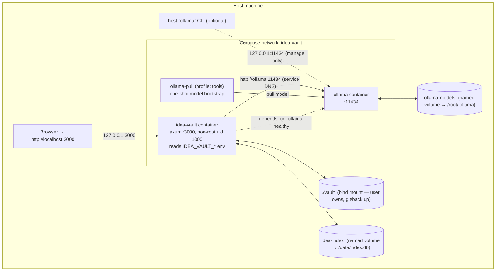
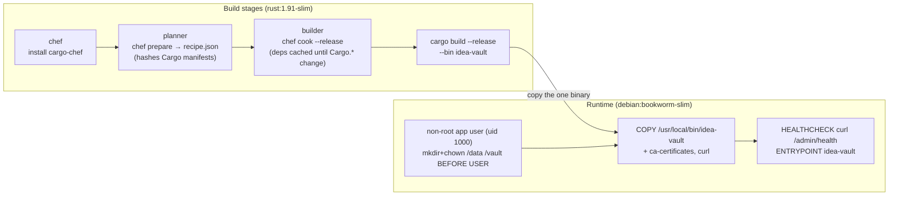
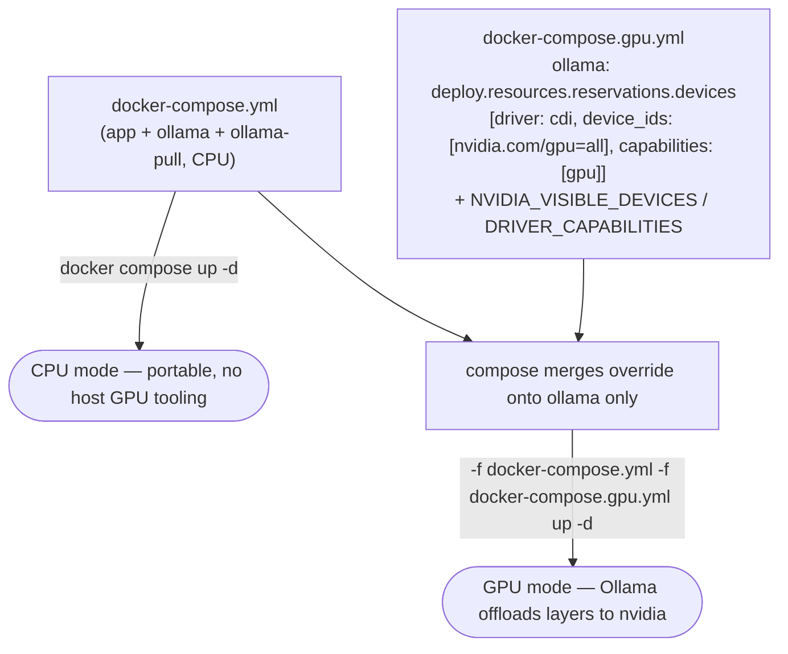
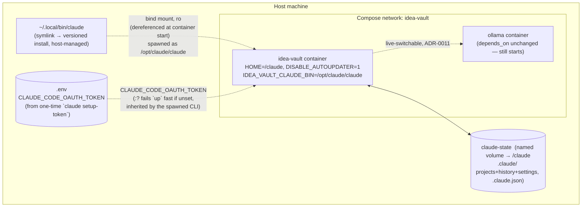

# 12 — Deployment (Containers)

> How idea-vault is hosted **locally, entirely in containers**, with or without a GPU. Home of
> **D26** (deployment topology), **D27** (multi-stage image build), **D28** (CPU vs GPU composition),
> **D29** (claude-code container topology).
> Decisions: [ADR-0008](./adr/0008-containerized-local-deployment.md),
> [ADR-0013](./adr/0013-containerized-claude-code.md) (claude-code in containers),
> [ADR-0017](./adr/0017-web-access-tools.md) (`IDEA_VAULT_WEB_ACCESS`, `IDEA_VAULT_SEARCH_URL` —
> outbound internet needed when web access is on),
> [ADR-0018](./adr/0018-mcp-servers.md) (`IDEA_VAULT_MCP_CONFIG`, the owner's MCP server registry).
> Patterns adapted
> from sibling repos: `mcp-server` (single-Rust-service multi-stage build), `cosmic-mmo` (compose
> topology, loopback publishing, profile-gated one-shot, json-file logging), `zomboid-seasons`
> (SQLite on a named volume, container-created `/data`).

## Topology in one paragraph

Two long-lived containers on one Compose network: **`idea-vault`** (the Rust axum binary) and
**`ollama`** (the local model server). The app reaches Ollama by **service DNS** (`http://ollama:11434`),
not `localhost`. The owner's **`vault/` is a host bind mount** (source of truth they own and back up);
the **SQLite index and Ollama models are named volumes** (rebuildable / re-pullable). A GPU changes
**only** the `ollama` service. The web UI's host-side publish is **loopback by default** but can opt
into LAN exposure via `IDEA_VAULT_HOST_BIND_IP` (the app has no built-in auth — only do this on a
trusted network); **Ollama's publish stays loopback-only always**, since Ollama has no auth of its
own and isn't meant to be reachable off-host.

## D26 — Deployment topology



Why these choices (see [03-data-model](./03-data-model.md) truth/derived split):

| Data | Mount | Why |
|------|-------|-----|
| `vault/` (markdown, **truth**) | **host bind mount** `./vault:/vault` | user-owned, irreplaceable, git-versioned; must survive `docker volume rm` and app removal |
| `.mcp-servers.json` (app config, **not** vault truth) | rides the same **host bind mount** as `vault/` by default | `IDEA_VAULT_MCP_CONFIG` defaults to `<vault>/.mcp-servers.json` purely because the vault bind mount is the one host-persistent path available; it is invisible to reindex ([03-data-model](./03-data-model.md), [ADR-0018](./adr/0018-mcp-servers.md)) |
| `index.db` (**derived**) | named volume `idea-index:/data` | rebuildable via reindex ([ADR-0002](./adr/0002-markdown-source-of-truth-sqlite-index.md)); app-managed, keep out of the user's tree; WAL sidecars live here too |
| Ollama models | named volume `ollama-models:/root/.ollama` | multi-GB, re-pullable; pull once, persist across restarts |
| `claude` CLI binary (claude-code override only) | **host bind mount** `${IDEA_VAULT_CLAUDE_HOST_BIN:-~/.local/bin/claude}:/opt/claude/claude:ro` | host-owned, host-managed version; ro so the container never rewrites it; dereferenced at container **start** — restart to pick up a host update ([ADR-0013](./adr/0013-containerized-claude-code.md)) |
| claude CLI state (claude-code override only) | named volume `claude-state:/claude` (via `HOME=/claude`) | rebuildable-adjacent but the owner wants it to **persist** — `.claude/` (projects, history, settings) + `.claude.json`, so project history survives container recreation and re-auth isn't needed every `up` |

## Configuration contract (env-driven)

Containerization requires the app to stop assuming `localhost`. `config.rs`
([02-module-reference](./02-module-reference.md)) reads these, each with a bare-`cargo run` default:

| Env var | Default (bare run) | In compose | Purpose |
|---------|--------------------|------------|---------|
| `IDEA_VAULT_BIND` | `127.0.0.1:3000` | `0.0.0.0:3000` | axum bind. **Must be `0.0.0.0` in a container** or the host port publish can't connect. |
| `IDEA_VAULT_HOST_BIND_IP` | `127.0.0.1` | `0.0.0.0` for LAN opt-in | compose-interpolation var, not read by `config.rs`: the **host-side** IP the `idea-vault` service's port is published on (`${IDEA_VAULT_HOST_BIND_IP:-127.0.0.1}:${IDEA_VAULT_HOST_PORT:-3000}:3000`). Distinct from `IDEA_VAULT_BIND` (the in-container axum bind, unchanged at `0.0.0.0:3000`) — this only controls who on the host/LAN can reach that published port. No built-in auth, so only set to `0.0.0.0`/a LAN IP on a trusted network. Ollama's own publish stays loopback-only always, independent of this var. |
| `IDEA_VAULT_VAULT_DIR` | `./vault` | `/vault` | vault root ([03-data-model](./03-data-model.md)). |
| `IDEA_VAULT_INDEX_PATH` | `./index.db` | `/data/index.db` | SQLite index path. |
| `IDEA_VAULT_OLLAMA_URL` | `http://localhost:11434` | `http://ollama:11434` | Ollama base URL ([05-ai-integration](./05-ai-integration.md)). **No code path hardcodes `localhost:11434`.** |
| `IDEA_VAULT_OLLAMA_MODEL` | `qwen3.5:4b` | `${IDEA_VAULT_OLLAMA_MODEL}` | default model, shared with the `ollama-pull` one-shot. |
| `IDEA_VAULT_AI_CONCURRENCY` | `2` | not set — falls back to `2` | process-wide bound K on concurrent Ollama calls — chat, skills, and swarm all share one semaphore ([ADR-0006](./adr/0006-bounded-concurrency-swarm.md)). |
| `IDEA_VAULT_OLLAMA_TIMEOUT_SECS` | `120` | not set — falls back to `120` | hard inactivity timeout for Ollama calls — the initial response and every token gap must arrive within this window or the call aborts ([05-ai-integration](./05-ai-integration.md), D20 degrade-not-hang). |
| `IDEA_VAULT_AUTO_COMPACT` | `true` | not set — falls back to `true` | initial auto-compact toggle: fold the conversation head into a rolling `compacted.md` summary before a chat turn once the context gets large ([ADR-0012](./adr/0012-auto-compact.md)); off only if set to `false`/`0`. Retunable live via `/settings`. |
| `IDEA_VAULT_COMPACT_THRESHOLD` | `0.80` | not set — falls back to `0.80` | initial effective-size fraction of the AI budget at which auto-compact fires, clamped to `0.5..=0.95` (unparsable/out-of-range falls back to the default); retunable live via `/settings`. |
| `IDEA_VAULT_LLM_BACKEND` | `ollama` | `ollama` (base file); the **claude override** changes the default to `${IDEA_VAULT_LLM_BACKEND:-claude-code}` — see [claude-code in containers](#claude-code-in-containers) | which LLM backend answers chat/skills/swarm **at boot** (the initial value): `ollama` or `claude-code` ([ADR-0009](./adr/0009-pluggable-llm-backend-claude-code.md)). Retunable live via the Settings page (`GET`/`POST /settings`) with no restart — see [ADR-0011](./adr/0011-live-switchable-llm-backend.md). |
| `IDEA_VAULT_OLLAMA_TEMPERATURE` | `0.7` | not set — falls back to `0.7` | initial Ollama sampling temperature, clamped to `0.0..=2.0` (unparsable/out-of-range falls back to the default); retunable live via `/settings`. |
| `IDEA_VAULT_OLLAMA_CTX_TOKENS` | `0` (auto) | `${IDEA_VAULT_OLLAMA_CTX_TOKENS:-0}` from `.env` | initial Ollama context-window override in **tokens**; `0` = derive from the model via `/api/show`, capped at 32,768 (VRAM guard), falling back to 8,192 until the cache warms; nonzero clamped `1024..=2_000_000`. Retunable live via `/settings` ([ADR-0014](./adr/0014-dynamic-context-budget.md)). |
| `IDEA_VAULT_CLAUDE_CTX_TOKENS` | `0` (auto) | `${IDEA_VAULT_CLAUDE_CTX_TOKENS:-0}` from `.env` (claude override file only) | initial claude-code context-window override in **tokens**; `0` = derive from the model name (`1m` marker → 1,000,000, else 200,000 — no default cap); nonzero clamped `1024..=2_000_000`. Retunable live via `/settings` ([ADR-0014](./adr/0014-dynamic-context-budget.md)). |
| `IDEA_VAULT_WEB_ACCESS` | `true` | not set — falls back to `true` | initial web-access toggle ([ADR-0017](./adr/0017-web-access-tools.md)): lets either backend crawl the internet — Ollama via the `ai::web` tool-calling loop, claude-code via its own WebSearch/WebFetch tools; off (`false`/`0`) disallows them on both. Retunable live via `/settings`. **The container needs outbound internet reachability when this is on** — a previously-unneeded posture, since the app otherwise only reaches the `ollama` service on the compose network. |
| `IDEA_VAULT_SEARCH_URL` | `https://html.duckduckgo.com/html/` | not set — falls back to the default | Ollama-path search endpoint used by `ai::web::web_search` ([ADR-0017](./adr/0017-web-access-tools.md)); override to point at a self-hosted SearXNG instance (or any HTML search endpoint accepting `?q=`) instead of DuckDuckGo. Read per call, no restart needed. Not used on the claude-code path (the CLI's own WebSearch is unaffected by it). |
| `IDEA_VAULT_MCP_CONFIG` | `<vault>/.mcp-servers.json` | `${IDEA_VAULT_MCP_CONFIG}` (unset ⇒ same vault-relative default, so it rides the `vault/` bind mount) | path to the owner's MCP server registry file (`crate::mcp::McpRegistry`, [ADR-0018](./adr/0018-mcp-servers.md)) — **app config, not vault truth**, but defaulted inside the vault dir purely because that's the one host-persistent bind mount; managed live from `/mcp` with no restart. Only override this if you want the registry to live outside the vault bind mount (e.g. on its own volume). |
| `IDEA_VAULT_CLAUDE_BIN` | `claude` | **fixed to `/opt/claude/claude`** by the claude override — do not set it yourself in a containerized run | path to the `claude` CLI. Native-only otherwise. |
| `IDEA_VAULT_CLAUDE_HOST_BIN` | *(native: unused)* | `~/.local/bin/claude` (default) — host path the claude override bind-mounts ro into the container | claude-code-in-containers only ([ADR-0013](./adr/0013-containerized-claude-code.md)); compose-interpolation var, not read by `config.rs`. |
| `CLAUDE_CODE_OAUTH_TOKEN` | *(native: unused — the CLI's own login state applies)* | **required** by the claude override (`:?` guard — `up`/`config` fails fast when unset) | long-lived token from a one-time host `claude setup-token`; inherited by the spawned CLI from the app's env ([ADR-0013](./adr/0013-containerized-claude-code.md)). |
| `IDEA_VAULT_CLAUDE_MODEL` | *(CLI default)* | `${IDEA_VAULT_CLAUDE_MODEL:-}` (blank = CLI default) | optional `--model` for the claude-code backend; retunable live via `/settings`. |
| `IDEA_VAULT_CLAUDE_CWD` | *(the vault dir)* | — | the foil's working dir. Defaults to the vault, **never the app source**, so a full-agentic foil cannot rewrite idea-vault. |
| `IDEA_VAULT_CLAUDE_ADD_DIRS` | *(none)* | — | colon-separated dirs the foil may read (Obsidian vault, Claude Code artifacts) → `--add-dir`. |
| `IDEA_VAULT_CLAUDE_ALLOWED_TOOLS` | *(all)* | — | comma-separated allow-list (only applied when permissions are **not** skipped). |
| `IDEA_VAULT_CLAUDE_SKIP_PERMISSIONS` | `true` | — | `--dangerously-skip-permissions` for unattended runs (the full-agentic default); set `false` to lock down. |
| `IDEA_VAULT_CLAUDE_TIMEOUT_SECS` | `300` | — | hard inactivity timeout for claude-code turns (agentic turns run longer than a hot local model). |
| `IDEA_VAULT_CLAUDE_EFFORT` | `high` | `${IDEA_VAULT_CLAUDE_EFFORT:-high}` | initial claude-code reasoning effort (`low`/`medium`/`high`), injected as a system-prompt hint since the CLI has no per-call effort flag; retunable live via `/settings`. |

> This is the one behavioral change containers impose on the app design. It updates the boot
> ([D25](./01-architecture.md)) "bind localhost" step and the Ollama client construction
> ([D11](./05-ai-integration.md)).

## D27 — Multi-stage image build

Adapted from `mcp-server`, plus `cargo-chef` dependency caching (which the reference Dockerfiles
lacked). Bundled SQLite (no system `libsqlite3`) and `rustls` (no OpenSSL) keep the runtime minimal.



Key runtime details:

- **Non-root**, uid/gid via `APP_UID`/`APP_GID` build args so the same uid owns the bind-mounted
  `vault/` and the named index volume.
- `/data` and `/vault` are `mkdir`+`chown`ed **before** `USER` so a freshly-created named volume
  inherits the app uid (the cosmic/zomboid volume-ownership gotcha — Docker copies mountpoint
  ownership onto empty volumes only).
- `curl` + `ca-certificates` are installed **for the healthcheck** (which hits `/admin/health`, the
  route that itself probes Ollama — [D20](./05-ai-integration.md)).

## D28 — CPU vs GPU (compose composition)

GPU acceleration matters only to Ollama; the app is byte-for-byte identical in both modes. The
difference is a single override file merged on top of the base compose.



Switching modes is just re-running `up -d` with or without the second `-f`. The `ollama-models`
volume is shared, so **no re-pull and no app rebuild** when moving between CPU and GPU.

### With GPU — host prerequisites

Modern Docker (25+) exposes NVIDIA GPUs through **CDI** (Container Device Interface), and the
override requests the CDI device `nvidia.com/gpu=all` — not the legacy `driver: nvidia` runtime.

1. NVIDIA driver installed (`nvidia-smi` works).
2. NVIDIA Container Toolkit installed and exposing GPUs over CDI:
   - **NixOS**: `hardware.nvidia-container-toolkit.enable = true;` — regenerates the CDI spec
     under `/run/cdi` on rebuild and registers **no** docker runtime hook.
   - **Debian/RHEL**: install `nvidia-container-toolkit`, then generate the spec:
     ```bash
     sudo nvidia-ctk cdi generate --output=/etc/cdi/nvidia.yaml
     ```
3. Verify the daemon discovered the device and it reaches a container:
   ```bash
   docker info | grep -A4 'CDI spec'                 # lists nvidia.com/gpu=all
   docker run --rm --device nvidia.com/gpu=all --entrypoint nvidia-smi ollama/ollama:latest -L
   ```
   Note: `docker run --gpus all …` may fail on CDI-only hosts (e.g. `AMD CDI spec not found`);
   request the device by name instead, as the override does.

Then: `docker compose -f docker-compose.yml -f docker-compose.gpu.yml up -d`, and confirm with
`docker compose logs ollama` (look for an `inference compute … library=CUDA` line naming the GPU).

> **Legacy runtime hosts**: if your host uses the nvidia docker *runtime* (older setups configured
> via `sudo nvidia-ctk runtime configure --runtime=docker && sudo systemctl restart docker`) rather
> than CDI, swap the reservation for `driver: nvidia`, `count: all`.

> `cosmic-mmo` runs its LLM sidecar deliberately **CPU-only** (`llama.cpp` with `-ngl 0`, bounded by
> `cpus`/`mem_limit`), so the nvidia block here is written fresh against the Compose spec, not copied.
> A CPU-cap approach (`cpus`, `mem_limit`) is a valid alternative to protect a co-located machine.

## claude-code in containers

An override, `docker-compose.claude.yml`, brings the agentic claude-code backend
([ADR-0009](./adr/0009-pluggable-llm-backend-claude-code.md)) into the containerized stack by
bind-mounting the **host's own** `claude` CLI rather than baking a copy into the image
([ADR-0013](./adr/0013-containerized-claude-code.md)).

### D29 — claude-code container topology



Run commands:

```bash
# one-time on the host
claude setup-token                                                    # paste the token into .env as CLAUDE_CODE_OAUTH_TOKEN

# claude-code backend, CPU
docker compose -f docker-compose.yml -f docker-compose.claude.yml up -d --build

# composable with the GPU override (disjoint services)
docker compose -f docker-compose.yml -f docker-compose.gpu.yml -f docker-compose.claude.yml up -d

# after a host `claude` CLI update — the bind mount is dereferenced at container start
docker compose -f docker-compose.yml -f docker-compose.claude.yml restart idea-vault
```

Pitfalls specific to this override (beyond the general pitfalls list below):

- **Rebuild before the volume is first created.** The image `chown`s the `/claude` mountpoint
  (D27) so a *freshly created* `claude-state` volume inherits app-uid ownership; a volume created
  from an older image is root-owned and the non-root `user:` can't write CLI state. Recovery:
  `down`, `docker volume rm idea-vault_claude-state`, rebuild, `up`.
- **Probe-green-but-auth-broken is possible.** The health probe is `claude --version`, which needs
  no authentication, so it stays green with a missing/expired token — only the first chat turn
  fails. `src/ai/claude_code.rs::classify_line` surfaces a bad-token error `result` as
  `AiError::Backend("claude error: <text>")` (e.g. "claude error: Invalid API key · Please run
  /login") so the failure is diagnosable in the UI instead of reading as an empty reply.
  `CLAUDE_CODE_OAUTH_TOKEN`'s `:?` guard on `up`/`config` catches the common "forgot to set it"
  case before the container even starts.
- **Restart to pick up a host CLI update.** The bind-mounted `~/.local/bin/claude` symlink is
  dereferenced once, at container start — `docker compose … restart idea-vault` (not a full
  rebuild) is enough after updating the CLI on the host.
- **Ollama still starts.** The override changes only the `idea-vault` service's environment/mounts;
  `ollama` keeps running so the Settings page can live-switch back to the local model with no
  restart ([ADR-0011](./adr/0011-live-switchable-llm-backend.md)).

## Operating the stack

```bash
docker compose build                                             # build the app image
docker compose up -d                                             # CPU mode (default)
docker compose -f docker-compose.yml -f docker-compose.gpu.yml up -d   # GPU mode
docker compose --profile tools run --rm ollama-pull              # first-run: pull the model
# open http://localhost:3000
docker compose down                                              # stop (volumes persist)
```

First-run note: a fresh `ollama-models` volume has no model, so AI is in the **degraded** state
([D20](./05-ai-integration.md)) until `ollama-pull` finishes (multi-GB, minutes). `depends_on:
service_healthy` gates only the **daemon**, not the model — the stack starts clean and the UI shows
the degraded banner until the model exists. This is intentional and matches the graceful-degradation
requirement.

**Local `.gguf` import (alternative to `ollama-pull`).** To run a local or fine-tuned weight file
instead of a registry pull, the `ollama-import` one-shot (`--profile tools`, same profile as
`ollama-pull`) reads the blob once into the `ollama-models` volume:

```bash
IDEA_VAULT_MODELS_DIR=/abs/path/to/gguf-dir IDEA_VAULT_GGUF=Your-Model-Q4_K_M.gguf \
  IDEA_VAULT_OLLAMA_MODEL=my-local docker compose --profile tools run --rm ollama-import
```

then set `IDEA_VAULT_OLLAMA_MODEL=my-local` in `.env` and `docker compose up -d`. See
`.env.example` for the `IDEA_VAULT_MODELS_DIR`/`IDEA_VAULT_GGUF` variables and a GPU-fit note for
7-8B Q4_K_M models on an 11 GB card.

## Pitfalls (carry into scaffolding & ops)

- **`localhost` in a container is the container.** Leaving `http://localhost:11434` makes every AI
  call hit the app itself. Read `IDEA_VAULT_OLLAMA_URL`. *(Most likely wiring mistake.)*
- **App must bind `0.0.0.0`** inside the container or the loopback publish can't reach it.
- **uid mismatch** on `./vault`: if `id -u` ≠ 1000, set `IDEA_VAULT_UID`/`GID` in `.env` **and**
  rebuild (so the build args match) — else `EACCES` on vault and index writes.
- **SQLite WAL**: `index.db-wal`/`-shm` live in the same volume; back up/reset all three together;
  never point two containers at one SQLite file. Losing the volume is recoverable via reindex.
- **GPU toolkit missing / wrong request mechanism** → `could not select device driver "nvidia"`
  means the host has no legacy nvidia runtime (expected on CDI hosts like NixOS) — the override uses
  `driver: cdi` + `device_ids: [nvidia.com/gpu=all]` for exactly this reason. Verify the device with
  `docker run --rm --device nvidia.com/gpu=all --entrypoint nvidia-smi ollama/ollama:latest -L`.
  Needs Compose v2 (the legacy `docker-compose` v1 ignores the reservation block).
- **arch**: nvidia passthrough is Linux/amd64 (and Jetson) only; on Apple Silicon the container is
  CPU-only. Build on the arch you deploy (or use `buildx`).
- **Bundled SQLite** compiles a C file in the builder — fine on `rust:slim` (ships `cc`); if a future
  base drops the toolchain, add `build-essential`.
- **Static assets**: templates compile into the binary (Askama), but htmx/CSS served from disk must
  be embedded (`rust-embed`) or `COPY`ed from the builder, or the UI ships without JS/CSS.
- **claude-code override — rebuild before first volume creation**, **restart to pick up a host CLI
  update**, and **probe-green-but-auth-broken**: see [claude-code in containers](#claude-code-in-containers)
  above for the full detail and recovery steps ([ADR-0013](./adr/0013-containerized-claude-code.md)).

## Files

| File | Purpose |
|------|---------|
| [`Dockerfile`](../Dockerfile) | multi-stage build (D27) |
| [`.dockerignore`](../.dockerignore) | trims context; never bakes `vault/`/`*.db`/secrets |
| [`docker-compose.yml`](../docker-compose.yml) | base stack (app + ollama + ollama-pull), CPU |
| [`docker-compose.gpu.yml`](../docker-compose.gpu.yml) | nvidia override for `ollama` (D28) |
| [`docker-compose.claude.yml`](../docker-compose.claude.yml) | claude-code backend override for `idea-vault` — bind-mounts the host CLI + `claude-state` volume (D29, [ADR-0013](./adr/0013-containerized-claude-code.md)) |
| [`.env.example`](../.env.example) | uid/gid, model, log level |

> These build once the crate is scaffolded ([02-module-reference](./02-module-reference.md)); today
> they are the deployment contract. Scaffolding is out of scope for the docs phase.

## Related

- [ADR-0008](./adr/0008-containerized-local-deployment.md) — the containerization decision + alternatives.
- [ADR-0003](./adr/0003-ollama-local-only-ai.md) — why Ollama; the URL is now env-driven.
- [ADR-0013](./adr/0013-containerized-claude-code.md) — claude-code in containers + rejected alternatives.
- [ADR-0014](./adr/0014-dynamic-context-budget.md) — dynamic context budget (`/api/show`, `num_ctx`, per-backend overrides).
- [ADR-0018](./adr/0018-mcp-servers.md) — the MCP server registry, its config-only vs. wire-client module split, and why `.mcp-servers.json` rides the vault bind mount without being vault truth.
- [05-ai-integration](./05-ai-integration.md) — D20 degradation the first-run relies on; the Ollama client contract (`/api/show`, `num_ctx`).
