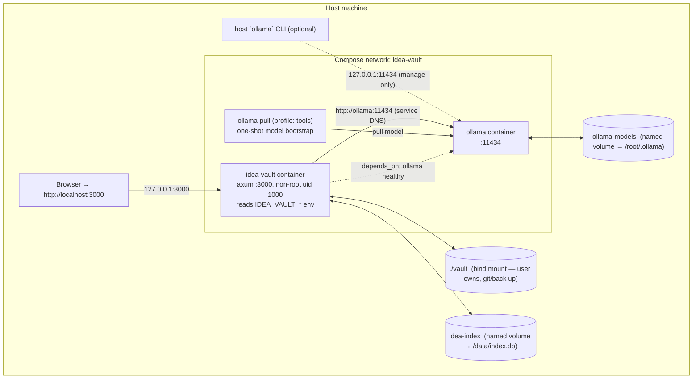
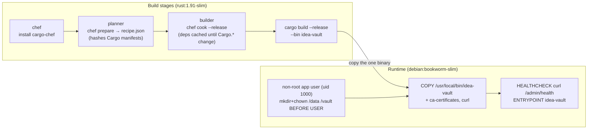
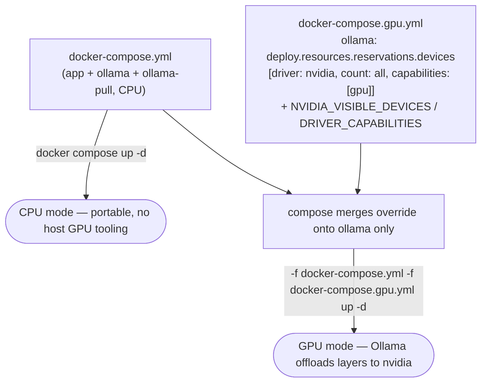

# 12 — Deployment (Containers)

> How idea-vault is hosted **locally, entirely in containers**, with or without a GPU. Home of
> **D26** (deployment topology), **D27** (multi-stage image build), **D28** (CPU vs GPU composition).
> Decision: [ADR-0008](./adr/0008-containerized-local-deployment.md). Patterns adapted from sibling
> repos: `mcp-server` (single-Rust-service multi-stage build), `cosmic-mmo` (compose topology,
> loopback publishing, profile-gated one-shot, json-file logging), `zomboid-seasons` (SQLite on a
> named volume, container-created `/data`).

## Topology in one paragraph

Two long-lived containers on one Compose network: **`idea-vault`** (the Rust axum binary) and
**`ollama`** (the local model server). The app reaches Ollama by **service DNS** (`http://ollama:11434`),
not `localhost`. The owner's **`vault/` is a host bind mount** (source of truth they own and back up);
the **SQLite index and Ollama models are named volumes** (rebuildable / re-pullable). A GPU changes
**only** the `ollama` service. Everything is published to **loopback** — a local tool, not a network
service.

## D26 — Deployment topology



Why these choices (see [03-data-model](./03-data-model.md) truth/derived split):

| Data | Mount | Why |
|------|-------|-----|
| `vault/` (markdown, **truth**) | **host bind mount** `./vault:/vault` | user-owned, irreplaceable, git-versioned; must survive `docker volume rm` and app removal |
| `index.db` (**derived**) | named volume `idea-index:/data` | rebuildable via reindex ([ADR-0002](./adr/0002-markdown-source-of-truth-sqlite-index.md)); app-managed, keep out of the user's tree; WAL sidecars live here too |
| Ollama models | named volume `ollama-models:/root/.ollama` | multi-GB, re-pullable; pull once, persist across restarts |

## Configuration contract (env-driven)

Containerization requires the app to stop assuming `localhost`. `config.rs`
([02-module-reference](./02-module-reference.md)) reads these, each with a bare-`cargo run` default:

| Env var | Default (bare run) | In compose | Purpose |
|---------|--------------------|------------|---------|
| `IDEA_VAULT_BIND` | `127.0.0.1:3000` | `0.0.0.0:3000` | axum bind. **Must be `0.0.0.0` in a container** or the host port publish can't connect. |
| `IDEA_VAULT_VAULT_DIR` | `./vault` | `/vault` | vault root ([03-data-model](./03-data-model.md)). |
| `IDEA_VAULT_INDEX_PATH` | `./index.db` | `/data/index.db` | SQLite index path. |
| `IDEA_VAULT_OLLAMA_URL` | `http://localhost:11434` | `http://ollama:11434` | Ollama base URL ([05-ai-integration](./05-ai-integration.md)). **No code path hardcodes `localhost:11434`.** |
| `IDEA_VAULT_OLLAMA_MODEL` | `qwen3.5:4b` | `${IDEA_VAULT_OLLAMA_MODEL}` | default model, shared with the `ollama-pull` one-shot. |
| `IDEA_VAULT_AI_CONCURRENCY` | `2` | not set — falls back to `2` | process-wide bound K on concurrent Ollama calls — chat, skills, and swarm all share one semaphore ([ADR-0006](./adr/0006-bounded-concurrency-swarm.md)). |
| `IDEA_VAULT_OLLAMA_TIMEOUT_SECS` | `120` | not set — falls back to `120` | hard inactivity timeout for Ollama calls — the initial response and every token gap must arrive within this window or the call aborts ([05-ai-integration](./05-ai-integration.md), D20 degrade-not-hang). |

> This is the one behavioral change containers impose on the app design. It updates the boot
> ([D25](./01-architecture.md)) "bind localhost" step and the Ollama client construction
> ([D11](./05-ai-integration.md)).

## D27 — Multi-stage image build

Adapted from `mcp-server`, plus `cargo-chef` dependency caching (which the reference Dockerfiles
lacked). Bundled SQLite (no system `libsqlite3`) and `rustls` (no OpenSSL) keep the runtime minimal.



Key runtime details:

- **Non-root**, uid/gid via `APP_UID`/`APP_GID` build args so the same uid owns the bind-mounted
  `vault/` and the named index volume.
- `/data` and `/vault` are `mkdir`+`chown`ed **before** `USER` so a freshly-created named volume
  inherits the app uid (the cosmic/zomboid volume-ownership gotcha — Docker copies mountpoint
  ownership onto empty volumes only).
- `curl` + `ca-certificates` are installed **for the healthcheck** (which hits `/admin/health`, the
  route that itself probes Ollama — [D20](./05-ai-integration.md)).

## D28 — CPU vs GPU (compose composition)

GPU acceleration matters only to Ollama; the app is byte-for-byte identical in both modes. The
difference is a single override file merged on top of the base compose.



Switching modes is just re-running `up -d` with or without the second `-f`. The `ollama-models`
volume is shared, so **no re-pull and no app rebuild** when moving between CPU and GPU.

### With GPU — host prerequisites

1. NVIDIA driver installed (`nvidia-smi` works).
2. NVIDIA Container Toolkit configured for Docker:
   ```bash
   sudo nvidia-ctk runtime configure --runtime=docker
   sudo systemctl restart docker
   ```
3. Verify: `docker run --rm --gpus all ubuntu nvidia-smi`.

Then: `docker compose -f docker-compose.yml -f docker-compose.gpu.yml up -d`, and confirm with
`docker compose logs ollama` (look for "offloaded N/N layers to GPU").

> `cosmic-mmo` runs its LLM sidecar deliberately **CPU-only** (`llama.cpp` with `-ngl 0`, bounded by
> `cpus`/`mem_limit`), so the nvidia block here is written fresh against the Compose spec, not copied.
> A CPU-cap approach (`cpus`, `mem_limit`) is a valid alternative to protect a co-located machine.

## Operating the stack

```bash
docker compose build                                             # build the app image
docker compose up -d                                             # CPU mode (default)
docker compose -f docker-compose.yml -f docker-compose.gpu.yml up -d   # GPU mode
docker compose --profile tools run --rm ollama-pull              # first-run: pull the model
# open http://localhost:3000
docker compose down                                              # stop (volumes persist)
```

First-run note: a fresh `ollama-models` volume has no model, so AI is in the **degraded** state
([D20](./05-ai-integration.md)) until `ollama-pull` finishes (multi-GB, minutes). `depends_on:
service_healthy` gates only the **daemon**, not the model — the stack starts clean and the UI shows
the degraded banner until the model exists. This is intentional and matches the graceful-degradation
requirement.

## Pitfalls (carry into scaffolding & ops)

- **`localhost` in a container is the container.** Leaving `http://localhost:11434` makes every AI
  call hit the app itself. Read `IDEA_VAULT_OLLAMA_URL`. *(Most likely wiring mistake.)*
- **App must bind `0.0.0.0`** inside the container or the loopback publish can't reach it.
- **uid mismatch** on `./vault`: if `id -u` ≠ 1000, set `IDEA_VAULT_UID`/`GID` in `.env` **and**
  rebuild (so the build args match) — else `EACCES` on vault and index writes.
- **SQLite WAL**: `index.db-wal`/`-shm` live in the same volume; back up/reset all three together;
  never point two containers at one SQLite file. Losing the volume is recoverable via reindex.
- **GPU toolkit missing** → the `-f docker-compose.gpu.yml` reservation errors or silently falls back
  to CPU; verify with `docker run --rm --gpus all ubuntu nvidia-smi`. Needs Compose v2 (the legacy
  `docker-compose` v1 ignores the reservation block).
- **arch**: nvidia passthrough is Linux/amd64 (and Jetson) only; on Apple Silicon the container is
  CPU-only. Build on the arch you deploy (or use `buildx`).
- **Bundled SQLite** compiles a C file in the builder — fine on `rust:slim` (ships `cc`); if a future
  base drops the toolchain, add `build-essential`.
- **Static assets**: templates compile into the binary (Askama), but htmx/CSS served from disk must
  be embedded (`rust-embed`) or `COPY`ed from the builder, or the UI ships without JS/CSS.

## Files

| File | Purpose |
|------|---------|
| [`Dockerfile`](../Dockerfile) | multi-stage build (D27) |
| [`.dockerignore`](../.dockerignore) | trims context; never bakes `vault/`/`*.db`/secrets |
| [`docker-compose.yml`](../docker-compose.yml) | base stack (app + ollama + ollama-pull), CPU |
| [`docker-compose.gpu.yml`](../docker-compose.gpu.yml) | nvidia override for `ollama` (D28) |
| [`.env.example`](../.env.example) | uid/gid, model, log level |

> These build once the crate is scaffolded ([02-module-reference](./02-module-reference.md)); today
> they are the deployment contract. Scaffolding is out of scope for the docs phase.

## Related

- [ADR-0008](./adr/0008-containerized-local-deployment.md) — the containerization decision + alternatives.
- [ADR-0003](./adr/0003-ollama-local-only-ai.md) — why Ollama; the URL is now env-driven.
- [05-ai-integration](./05-ai-integration.md) — D20 degradation the first-run relies on.
