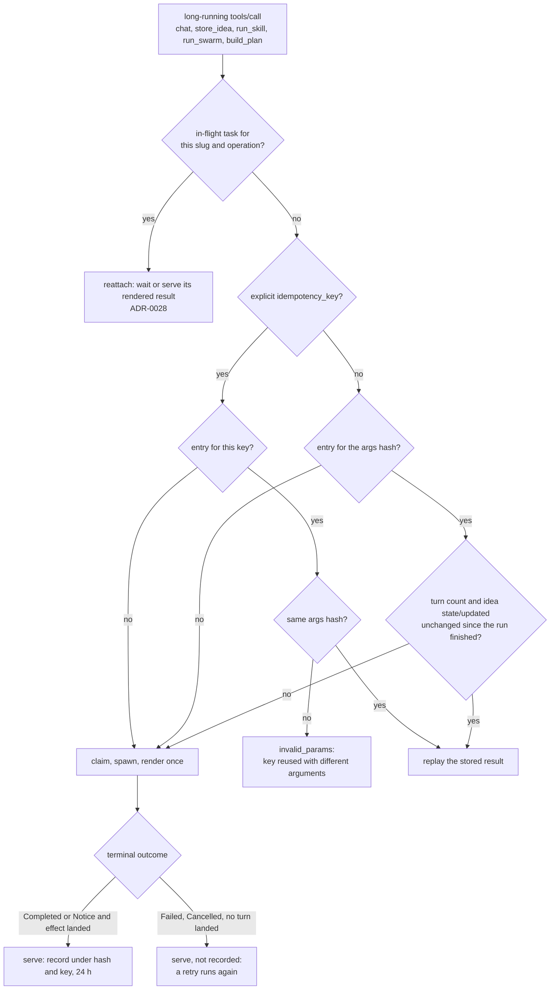

# 13 — Inbound MCP server

> How idea-vault exposes **itself** as a Model Context Protocol server at `POST /api/mcp`, so an
> external LLM client (Claude Desktop/Code, or any Streamable-HTTP MCP client) can list ideas,
> read one, continue a discussion, run skills and swarms on it, and store it — the mirror image of
> [ADR-0018](./adr/0018-mcp-servers.md)'s **outbound** registry (idea-vault calling *other* MCP
> servers). Decision records: [ADR-0024](./adr/0024-mcp-server-inbound.md), amended by
> [ADR-0028](./adr/0028-optional-task-support-bounded-wait.md),
> [ADR-0029](./adr/0029-mcp-moves-and-full-idea-read.md) and
> [ADR-0033](./adr/0033-mcp-idempotent-replay-and-plan-tools.md) and
> [ADR-0036](./adr/0036-mcp-list-workflows-and-run-workflow.md). This doc is both the
> feature reference and a general-purpose **cookbook** for wiring an MCP server onto an axum app
> that already runs long AI calls as background jobs — the pattern generalizes past idea-vault.

## Why this exists

idea-vault's core AI turns (`chat`, `store`, `skill`, `swarm`, `workflow`, `extract`, `compact`)
run as **detached background jobs** (ADR-0010, `web::jobs`): a route claims a per-idea job slot,
spawns a `tokio::spawn` task, and returns immediately; the web UI polls `GET /idea/{slug}/pending`
until the job resolves. That shape was chosen so a model call — which can run for tens of seconds
on a local model — never depends on one HTTP request/response staying open. Any inbound MCP
surface has to respect that same constraint, and the [Model Context Protocol's **Tasks**
primitive](https://modelcontextprotocol.io/specification/2025-11-25/basic/utilities/tasks)
(SEP-1686) turns out to match it almost exactly: a `tools/call` made with a `task: {}` parameter
returns immediately with a task id; the client polls `tasks/get`/`tasks/result` afterward. That's
the load-bearing idea behind everything below.

## Module layout

```
web::mcp_server
├── mod.rs       — router() : assembles the rmcp StreamableHttpService + AuthLayer, mounts /api/mcp
├── auth.rs      — single-token Bearer AuthLayer/AuthMiddleware (Tower Layer/Service pair)
├── handler.rs   — IdeaVaultMcpServer : the rmcp::ServerHandler impl
├── tools.rs     — the tool catalog + synchronous tool dispatch (list_ideas, get_idea, search,
│                   create_idea, reopen_idea, list_skills, list_workflows, get_artifact, get_plan,
│                   answer_plan)
├── tasks.rs     — TaskRegistry : the Task↔Job bridge for chat/store_idea/run_skill/run_swarm/build_plan/run_workflow
├── idempotency.rs — ReplayCache + args_hash : replay of a served result (ADR-0033, D34)
└── prompts.rs   — a small canned prompt catalog
```

Lives under `web` (not a new top-level module) because it depends on `AppState` and everything
`web` already depends on — no new module-dependency edge. It is a **third** same-topic module
alongside `crate::mcp` (the outbound server registry) and `crate::ai::mcp` (the outbound client):
three modules, one topic, opposite directions, each staying in its own lane.

## Router assembly (`mod.rs`)

```rust
pub fn router(state: AppState, token: String) -> Router {
    let handler = IdeaVaultMcpServer::new(state);
    let service = StreamableHttpService::new(
        move || Ok(handler.clone()),
        Arc::new(LocalSessionManager::default()),
        StreamableHttpServerConfig::default(),
    );
    Router::new()
        .route_service("/api/mcp", service)
        .layer(AuthLayer::new(token))
}
```

`app::build_router` merges this in only when `Config::mcp_server_token` is `Some` — unset means
the route is never mounted, not mounted-but-open (see ADR-0024's "detect absence, disable the
feature" reasoning). Path choice matters: idea-vault's *outbound* registry UI already owns `/mcp`
and `/mcp/{name}/*`, so the inbound protocol endpoint needed its own namespace — `/api/mcp` was
free. Pick whatever prefix isn't already claimed on your own router before copying this pattern.

`IdeaVaultMcpServer` is constructed **once** here, not per-request or per-session — its `tasks:
Arc<TaskRegistry>` field must be shared across every session, since a client may reconnect between
`enqueue_task` and a later `tasks/get`. The `move || Ok(handler.clone())` factory `rmcp` calls per
session clones the outer struct cheaply (it's just an `AppState` clone plus an `Arc` clone).

## Auth (`auth.rs`)

A Tower `Layer`/`Service` pair, adapted from the sibling `mcp-server` repo's own `AuthLayer` but
simplified: idea-vault is solo, so there's no multi-user `CredentialsStore` — just an `Arc<str>`
token and a `Bearer <token>` equality check. On success the request passes through unchanged (no
identity is injected into extensions, because nothing downstream needs one). On failure, a
JSON-RPC-shaped 401 body is returned directly from the middleware, before the request ever reaches
`rmcp`.

**Cookbook note:** if your server *does* have multiple callers/identities, inject the resolved
identity into the request's extensions in the middleware (`req.extensions_mut().insert(...)`), and
pull it back out inside `call_tool`/`enqueue_task` via
`context.extensions.get::<http::request::Parts>().and_then(|p| p.extensions.get::<YourIdentity>())`
— `rmcp` copies the inbound `http::request::Parts` into every `RequestContext`, which is how a
Tower-layer-populated identity survives into the MCP handler. See `mcp-server`'s
`CosmicMcpServer::call_tool` for a worked example; idea-vault doesn't need this because there's
only ever one caller.

## The `ServerHandler` (`handler.rs`)

`IdeaVaultMcpServer` implements `rmcp::ServerHandler`. The methods that matter:

- `get_info` — capabilities (`enable_tools().enable_prompts()`, **not** `enable_resources()` —
  the MVP doesn't expose vault files as MCP resources yet) plus a short instructions string.
- `get_tool` — returns one tool's full definition by name; `rmcp`'s own dispatch layer calls this
  **before** `call_tool`/`enqueue_task` to enforce each tool's declared `TaskSupport` (see below).
  Returning `None` here (the trait default) would silently skip that enforcement.
- `list_tools` / `call_tool` — the synchronous surface, delegated to `tools.rs`.
- `enqueue_task` / `get_task_info` / `get_task_result` / `cancel_task` — the Task lifecycle,
  delegated to `tasks::TaskRegistry`.
- `list_prompts` / `get_prompt` — delegated to `prompts.rs`.

## Marking a tool long-running (`tools.rs`)

```rust
Tool::new("chat", "...", schema)
    .with_execution(ToolExecution::new().with_task_support(TaskSupport::Optional))
```

`TaskSupport` has three values. `Forbidden` (the default) is synchronous only. `Required` means
`rmcp`'s dispatch layer itself rejects a plain (non-task) `tools/call` for that name with
`-32601 Method not found`, **before `call_tool` ever runs** — the cheapest possible way to force a
client onto the polling lifecycle, with zero branching in your own handler. `Optional` lets the
client choose: `tools/call` with `task:{}` goes to `enqueue_task`, without it to `call_tool`.

`chat`/`store_idea` were `Required` until [ADR-0028](./adr/0028-optional-task-support-bounded-wait.md)
and are now `Optional` (as are `run_skill`/`run_swarm`, added by ADR-0029, `build_plan`, added by ADR-0033, and `run_workflow`, added by ADR-0036), because a client that does not implement Tasks (Claude Code's own MCP
client, for one) could otherwise not call them at all. The two paths a plain call and a task call
take are:

| Call shape | Handler | Behaviour |
|---|---|---|
| `tools/call` + `task:{}` | `enqueue_task` → `TaskRegistry::enqueue` | Unchanged from ADR-0024: claim + spawn, return a task id, client polls `tasks/get`/`tasks/result`. |
| plain `tools/call` | `call_tool` → `tools::call_sync` → `TaskRegistry::call_sync_bounded` | Same claim + spawn, a real task id is minted, then a **bounded wait** (`SYNC_WAIT_BUDGET`, 3 s, polled every `SYNC_POLL_INTERVAL`, 250 ms). Finished in time → the same result `tasks/result` would give. Not finished → a non-error "still running" note naming the task id; the job keeps running, and a plain retry with the **same arguments** reattaches to that task — waiting if it is still running, or serving its rendered result if it finished in the meantime — with no second job and no duplicate turn. After the result was *served*, an identical retry **replays** it (step 5 below, D34) instead of starting a second run. A *different* operation (another `chat` message, another skill, another angle list) while the previous one is still running is a new operation and fails "already busy", exactly like task mode. |

The wait is deliberately a "did it finish fast?" grace window, not a model timeout — it must stay
far below any HTTP client's request timeout, which is why it is a module constant in `tasks.rs`
and not derived from `IDEA_VAULT_OLLAMA_TIMEOUT_SECS`. **Cookbook note:** if you copy this, keep
the plain path on the *same* registry and terminal cache as the task path (next section); a plain
path that polls your job system directly is a second reader of one-shot state and will race the
task path. The `// Was TaskSupport::Required until ADR-0028` comments in `tools::catalog()` are
the revert marker: flip the two values back and the plain path becomes unreachable.

## The Task↔Job bridge (`tasks.rs`)

The one genuinely new piece of machinery, and the reusable idea if you're copying this pattern
onto a different app with its own "background job, polled by the client" system:

1. **`enqueue_task`** validates the call synchronously (idea exists, right state, not already
   busy) so a doomed call fails fast as a protocol error rather than minting a task the client has
   to poll just to learn it was doomed. On success it claims the job slot, spawns the work exactly
   like the HTTP route does (reusing the *same* `pub(crate)` functions the route calls —
   `chat::spawn_chat_turn`, `memory::run_store_work`, `memory::{guard_skill, spawn_skill_job,
   guard_swarm, spawn_swarm_job}` — never a second copy of the business logic),
   mints a task id, and records `task_id → (idea slug, tool kind)` in an in-memory map.
2. **`get_task_info`** (`tasks/get`) looks up the slug, calls the job system's own status peek
   (`web::jobs::peek`), and translates its states into MCP `TaskStatus`: `Running → Working`,
   `Idle → Completed`, `Failed → Failed`. No changes to the job module itself — this bridge
   consumes it purely through existing public functions.
3. **`get_task_result`** (`tasks/result`) is the interesting part: idea-vault's job system tracks
   *status* but never stores a *return value* (the web UI doesn't need one — it just re-renders
   the transcript from disk once a job finishes). So when the job first goes idle, `observe`
   **derives the tool's result from the vault once and stores it** on the task entry
   (`TaskEntry::rendered`, ADR-0033) — the task's own turn, the first after its claim baseline,
   for `chat`/`run_skill`/`run_swarm` (each appends exactly one assistant turn), the fresh
   frontmatter for `store_idea`, the `get_plan` JSON of the plan its pointer turn links for
   `build_plan`. Taking the newest turn instead would hand a task first observed late, after
   another job ran on the idea, that job's reply rather than its own. This isn't a workaround; the vault is the source of truth (ADR-0002)
   regardless of which surface asks. A job that ends `Idle` but landed no turn (the web `/pending`
   poll consumed its `Failed`/`Notice` first), or a `store_idea` that ends `Idle` with the idea
   not `Stored`, is rendered as an error, `finished but its result was consumed elsewhere — check
   get_idea`, and never cached.
4. **`cancel_task`** (`tasks/cancel`) forwards straight to the job system's own `cancel`.
5. **`call_sync_bounded`** (the plain-call fallback, ADR-0028) is not a fifth kind of reader: it
   calls the same `claim_and_spawn` as step 1, registers a real task id (plus a `slug → task_id`
   reverse index, with the operation key — the `chat` message, the skill name, or the
   comma-joined swarm angles — recorded on the entry, so a retry with the same
   arguments can find its own task whether it is still running or already finished), and loops
   on the same `observe()` terminal cache steps 2–3 use, for a fixed budget. Its result is built
   by the same helper as step 3. Once it has served a terminal outcome it records that result in
   the `ReplayCache` and drops the reverse-index entry (`TaskRegistry::serve`, shared with
   `tasks/result`), so the next call is judged by the replay rules instead of reattaching to a
   finished task ([D34](#d34--mcp-replay-decision-adr-0033)).

## D34 — MCP replay decision (ADR-0033)

A retry after a dropped response or a lost "still running" note must not start a second model run
(for `run_skill build-prompt` it wrote a second, unrelated plan). Rules:

- A result is **rendered once**, at the first terminal observation, and stored.
- It is cached only when it is Completed or a Notice **and** its effect landed: a turn past the
  count at claim for Chat/Skill/Swarm/Plan, or the idea actually `Stored` for Store. Failed,
  Cancelled and false-success results are never cached.
- A cached entry is recorded under the args hash (sha256 over the arguments minus
  `idempotency_key`, keys sorted) and, if the call carried one, under the explicit key. Entries
  live 24 h, in memory only: a restart loses them and the retry re-runs.
- Explicit key: same key and same arguments replays whenever; the same key with different
  arguments is `invalid_params`; a key never seen is a miss (a fresh key is how a client forces a
  new run). Hash key: replays only while the idea's turn count and its `(state, updated)` stamp
  still equal what they were when the run finished, so an identical `chat` message after an
  intervening turn is a new question, and a `store_idea` after a reopen is a new store.
- A replay is prefixed `(replayed result of task N) `; in task mode it mints an already-terminal
  task so `tasks/get` then `tasks/result` work unchanged.



If you adapt this pattern for a job system that already returns a value from its completion
callback, `get_task_result` gets simpler — you'd store that value in the task-id map instead of
re-deriving it. The re-derive step here is specific to idea-vault's markdown-is-truth design, not
an inherent part of the Task↔Job bridge idea.

## Prompts (`prompts.rs`)

A tiny static catalog (`continue-discussion`, `new-idea`) in the same declarative shape as tools:
name, description, typed arguments, a text template with `{arg}` placeholders filled at `get`
time. Prompts are pure text — no vault I/O — they just name which tools an MCP client's "/" picker
should drive next. Both make the client a **relay**: idea-vault's own model is the foil, a `chat`
message is saved as the owner's turn, so the client sends the owner's words verbatim and offers
moves (`list_skills` → `run_skill`/`run_swarm`) instead of arguing as the foil itself — which would
put a second foil in the owner's voice (ADR-0029).

## Testing pattern (`tests/mcp_server.rs`)

Build the real `axum::Router` via `app::build_router(state)` **once per test**, then drive it with
`tower::ServiceExt::oneshot`, reusing the same `Router` (via `.clone()`) for every request in that
test — building a fresh router per request would mint a fresh, empty `LocalSessionManager` and
`TaskRegistry` and break the session/task lifecycle. The flow every test follows:

1. **Handshake**: POST `initialize` → capture the `mcp-session-id` response header → POST
   `notifications/initialized` carrying that session id. Every later request in the test carries
   the same session id header.
2. Response bodies are SSE (`text/event-stream`) by default — pull the JSON-RPC payload out of the
   `data: ` line (`extract_json` helper), falling back to parsing the raw body as JSON for the
   rare non-SSE response.
3. For a task-mode call: POST `tools/call` with `"task": {}` → read `result.task.taskId` → poll
   `tasks/get` until `result.status != "working"` → POST `tasks/result` → assert on the payload
   **and** on the on-disk vault state (markdown-is-truth: a test that only checks the MCP response
   without checking `conversation.md`/`idea.md` on disk hasn't actually verified anything durable
   happened). For a plain call: POST `tools/call` without `task` → assert on the payload directly
   (a fast mock) or on the "still running" note followed by a retry (a `TokensAfterDelay` mock
   longer than the wait budget), and count `## user`/`## assistant` headings in `conversation.md`
   to prove a retry neither duplicated nor lost a turn.
4. AI paths reuse the existing `support::spawn`/`ChatScript` mock Ollama server — never a live
   model, exactly like every other AI-path test in this suite (docs/10-testing-strategy.md).

## Config

| Var | Default | Purpose |
|---|---|---|
| `IDEA_VAULT_MCP_TOKEN` | unset (feature off) | Bearer token gating `/api/mcp`. Unset/blank: not mounted. No live retuning — a restart is needed to change it, since the route is mounted once at boot. |

The token is a server secret and the claude-code foil never sees it: the child's environment is a
fixed pass-list that always excludes every `IDEA_VAULT_*` key
([ADR-0039](./adr/0039-foil-hygiene-and-lockdown.md)). An MCP `chat`, `run_skill`, `run_swarm`,
`run_workflow`, `build_plan`, `answer_plan` re-plan or `store_idea` call runs the same detached
job as the web route, so it writes the same run journal
([ADR-0037](./adr/0037-run-journal-diagnostics-only-call-record.md)); that journal is unrelated to
D34's result replay (a replay serves a stored result to an identical retry, while the journal is a
read-only diagnostics record that nothing serves back).

See [docs/12-deployment.md](./12-deployment.md) for the full env var contract table, and
[ADR-0024](./adr/0024-mcp-server-inbound.md) for why absence disables the feature rather than
defaulting to open.

## Scope: what's in, what's deferred

**In:**

| Tool | Shape | What it does |
|---|---|---|
| `list_ideas` | sync | Every idea, newest first |
| `get_idea` | sync | The whole idea: frontmatter, body, conversation, memory facts with bodies, compacted summary, artifact list, `.html` report names |
| `get_artifact` | sync | One markdown artifact (finding, synthesis, quarantine, build plan version) by slug |
| `get_plan` | sync | One build-plan version as JSON: lineage, open questions with the tasks each blocks, owner-blocked tasks with reasons and `answerable`, settled items; defaults to the head |
| `answer_plan` | sync | Answers (`{"Q6": "…"}`, the owner's own words) on the head plan → a new version, no model call; refused while a job runs; idempotent from the vault (ADR-0032) |
| `search` | sync | FTS over titles, bodies, conversations, memory, artifacts |
| `list_skills` | sync | The visible skill book (name, stage, role, use/avoid guidance, source) |
| `list_workflows` | sync | The visible workflow book, in chip order: name, description, use/avoid guidance, stage kinds, `call_ceiling` (worst-case model calls, ADR-0034), `needs_sources`, `capstone`, source (ADR-0036) |
| `create_idea` | sync | New Draft |
| `reopen_idea` | sync | Stored → Reopened |
| `chat` | long-running | One owner turn; the foil's reply is returned |
| `run_skill` | long-running | One named move (R6's guards); its turn is returned |
| `run_swarm` | long-running | Up to 8 angles, converged (R7's guards); the synthesis is returned |
| `store_idea` | long-running | Consolidate + verified memory extraction; quarantine count as a notice |
| `build_plan` | long-running | The build-prompt capstone, or with `audited:true` the ready-to-build workflow; a new plan version linked to the head; returns the `get_plan` JSON |
| `run_workflow` | long-running | One named non-capstone workflow (R22's guards, via `guard_workflow`/`spawn_workflow_job`); returns its one turn plus a second content item `{"artifacts": [slug…], "hint": …}` naming the stage artifacts and run record, read with `get_artifact` (ADR-0036) |

Plus the two-prompt catalog. The six long-running tools (each takes an optional `idempotency_key`)
are callable both as a task and
plainly (bounded wait, ADR-0028). A Task-unaware client cannot use the task path. Its plain call
runs as a real task (`tasks::TaskRegistry::call_sync_bounded`), and when the turn outlives the
3 s `SYNC_WAIT_BUDGET`, the "still running" note returns that task's id. `tasks/cancel`
(`tasks::TaskRegistry::cancel`) accepts an id from either path, for any client that speaks that
method.

**`run_workflow` details** ([ADR-0036](./adr/0036-mcp-list-workflows-and-run-workflow.md)): a name the
book does not hold, including one present only as an invalid owner file, is `invalid_params` before
any job slot is claimed. The capstone (`ready-to-build`, and any workflow that chains a build-plan
skill) is refused with a pointer to `build_plan` with `audited:true`, which versions the plan and
carries the owner's answers. The artifact slugs are read back from the turn's trailing
`Stage artifacts:` line (only its last line, so a model-written look-alike earlier in the turn is
never taken for it). Replay follows [ADR-0033](./adr/0033-mcp-idempotent-replay-and-plan-tools.md)
unchanged (tool name `run_workflow` plus the arguments hash), so an identical retry after a served
result replays it and starts no second run; a run can cost up to the workflow's ceiling, which is
what `list_workflows` reports before the client calls.

**Deferred:** extract/compact tools, chat queueing on a busy idea (MCP refuses instead),
fork/tags/rename/sources-management/delete-* tools, MCP `resources` (idea.md/conversation.md as
`resources/read` + `resources/subscribe` push-on-update — `rmcp` supports this; it's additive and
independent of the current tool set), a stdio transport variant, a client-as-foil mode (a no-model
`append_turn` and a client-authored store — ADR-0029's first rejected alternative), and
multi-user/per-caller credential scoping (not needed while idea-vault is solo). Extending the tool
catalog is mechanical — add an entry to `tools::catalog()` and a matching arm in `tools::call_sync`
(or, for another long-running move, a `TaskKind` plus a `tasks::claim_and_spawn` arm that calls the
web route's own `guard_*`/`spawn_*` fns) — but do it alongside an ADR amending ADR-0024's scope, as
ADR-0029 did.
