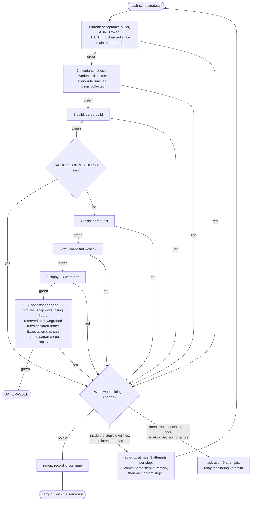

# 14 — The no-mistakes gate

> The shipping gate (`scripts/gate.sh`), its invariant catalog (`scripts/check-invariants.sh`) and
> the findings protocol that both the developer and every build plan's `PROMPT.md` follow. Home of
> **D41**. Decision record: ADR-0041 (amends ADR-0030's run protocol, links ADR-0034 and ADR-0038).

## The pipeline

`bash scripts/gate.sh` runs seven steps in a fixed order and stops at the first red one. There is
no `--skip`, `--from` or environment seam; the only flags are `--list` (print this table) and
`--install-hook` (alone). After any fix, the whole gate re-runs from step 1.

| # | Step | What it checks |
|---|---|---|
| 1 | intent | The top `# Intent` block of `docs/INTENT.md` has `## Acceptance criteria` with a `- ` bullet and names an `ADR-NNNN` or `D<n>`; on a branch, `docs/INTENT.md` changed since `merge-base(HEAD, main)` (no `main` ref is red, never a silent pass) |
| 2 | invariants | `scripts/check-invariants.sh --strict` |
| 3 | build | `cargo build` |
| 4 | tests | `cargo test`, then `idea-vault validate` on a scratch copy of the golden vault (any finding is red); red first if `PARSER_CORPUS_BLESS` is set at all, because blessing inside the gate is a bypass |
| 5 | fmt | `cargo fmt --check` |
| 6 | clippy | `cargo clippy --all-targets -- -D warnings` |
| 7 | honesty | On a branch, every changed fixture or snapshot, rising `*_FLOOR`, and removed or downgraded catalog id since the merge-base is listed as `- <path or id>: <why>` under `## Expectation changes` in the top intent block (an item ending in `/` covers a directory) |
| — | budget | Not a step: there is no metered spend (Ollama is local, claude runs on a subscription); the runtime cap is the workflow CallBudget (ADR-0034) |

The gate is not local-only: CI (`.github/workflows/ci.yml`, docs/10 "CI, automated review and
hotfix") runs this same script, unchanged, on every pull request and every push to main, after
`cargo fetch --locked`. A green CI check therefore means all seven steps passed on the PR merge
commit, with a local `main` ref for step 1. The one exception is a push to main whose tree is
byte-identical to a tree that already went green on a same-repository pull request and that
leaves `.github/workflows/` untouched: CI skips the gate there, because those exact files already passed it (docs/10).

`--install-hook` writes a `pre-push` hook (marker `# idea-vault gate pre-push hook v1`, mode
0755) into `git rev-parse --git-path hooks`, which honours `core.hooksPath` and worktrees. It
re-installs over its own hook and refuses one without the marker. The hook runs
`scripts/check-invariants.sh --strict`: fast, and no cargo.

### D41 — The gate pipeline and the findings protocol

There is no skip, no `--from` and no budget step: the runtime cap is the workflow CallBudget
([ADR-0034](./adr/0034-grounded-ranked-and-bounded-workflow-stages.md)). A no-op finding changes no file, so the run
carries on; only a fix restarts the gate.

## The invariant catalog

`scripts/check-invariants.sh --list` prints it as `id|severity|ADR/D|zero-state`. Every rule runs
and reports (`[ok] <id> — …` or `ERROR|WARN|INFO <id>: <target> — <message>`); `--strict` promotes
WARN to ERROR; INFO never counts. Every id, and every detection arm of a multi-arm rule, has a
seeded violation in `tests/gate_invariants.rs` that flags exactly that id, and a meta-test fails
when a rule ships without one. `checklist-mirror` is INFO for a `.claude/` mirror file that is
absent (a fresh clone, or a worktree whose `.claude/` holds only a campaign workspace) and an error
for one that exists and drifted.

The catalog, in `--list` order:

| Id | Severity | Holds |
|---|---|---|
| `ollama-url`, `bind-addr` | error | no hardcoded Ollama URL or bind outside `src/config.rs` |
| `restart-no`, `vault-bind-long` | error | compose `restart: "no"`, long-syntax vault bind (ADR-0019, ADR-0020) |
| `no-docker-exec` | error | the app never runs docker (ADR-0020) |
| `doc-links` | error | ADR paths in CLAUDE.md and links in docs/08 resolve |
| `ratchet` | error | clippy lint attributes (`allow` or `expect`) and unsafe blocks at or under their floors |
| `d4-config`, `d4-web-app` | error | the D4 module edges into `config` and `app` |
| `ratchet-slack` | warn | no count below its floor |
| `ignore-ratchet` | error | `#[ignore]` at or under `IGNORE_FLOOR` (TST-6) |
| `doc-ranges` | error | CLAUDE.md's D and ADR ranges name the highest ones |
| `doc-range-gaps` | info | unused D or ADR numbers below the highest |
| `checklist-mirror` | error | the `[dev]` checklist mirrors in `.claude/` |
| `intent-archive` | info | `docs/INTENT.md` holds one intent block |
| `tool-fence`, `no-skip-permissions` | error | foil lockdown (ADR-0039) |
| `runs-not-truth` | error | no run-journal path where truth or prompts are read (ADR-0037) |
| `discard-truth-write` | error | no `let _ =` on a vault store, index or memory write in `src/` (ARCH-4, BE-007) |
| `graceful-shutdown` | error | `src/main.rs` serves with `with_graceful_shutdown` (BE-012) |
| `sql-literal` | error | no `format!`-built `SELECT`/`INSERT`/`UPDATE`/`DELETE` in `src/index` or `src/memory` (DA-001) |
| `anyhow-edge` | error | `anyhow` only in `src/main.rs` and `src/import.rs` (PFC-2, BE-010) |
| `no-deep-super` | error | no `#[path]` and no `super::super` in `src/` |
| `busy-timeout` | error | `src/index/schema.rs` sets the SQLite `busy_timeout` (DA-003, BE-011) |
| `allow-reason` | error | every clippy lint attribute in `src/` is `#[expect(clippy::…, reason = "…")]` |

What the compiler can hold is not a grep: `Cargo.toml` `[lints]` denies `unsafe_code`,
`clippy::unwrap_used`, `todo`, `unimplemented`, `print_stdout`, `print_stderr`,
`undocumented_unsafe_blocks` and `missing_safety_doc`, and step 6 enforces them. Unsafe code is
allowed only with a local `#[expect(unsafe_code, reason = "…")]` and a `// SAFETY:` comment above
each block (a `# Safety` doc section on an `unsafe fn`), and it is counted by the unsafe ratchet.
`clippy.toml` exempts test code from the unwrap and print denials; an integration-test crate, whose
helpers sit outside `#[test]` functions, carries a crate-level allow for `unwrap_used`, and
`src/main.rs` prints CLI output under a local `#[expect(clippy::print_stdout, reason = "…")]`.

Step 1's freshness check is skipped on `main`; step 7's honesty check is not: on `main` it diffs
the working tree and index against `HEAD`, so a commit made straight to `main` still declares its
expectation changes.

## Findings protocol

Act on a finding by what fixing it would change, not by how bad it looks.

- **no-op** — a note that changes no file: record it and continue.
- **auto-fix** — at most 3 attempts per gate step; a fix that greens a red step is committed as
  `gate(<step>): 
`; re-run the whole gate after every fix.
- **ask-user** — 0 attempts; relay the finding verbatim. Anything that touches `docs/INTENT.md`
  acceptance, an ADR's Decision section, CLAUDE.md "Confirmed architecture decisions", an existing
  test's assertions, a fixture, snapshot or golden, a rising floor, or removes or downgrades an
  invariant rule is ask-user.

The product side is `RUN_PROTOCOL` rules 9–12 in every `PROMPT.md`, with the field-key
classification `FIELD_ACTION` in `concepts::build_plan::plan`.

## Hard rules

- Never `--no-verify`.
- Never set `PARSER_CORPUS_BLESS` to get green.
- Never raise a floor or a cap mid-gate.
- Never judge by piped output instead of the exit code (CORE-1).
- Never commit around a red gate or report success past one.

## Encode the class

An escaped mistake becomes, in order of preference: a new invariant rule plus its `SEEDS` row, a
new test, or a `[dev]` checklist line below plus its mirrors. A mistake class is not recorded as a
memory file; memory keeps preferences and context.

## Checklist

`[dev]` phrases are mirrored verbatim in `.claude/skills/attack/SKILL.md` step 6 and
`.claude/rules/core.md` (checked by `scripts/skill-check.sh`, the `checklist-mirror` rule);
`[product]` phrases appear verbatim in `RUN_PROTOCOL` (checked by `plan::tests`).

1. **Re-run the whole gate from step 1 after any fix** [dev]
2. **Judge every step by its exit code, never by piped output** [dev]
3. **Act on a finding by what fixing it would change: no-op, auto-fix or ask-user** [dev]
4. **Never weaken a check to go green** [dev]
5. **Declare every fixture, snapshot or floor change under ## Expectation changes** [dev]
6. **Encode an escaped mistake as a rule, a test or a checklist line, never a memory** [dev]
7. **Act on a failure by what fixing it would change, not by how bad it looks** [product]
8. **Never make a check pass by weakening it** [product]
9. **then the full gate from its first step** [product]
10. **A mistake that escaped a task is encoded, not remembered** [product]
